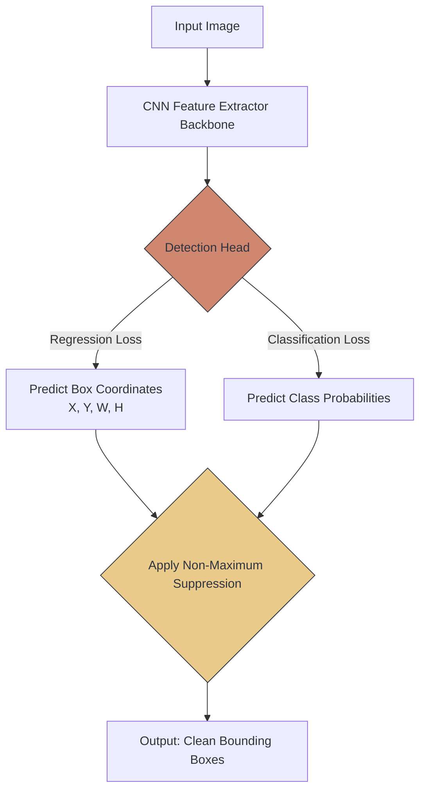

# 📦 Introduction to Object Detection

> **Difficulty**: ⭐⭐⭐⭐☆ Advanced | **Prerequisites**: Modern CNN Architectures | **Estimated Reading Time**: 25 Minutes

---

## 📋 Table of Contents
1. [What Problem Does This Solve?](#1-what-problem-does-this-solve)
2. [Intuition](#2-intuition)
3. [Core Mechanics (Bounding Boxes)](#3-core-mechanics-bounding-boxes)
4. [Visual Explanation](#4-visual-explanation)
5. [The Two Paradigms](#5-the-two-paradigms)
6. [Failure Cases](#6-failure-cases)
7. [What's Next?](#7-whats-next)

---

## 1. What Problem Does This Solve?

Standard Image Classification (like ResNet) outputs a single answer for an entire image (e.g., `Dog`). If you feed a ResNet an image of a busy street with 10 cars, 5 pedestrians, and 3 traffic lights, the network will collapse. It can only output one class.

**Object Detection** solves this by fundamentally changing the architecture to output two distinct things simultaneously: **Localization** (drawing a box around where objects are) and **Classification** (identifying what is inside the box). It handles multiple objects in the exact same frame.

---

## 2. Intuition

### 🟢 Beginner
If classification is pointing at a picture and saying "That's a cat," Object Detection is taking a red marker, drawing a precise rectangle around the cat, drawing another rectangle around a dog in the background, and writing their names above the boxes.

### 🟡 Intermediate
To achieve this, the network cannot just output a single probability vector of length 10. It must output a massive tensor containing the coordinates for bounding boxes: `[x_center, y_center, width, height]`, plus the confidence score that an object exists in that box, plus the class prediction. This means Object Detection requires a highly complex, multi-part **Loss Function**.

### 🔴 Advanced
The hardest part of training an object detector is balancing the Loss. You are simultaneously training a **Regression Task** (using Smooth L1 Loss to mathematically stretch and shift the bounding box coordinates to perfectly surround the object) and a **Classification Task** (using Cross-Entropy to guess the class ID). If the regression loss overpowers the classification loss during backpropagation, the model will draw perfect boxes but will have no idea what is inside them.

---

## 3. Core Mechanics (Bounding Boxes)

**IoU (Intersection over Union)**
How do we know if our network drew a "good" bounding box compared to the ground-truth label? We use IoU.
$$ IoU = \frac{\text{Area of Overlap}}{\text{Area of Union}} $$
If the predicted box perfectly overlaps the true box, IoU is `1.0`. If they don't touch, IoU is `0.0`. Generally, an IoU $> 0.5$ is considered a successful detection.

**NMS (Non-Maximum Suppression)**
Neural networks are eager. If they see a dog, they might predict 15 slightly different overlapping boxes around the exact same dog. **NMS** is an algorithm that cleans this up: it finds the box with the highest confidence, looks at all other boxes overlapping it (high IoU), and deletes them, leaving only the single best box.

---

## 4. Visual Explanation

---

## 5. The Two Paradigms

Object Detection is split into two warring factions of architectures:

1. **Two-Stage Detectors (e.g., Faster R-CNN)**
   - *Stage 1*: A network scans the image and proposes 2,000 regions that "might" contain an object.
   - *Stage 2*: A heavy classifier crops those regions and determines exactly what is in them.
   - *Pros*: Incredible, pixel-perfect accuracy. Great for small objects.
   - *Cons*: Extremely slow. Cannot be used for real-time video on edge devices.

2. **One-Stage Detectors (e.g., YOLO - You Only Look Once)**
   - Skips the region proposal entirely. Divides the image into a grid, and forces the network to guess boxes and classes directly from the grid in a single forward pass.
   - *Pros*: Unbelievably fast. Achieves 60+ FPS for real-time video tracking.
   - *Cons*: Struggles with densely packed, tiny objects (like a flock of birds).

---

## 6. Failure Cases

1. **Occlusion**: If a car is parked behind a tree, and only its bumper is visible, standard Object Detectors struggle to draw a box around the entire car, because they don't have the context of the invisible parts.
2. **Dense Crowds**: If two people are standing shoulder-to-shoulder, their bounding boxes will naturally overlap by a huge amount (IoU > 0.6). NMS will mathematically assume the second person is just a duplicate prediction and delete it, rendering the second person literally invisible to the system.

---

## 7. What's Next?

### Summary
Object Detection bridges localization and classification. By outputting bounding box coordinates and using IoU and NMS to evaluate and clean the results, we can identify multiple objects in real-world scenes.

### Why it matters
This is the technology powering Tesla Autopilot, Amazon Go stores, and modern surveillance systems. 

### Next Topic
Bounding boxes are rigid squares. What if we need to know the exact shape and curve of the object, right down to the pixel? We will explore this in **Introduction to Image Segmentation**.

[← Visualizing CNN Predictions](14-Visualizing-CNN-Predictions.md) | [Return to Module Index](./README.md) | [Next: Intro to Image Segmentation →](16-Introduction-To-Image-Segmentation.md)
