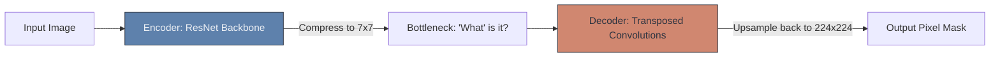

# 🖌️ Introduction to Image Segmentation

> **Difficulty**: ⭐⭐⭐⭐☆ Advanced | **Prerequisites**: Object Detection, CNNs | **Estimated Reading Time**: 25 Minutes

---

## 📋 Table of Contents
1. [What Problem Does This Solve?](#1-what-problem-does-this-solve)
2. [Intuition](#2-intuition)
3. [Core Mechanics (Encoder-Decoder)](#3-core-mechanics-encoder-decoder)
4. [Algorithm Workflow](#4-algorithm-workflow)
5. [Visual Explanation](#5-visual-explanation)
6. [Failure Cases](#6-failure-cases)
7. [What's Next?](#7-whats-next)

---

## 1. What Problem Does This Solve?

Bounding boxes are fast, but they are fundamentally inaccurate. If you draw a bounding box around a person's outstretched arms, 80% of the pixels inside that square box are actually just the background sky. 

If a robot needs to pick up a fragile glass, or a surgeon needs an AI to highlight a tumor, a box does not provide the geometric shape needed. **Image Segmentation** solves this by leaving boxes behind entirely and classifying *every single pixel* in the image.

---

## 2. Intuition

### 🟢 Beginner
Object detection is drawing a quick, rough square around a dog. Segmentation is opening a coloring book and carefully staying inside the lines, coloring the dog blue, the sky red, and the grass green. You are assigning a color (a class label) to every single tiny dot (pixel) on the page.

### 🟡 Intermediate
There are three distinct types of Segmentation you must know:
1. **Semantic Segmentation**: Colors all objects of a class the same color. If there are 3 sheep in a field, it colors all sheep red. It does not know where Sheep 1 ends and Sheep 2 begins.
2. **Instance Segmentation**: Treats every object as a unique entity. It colors Sheep 1 red, Sheep 2 blue, and Sheep 3 green.
3. **Panoptic Segmentation**: Combines both. It assigns a unique ID to instances (Sheep 1, Sheep 2) while also semantically segmenting the background "stuff" (the sky, the grass) which Instance Segmentation normally ignores.

### 🔴 Advanced
Because segmentation assigns a class to every pixel, the final output of the network is not a 1D array of 10 probabilities. The output is a massive 3D Tensor of shape `[Classes, Height, Width]`. 
If you are classifying a $256 \times 256$ image into 20 classes, the output tensor is `[20, 256, 256]`. We then apply an `argmax` across the Class dimension to collapse it into a single $256 \times 256$ 2D matrix, where every cell contains an integer (e.g., `0` for background, `1` for Sheep), representing the final mask.

---

## 3. Core Mechanics (Encoder-Decoder)

Standard CNNs (like ResNet) are **Encoders**. They use pooling layers to crush a massive image down into a tiny $7 \times 7$ grid to figure out *what* the object is. 
But Segmentation requires the output to be the *exact same size* as the input image. 

Therefore, Segmentation networks use an **Encoder-Decoder** architecture.
1. The **Encoder** downsamples the image to extract the semantic meaning ("It's a cat").
2. The **Decoder** uses **Transposed Convolutions** to mathematically blow that $7 \times 7$ grid back up to $224 \times 224$, mapping the semantic meaning back onto the spatial coordinates ("The cat is specifically at these pixels").

---

## 4. Algorithm Workflow

1. Input a $256 \times 256$ RGB image.
2. Pass through an Encoder CNN to get a deep $8 \times 8$ feature map.
3. Pass through a Decoder (Transposed Convolutions) to upsample back to $256 \times 256$.
4. Calculate the **Dice Coefficient** (a metric similar to IoU) to measure how perfectly the predicted mask overlaps the true ground-truth mask.
5. Backpropagate the Dice Loss to update the network.

---

## 5. Visual Explanation

---

## 6. Failure Cases

1. **Lost Thin Structures**: Because the image is compressed down to an $8 \times 8$ grid in the bottleneck, very thin objects (like bicycle spokes or telephone wires) completely disappear from the feature map. The decoder cannot reconstruct what the encoder destroyed.
2. **Checkerboard Artifacts**: Transposed convolutions can sometimes overlap unevenly during the upsampling process, causing the final mask to look like it has a faint checkerboard pattern.

---

## 7. What's Next?

### Summary
Image Segmentation classifies every pixel in an image, allowing us to understand the exact shape and contours of objects using an Encoder-Decoder architecture.

### Why it matters
Self-driving cars cannot use bounding boxes to stay in their lane; they must use segmentation to map the exact, curving pixel boundaries of the road.

### Next Topic
We skipped over some minor but crucial mathematical details of convolutions. How do we prevent images from shrinking? We will cover this in **Padding and Strides**.

[← Introduction To Object Detection](15-Introduction-To-Object-Detection.md) | [Return to Module Index](./README.md) | [Next: Padding and Strides →](17-Padding-And-Strides.md)
