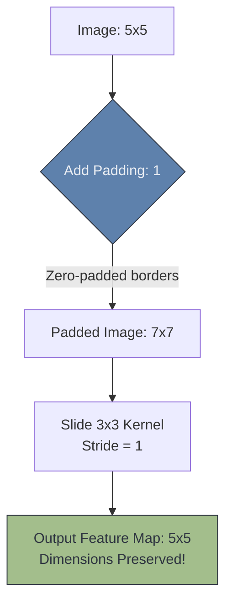

# 📏 Padding and Strides

> **Difficulty**: ⭐⭐☆☆☆ Intermediate | **Prerequisites**: Convolution Operation | **Estimated Reading Time**: 20 Minutes

---

## 📋 Table of Contents
1. [What Problem Does This Solve?](#1-what-problem-does-this-solve)
2. [Intuition](#2-intuition)
3. [Core Mathematics (The Formula)](#3-core-mathematics-the-formula)
4. [Algorithm Workflow](#4-algorithm-workflow)
5. [Visual Explanation](#5-visual-explanation)
6. [PyTorch Implementation](#6-pytorch-implementation)
7. [Failure Cases](#7-failure-cases)
8. [What's Next?](#8-whats-next)

---

## 1. What Problem Does This Solve?

If you slide a $3 \times 3$ kernel over a $5 \times 5$ image, the output feature map shrinks to $3 \times 3$. If you do this repeatedly in a deep network, your image will rapidly shrink to $1 \times 1$ and vanish before reaching the end of the network. Furthermore, the pixels on the edges of the image are only "seen" by the kernel once, while the pixels in the center are scanned multiple times, causing edge information to be lost.

**Padding** solves the shrinking problem by adding a border of fake pixels around the image.
**Strides** solve the problem of spatial compression, allowing us to actively control how fast the image shrinks.

---

## 2. Intuition

### 🟢 Beginner
Imagine you are painting a floor with a large, square sponge. If you can only place the sponge fully inside the room, you will miss the corners where the floor meets the walls. **Padding** is like adding a temporary strip of tape around the outside of the room. It allows you to push the sponge all the way into the corners, ensuring every inch of the real floor gets painted equally.

### 🟡 Intermediate
**Padding (P)**: We literally add rings of `0`s (Zero-Padding) around the perimeter of the image matrix. If we add `P=1` to a $5 \times 5$ image, it becomes $7 \times 7$. When we slide our $3 \times 3$ kernel over it, the output is perfectly preserved at $5 \times 5$!
**Stride (S)**: The step size of the sliding window. A Stride of `1` moves the window 1 pixel at a time. A Stride of `2` skips a pixel, effectively halving the output size. Strides are often used instead of Pooling layers to compress the image.

### 🔴 Advanced
The mathematical relationship between input size, kernel size, padding, and stride must be memorized to build custom architectures without crashing.
If you use a $5 \times 5$ kernel, you must use a Padding of `2` to preserve the shape. If you use a $7 \times 7$ kernel, you need a Padding of `3`. 
The formula to preserve the input shape (assuming Stride=1) is: 
$$ \text{Padding} = \frac{F - 1}{2} $$
*(Where F is the odd-numbered filter size).*

---

## 3. Core Mathematics (The Formula)

If you are building a custom CNN, you must calculate the exact size of the tensor leaving a convolutional layer so you can define the next layer correctly.
Here is the master formula for calculating the output Spatial Size ($O$):

$$ O = \lfloor \frac{W - F + 2P}{S} \rfloor + 1 $$

- $W$ = Input Width (e.g., $224$)
- $F$ = Filter/Kernel Size (e.g., $3$)
- $P$ = Padding (e.g., $1$)
- $S$ = Stride (e.g., $2$)

Let's calculate: $O = \lfloor \frac{224 - 3 + 2(1)}{2} \rfloor + 1 = \lfloor \frac{223}{2} \rfloor + 1 = 111 + 1 = 112$.
The output size is exactly $112 \times 112$.

---

## 4. Algorithm Workflow

When designing a feature extractor block:
1. Choose a Kernel Size (almost always $3 \times 3$).
2. Apply `Padding = 1` and `Stride = 1` to perfectly preserve the spatial dimensions while increasing the channel depth.
3. Apply a Pooling layer (or a Convolution with `Stride = 2`) to cut the spatial dimensions exactly in half.

---

## 5. Visual Explanation



---

## 6. PyTorch Implementation

```python
import torch
import torch.nn as nn

# Input image: [Batch, Channels, Height, Width] -> [1, 1, 5, 5]
image = torch.ones(1, 1, 5, 5)

# Layer 1: No Padding (Shrinks image)
conv_no_pad = nn.Conv2d(1, 1, kernel_size=3, padding=0, stride=1)
out_shrink = conv_no_pad(image)
print(f"No Padding Output: {out_shrink.shape}") # [1, 1, 3, 3]

# Layer 2: With Padding (Preserves image)
conv_pad = nn.Conv2d(1, 1, kernel_size=3, padding=1, stride=1)
out_preserved = conv_pad(image)
print(f"Padding=1 Output: {out_preserved.shape}") # [1, 1, 5, 5]

# Layer 3: Strided Convolution (Compresses image like Pooling)
conv_stride = nn.Conv2d(1, 1, kernel_size=3, padding=1, stride=2)
out_strided = conv_stride(image)
print(f"Stride=2 Output: {out_strided.shape}") # [1, 1, 3, 3]
```

---

## 7. Failure Cases

1. **Fractional Shapes**: If you use a Stride of 2 on an image with a Width of $225$, the mathematical output of the formula is $112.5$. PyTorch uses the `floor` function, so it will simply round down to $112$ and drop the final column of pixels entirely. This can cause subtle alignment bugs later in the network. Always ensure your image dimensions are cleanly divisible by 2 (e.g., $224 \times 224$).
2. **Even Sized Kernels**: Never use a $2 \times 2$ or $4 \times 4$ kernel for standard convolutions. If you plug them into the padding formula $\frac{F-1}{2}$, you get a fractional padding (like $0.5$). You cannot pad half a pixel. Always use odd kernels ($3 \times 3, 5 \times 5, 7 \times 7$).

---

## 8. What's Next?

### Summary
Padding prevents the image from shrinking and preserves edge information by wrapping the matrix in zeros. Strides dictate the step size of the sliding window, allowing us to rapidly downsample the image without needing a dedicated Pooling layer.

### Why it matters
Mastering the $O = \lfloor \frac{W - F + 2P}{S} \rfloor + 1$ formula is the only way to track tensor shapes and prevent dimensional crash errors when writing PyTorch code.

### Next Topic
We know how to calculate the Forward Pass perfectly. But what exactly happens when we call `.backward()`? We will explore the Calculus of Deep Learning in **CNN Backpropagation**.

[← Intro to Image Segmentation](16-Introduction-To-Image-Segmentation.md) | [Return to Module Index](./README.md) | [Next: CNN Backpropagation →](18-CNN-Backpropagation.md)
