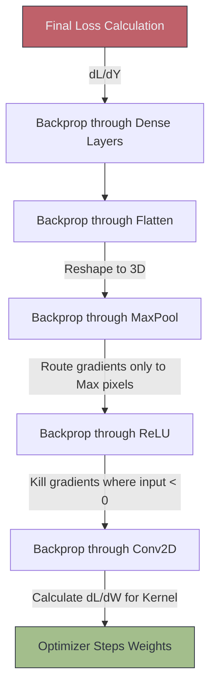

# 🧮 CNN Backpropagation

> **Difficulty**: ⭐⭐⭐⭐⭐ Expert | **Prerequisites**: CNN Training Pipeline, Calculus | **Estimated Reading Time**: 35 Minutes

---

## 📋 Table of Contents
1. [What Problem Does This Solve?](#1-what-problem-does-this-solve)
2. [Intuition](#2-intuition)
3. [Core Mathematics (The Chain Rule)](#3-core-mathematics-the-chain-rule)
4. [Algorithm Workflow](#4-algorithm-workflow)
5. [Visual Explanation](#5-visual-explanation)
6. [Failure Cases](#6-failure-cases)
7. [What's Next?](#7-whats-next)

---

## 1. What Problem Does This Solve?

During the Forward Pass, a CNN makes a guess. Let's say it guesses "Dog" with 10% confidence, but the truth is it's a Dog with 100% confidence. The Loss is extremely high. 
We have a massive network with 25 million specific weight numbers (parameters). Which specific weight caused the error? Did Weight #14,002 need to be slightly higher? Did Weight #5,000 need to be lower? 

**Backpropagation** solves the problem of Credit Assignment. It uses calculus to calculate the exact mathematical influence (the gradient) that *every single weight* had on the final error, telling the Optimizer exactly how to update them.

---

## 2. Intuition

### 🟢 Beginner
Imagine you are baking a cake. It comes out tasting terrible (High Loss). You need to fix the recipe. Backpropagation is the process of tasting the cake and working backward:
"It's too salty. Which step added salt? Step 4. Let's reduce the salt in Step 4. It's also too dry. Which step added water? Step 2. Let's increase the water in Step 2."
We trace the error backward through the steps to find exactly which ingredient to adjust.

### 🟡 Intermediate
In a standard Dense network, Backpropagation is just simple matrix multiplication using the Chain Rule. 
In a CNN, it is highly complex because of **Weight Sharing**. Remember that a $3 \times 3$ Kernel (9 weights) slides across the entire image and produces thousands of outputs. Therefore, when calculating how much a single weight in that Kernel contributed to the error, we must sum up the gradients from *every single spatial location* that weight touched.

### 🔴 Advanced
The Backward Pass of a Convolution is, beautifully, just another Convolution! 
If you want to find the gradients of the input feature map (to pass back to the previous layer), you take the gradients coming down from the loss function, pad them, and mathematically **Convolve them with the flipped (rotated 180 degrees) Kernel**. The mathematical elegance of this is why CNNs are so computationally efficient to train on GPUs.

---

## 3. Core Mathematics (The Chain Rule)

To find how much a specific Kernel weight ($w$) affects the final Loss ($L$), we use the Chain Rule of Calculus.

Let $y$ be the output of the convolution, and $x$ be the input.
$$ \frac{\partial L}{\partial w} = \sum \frac{\partial L}{\partial y} \cdot \frac{\partial y}{\partial w} $$

Because the weight $w$ was shared across the entire image to calculate $y$, we must sum ($\sum$) the gradients $\frac{\partial L}{\partial y}$ across all spatial dimensions (Height and Width) of the feature map. 

This is why PyTorch physically cannot delete the intermediate tensors $x$ and $y$ during the Forward Pass. It must keep them locked in GPU VRAM because they are required right here in the Chain Rule formula.

---

## 4. Algorithm Workflow

When you type `loss.backward()` in PyTorch:
1. PyTorch calculates the derivative of the Cross Entropy Loss function.
2. It flows that gradient backward into the final Dense classification layers.
3. It flows into the Flatten layer (which simply un-flattens the 1D gradient vector back into a 3D tensor).
4. It hits the Pooling layer. (For Max Pooling, the gradient is simply routed *only* to the specific pixel that was the maximum during the forward pass. The other 3 pixels in the $2 \times 2$ window get a gradient of 0).
5. It hits the ReLU layer. (If the forward input was $>0$, the gradient passes through unchanged. If it was $<0$, the gradient is killed to 0).
6. It hits the Convolution layer, calculating the gradient for the weights, and passing the remaining gradient backward to the next block.

---

## 5. Visual Explanation

---

## 6. Failure Cases

1. **Vanishing Gradients**: If you stack 50 layers, you are multiplying 50 fractions together using the Chain Rule. $0.5 \times 0.5 \times 0.5... = 0.0000001$. By the time the gradient reaches the first convolution layer, it is so microscopic that the weights do not update at all. (Solved by ReLU and ResNet).
2. **Exploding Gradients**: The opposite problem. If your weights initialize too large, you are multiplying whole numbers together: $2 \times 2 \times 2... = 10,000,000$. The gradient explodes, causing the weights to swing wildly to `NaN`. (Solved by Gradient Clipping and Batch Normalization).

---

## 7. What's Next?

### Summary
Backpropagation uses the Chain Rule of Calculus to trace the Loss backward through the network, determining the exact mathematical adjustment required for every single filter weight. 

### Why it matters
You do not need to calculate this by hand; PyTorch's Autograd engine handles it automatically. However, understanding the flow of gradients is the only way to diagnose why a deep network fails to train.

### Next Topic
We have covered all the fundamental theory of CNNs. Let's look at history. We will analyze the two models that started the Deep Learning revolution: **LeNet and AlexNet**.

[← Padding and Strides](17-Padding-And-Strides.md) | [Return to Module Index](./README.md) | [Next: LeNet and AlexNet →](19-LeNet-And-AlexNet.md)
