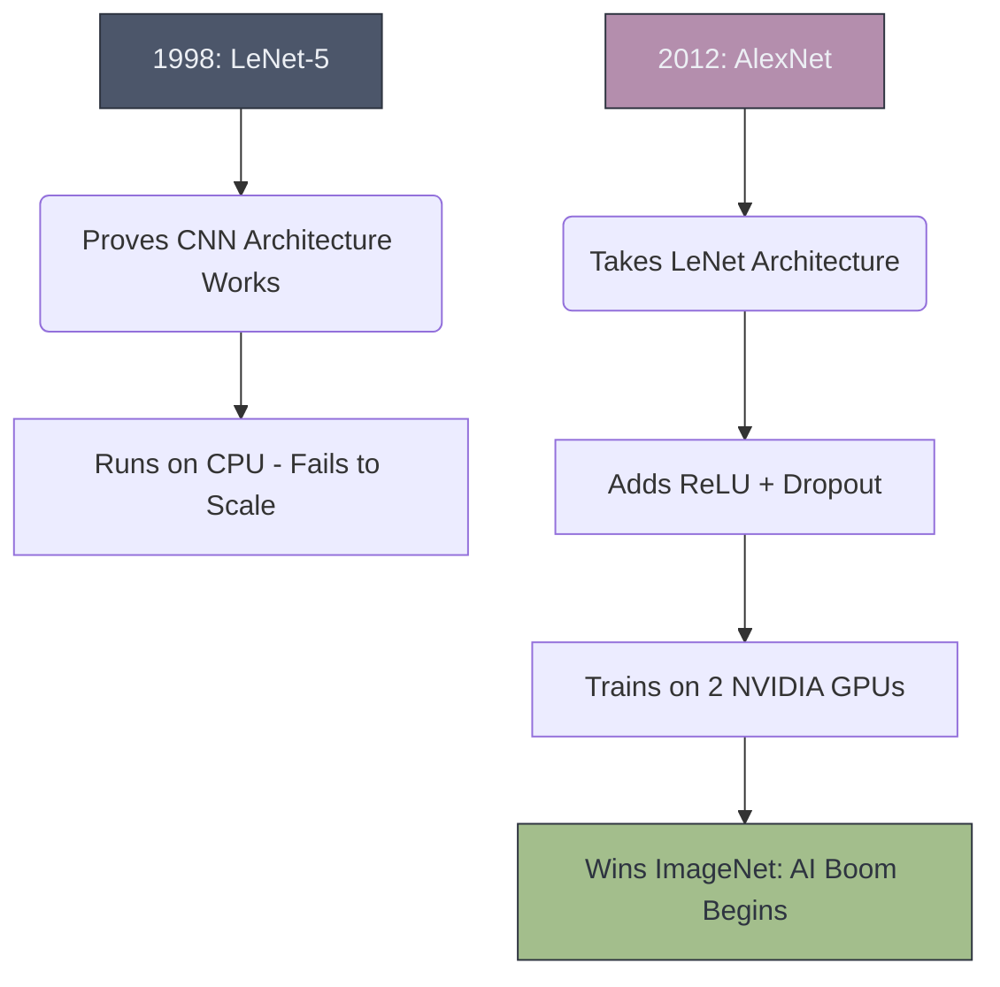

# 📜 The Pioneers: LeNet & AlexNet

> **Difficulty**: ⭐☆☆☆☆ Beginner | **Prerequisites**: CNN Fundamentals | **Estimated Reading Time**: 20 Minutes

---

## 📋 Table of Contents
1. [What Problem Does This Solve?](#1-what-problem-does-this-solve)
2. [Intuition](#2-intuition)
3. [LeNet-5 (1998)](#3-lenet-5-1998)
4. [AlexNet (2012)](#4-alexnet-2012)
5. [Visual Explanation](#5-visual-explanation)
6. [PyTorch Implementation Concept](#6-pytorch-implementation-concept)
7. [What's Next?](#7-whats-next)

---

## 1. What Problem Does This Solve?

Before 2012, Artificial Intelligence was largely considered a failed academic pursuit (The AI Winter). Classical algorithms like SVMs and Random Forests ruled the industry. 
Understanding **LeNet and AlexNet** solves the problem of historical context: proving exactly how Convolutional Neural Networks broke out of academia, leveraged GPU hardware, and completely conquered the world.

---

## 2. Intuition

### 🟢 Beginner
Every modern jet plane traces its roots back to the Wright Brothers' first flyer. It was small, clunky, and basic, but it proved that flight was possible. LeNet is the Wright Flyer of AI. AlexNet is the first Jet Engine—the exact moment when the technology became powerful enough to change the world.

### 🟡 Intermediate
Yann LeCun invented the modern CNN architecture in 1998 with **LeNet-5**. He proved that alternating Convolutions and Pooling layers could automatically extract features from images. It successfully read handwritten zip codes on mail for the US Postal Service. However, it was abandoned because computers in 1998 were simply too slow to scale the network to larger images.

### 🔴 Advanced
In 2012, Geoffrey Hinton's team built **AlexNet** and entered the ImageNet Challenge (classifying 1.2 million high-res images). They didn't invent new math; they simply made LeNet much deeper and trained it on **NVIDIA GPUs** instead of CPUs. They also introduced **ReLU** (to solve the vanishing gradient) and **Dropout** (to prevent overfitting). AlexNet destroyed the classical CV algorithms by an absurd 10.8% margin, triggering the global Deep Learning boom that continues today.

---

## 3. LeNet-5 (1998)

**The Architecture:**
- **Input**: $32 \times 32$ Grayscale image.
- **C1**: Convolution ($5 \times 5$ kernel), 6 filters $\rightarrow$ Output: $28 \times 28 \times 6$
- **S2**: Average Pooling ($2 \times 2$, stride 2) $\rightarrow$ Output: $14 \times 14 \times 6$
- **C3**: Convolution ($5 \times 5$ kernel), 16 filters $\rightarrow$ Output: $10 \times 10 \times 16$
- **S4**: Average Pooling ($2 \times 2$, stride 2) $\rightarrow$ Output: $5 \times 5 \times 16$
- **F5**: Flatten & Dense Layer (120 neurons)
- **F6**: Dense Layer (84 neurons)
- **Output**: 10 neurons (Digits 0-9)

*Note: It used `Tanh` and `Sigmoid` activations, as ReLU had not been popularized yet.*

---

## 4. AlexNet (2012)

**The Breakthroughs:**
1. **ReLU Activation**: Replaced `Tanh`, speeding up training by 6x and preventing vanishing gradients.
2. **Multiple GPUs**: The model was too big for a single 3GB GPU, so they split the network across two GTX 580 GPUs.
3. **Dropout**: Introduced randomly turning off 50% of the neurons during training to force the network to learn robust features, solving the overfitting problem.
4. **Data Augmentation**: Cropping, flipping, and color-shifting the 1.2 million images on the fly.

---

## 5. Visual Explanation



---

## 6. PyTorch Implementation Concept

LeNet-5 is so small it can be implemented in a few lines of modern PyTorch:

```python
import torch.nn as nn

class LeNet5(nn.Module):
    def __init__(self):
        super(LeNet5, self).__init__()
        # Backbone
        self.feature_extractor = nn.Sequential(
            nn.Conv2d(in_channels=1, out_channels=6, kernel_size=5),
            nn.Tanh(),
            nn.AvgPool2d(kernel_size=2, stride=2),
            nn.Conv2d(in_channels=6, out_channels=16, kernel_size=5),
            nn.Tanh(),
            nn.AvgPool2d(kernel_size=2, stride=2)
        )
        # Classifier
        self.classifier = nn.Sequential(
            nn.Flatten(),
            nn.Linear(in_features=16 * 5 * 5, out_features=120),
            nn.Tanh(),
            nn.Linear(in_features=120, out_features=84),
            nn.Tanh(),
            nn.Linear(in_features=84, out_features=10)
        )

    def forward(self, x):
        x = self.feature_extractor(x)
        x = self.classifier(x)
        return x
```

---

## 7. What's Next?

### Summary
LeNet proved the mathematical concept of CNNs, and AlexNet proved their absolute dominance by combining the architecture with GPU compute, ReLU activations, and Dropout regularization.

### Why it matters
You will never use LeNet or AlexNet in production today. But understanding the specific problems they faced (and solved) provides the context for why modern architectures are designed the way they are.

### Next Topic
AlexNet was messy and chaotic. Two years later, researchers at Oxford University decided to clean up the architecture into a beautiful, standardized mathematical pattern. We will explore this in **VGG Net**.

[← CNN Backpropagation](18-CNN-Backpropagation.md) | [Return to Module Index](./README.md) | [Next: VGG Net →](20-VGG-Net.md)
