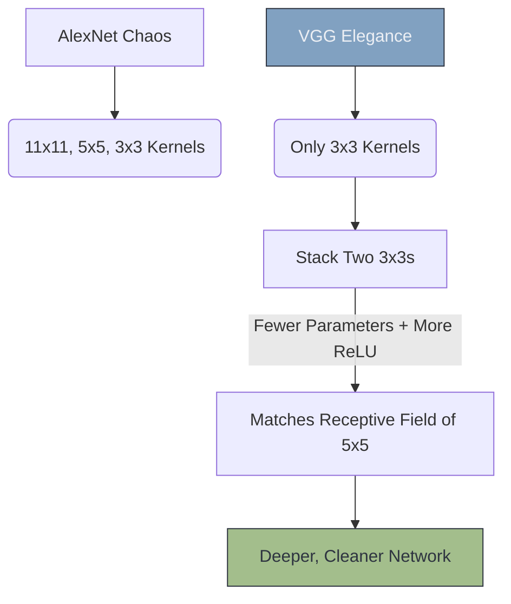

# 📐 VGG Net: The Architecture Standard

> **Difficulty**: ⭐⭐☆☆☆ Intermediate | **Prerequisites**: LeNet & AlexNet | **Estimated Reading Time**: 20 Minutes

---

## 📋 Table of Contents
1. [What Problem Does This Solve?](#1-what-problem-does-this-solve)
2. [Intuition](#2-intuition)
3. [Core Mechanics (The 3x3 Rule)](#3-core-mechanics-the-3x3-rule)
4. [Algorithm Workflow](#4-algorithm-workflow)
5. [Visual Explanation](#5-visual-explanation)
6. [Failure Cases](#6-failure-cases)
7. [What's Next?](#7-whats-next)

---

## 1. What Problem Does This Solve?

AlexNet was incredibly powerful, but its architecture was chaotic. It used massive $11 \times 11$ convolutions, followed by $5 \times 5$ convolutions, followed by $3 \times 3$ convolutions, seemingly at random. There was no mathematical elegance.

**VGG (Visual Geometry Group) Net** (2014) solved the chaos by establishing strict architectural design rules. It proved that you don't need massive, complex kernels. You only ever need tiny $3 \times 3$ kernels, stacked deeply, to achieve State-of-the-Art accuracy.

---

## 2. Intuition

### 🟢 Beginner
Imagine trying to build a LEGO tower. AlexNet used massive 11-peg bricks, medium 5-peg bricks, and tiny 3-peg bricks all mixed together. It worked, but it was ugly. VGG realized that if you just use the standard, tiny 3-peg brick over and over again, you can build a tower that is significantly taller, stronger, and more mathematically sound.

### 🟡 Intermediate
VGG established the "Block" architecture that every modern network uses today. 
A **VGG Block** is simple: 
1. Perform a $3 \times 3$ Convolution (with Padding=1 to preserve the shape).
2. Perform *another* $3 \times 3$ Convolution.
3. Apply Max Pooling to shrink the shape.
This clean, modular block is just repeated 5 times to build the network. 

### 🔴 Advanced
Why is $3 \times 3$ so magical? **Receptive Fields.**
If you use a single $5 \times 5$ kernel, it sees a $5 \times 5$ area of the image and requires $25$ parameters.
If you stack two $3 \times 3$ kernels on top of each other, the second kernel sees the output of the first, meaning it effectively sees a $5 \times 5$ area of the original image! But two $3 \times 3$ kernels only require $9 + 9 = 18$ parameters. 
VGG proved that stacking small kernels achieves the exact same Receptive Field as large kernels, but uses fewer parameters and allows you to insert more ReLU non-linearities, creating a mathematically superior network.

---

## 3. Core Mechanics (The 3x3 Rule)

**The VGG Ruleset:**
1. All convolutions are strictly $3 \times 3$.
2. All convolutions use `stride=1` and `padding=1` to perfectly preserve spatial dimensions.
3. All spatial reduction is handled *exclusively* by $2 \times 2$ Max Pooling layers.
4. Every time the spatial dimensions (Height/Width) are halved by a Pooling layer, the number of Channels (Filters) is exactly doubled (e.g., $64 \rightarrow 128 \rightarrow 256$).

---

## 4. Algorithm Workflow

VGG-16 Architecture:
- **Block 1**: 2 Convs (64 channels) $\rightarrow$ MaxPool (Image is now $112 \times 112$)
- **Block 2**: 2 Convs (128 channels) $\rightarrow$ MaxPool (Image is now $56 \times 56$)
- **Block 3**: 3 Convs (256 channels) $\rightarrow$ MaxPool (Image is now $28 \times 28$)
- **Block 4**: 3 Convs (512 channels) $\rightarrow$ MaxPool (Image is now $14 \times 14$)
- **Block 5**: 3 Convs (512 channels) $\rightarrow$ MaxPool (Image is now $7 \times 7$)
- **Head**: Flatten $\rightarrow$ Dense(4096) $\rightarrow$ Dense(4096) $\rightarrow$ Dense(1000)

---

## 5. Visual Explanation

---

## 6. Failure Cases

1. **The Dense Head Disaster**: VGG-16 is a massive model containing 138 million parameters. However, 100 million of those parameters are contained entirely in the final Dense(4096) layers! The feature extractor is highly efficient, but the classifier head is a bloated nightmare. It takes up over 500MB of disk space. Modern networks (like ResNet) completely eliminated these heavy Dense layers, replacing them with Global Average Pooling.
2. **The Degradation Limit**: VGG pushed the network depth to 19 layers (VGG-19). But when researchers tried to push it to 30 layers, the accuracy collapsed. VGG had reached the mathematical limit of standard CNNs before the Vanishing Gradient problem destroyed the network. It would take **ResNet** (the next evolution) to break this limit using Skip Connections.

---

## 7. What's Next?

### Summary
VGG standardized Deep Learning architecture. It proved that deep stacks of tiny $3 \times 3$ kernels mathematically outperform large, complex kernels by saving parameters and increasing non-linearity.

### Why it matters
The "VGG Block" pattern ($Conv \rightarrow ReLU \rightarrow Conv \rightarrow ReLU \rightarrow Pool$) is still the default way human engineers think about and design custom Convolutional networks today.

### Next Topic
You have completed the entire theoretical curriculum of Convolutions! It is time to put everything together. We will build, train, and test a network in **CNN From Scratch (PyTorch)**.

[← LeNet and AlexNet](19-LeNet-And-AlexNet.md) | [Return to Module Index](./README.md) | [Next: CNN From Scratch →](21-CNN-From-Scratch-PyTorch.md)
