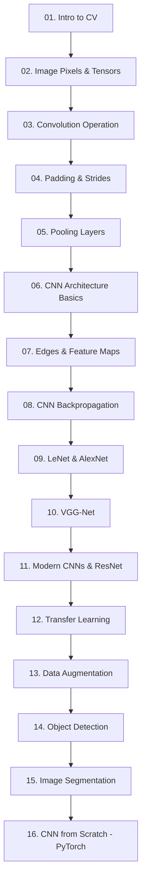

# 🖼️ Computer Vision & Convolutional Neural Networks (CNNs)

Welcome to the **Computer Vision & CNNs** module. This module provides a complete, mathematically rigorous, and code-rich journey from the absolute first principles of images and convolutions to modern deep learning architectures and production-grade Vision pipelines in PyTorch.

---

## 🗺️ Learning Roadmap

This module is structured logically to build pixel-level intuition first, cover core convolution/pooling operators, implement deep CNN structures, explore transfer learning, and touch on advanced detection/segmentation tasks.



---

## 📂 Directory Structure

Below is the file layout of this module:

- 📄 [01-Introduction-To-Computer-Vision.md](./01-Introduction-To-Computer-Vision.md) — Human vision systems, camera models, and early features.
- 📄 [02-Image-Representation-And-Pixels.md](./02-Image-Representation-And-Pixels.md) — Grayscale, RGB, channels, and tensor shapes.
- 📄 [03-Convolution-Operation.md](./03-Convolution-Operation.md) — Math of sliding filters, cross-correlation, and features.
- 📄 [04-Padding-And-Strides.md](./04-Padding-And-Strides.md) — Dimensions calculations, boundary padding, and striding.
- 📄 [05-Pooling-Layers.md](./05-Pooling-Layers.md) — Max, average pooling, and backprop routes.
- 📄 [06-CNN-Architecture-Basics.md](./06-CNN-Architecture-Basics.md) — Stacking convolutional blocks and fully connected outputs.
- 📄 [07-Edge-Detection-And-Feature-Maps.md](./07-Edge-Detection-And-Feature-Maps.md) — Sobel operators, gradients, and layer-wise maps.
- 📄 [08-CNN-Backpropagation.md](./08-CNN-Backpropagation.md) — Math of gradients through convolutions and weight sharing.
- 📄 [09-LeNet-And-AlexNet.md](./09-LeNet-And-AlexNet.md) — Historical milestone networks.
- 📄 [10-VGG-Net.md](./10-VGG-Net.md) — Architecture of stacked 3x3 convolutions.
- 📄 [11-Modern-CNN-Architectures.md](./11-Modern-CNN-Architectures.md) — ResNet skip connections, DenseNet, and EfficientNet.
- 📄 [12-Transfer-Learning.md](./12-Transfer-Learning.md) — Fine-tuning vs. Feature Extraction, layer freezing.
- 📄 [13-Data-Augmentation.md](./13-Data-Augmentation.md) — Regularizing vision networks with spatial and color transformations.
- 📄 [14-Object-Detection-Introduction.md](./14-Object-Detection-Introduction.md) — Bounding boxes, IoU, and detection frameworks.
- 📄 [15-Image-Segmentation-Introduction.md](./15-Image-Segmentation-Introduction.md) — Pixel-wise classification, semantic vs. instance segmentation.
- 📄 [16-CNN-From-Scratch-PyTorch.md](./16-CNN-From-Scratch-PyTorch.md) — Implementation pipeline from scratch.

### 📓 Interactive Notebooks (`notebooks/`)
1. 📓 [CNN_Basics_From_Scratch.ipynb](./notebooks/CNN_Basics_From_Scratch.ipynb)
2. 📓 [Image_Classification_CNN.ipynb](./notebooks/Image_Classification_CNN.ipynb)
3. 📓 [Transfer_Learning_Exploration.ipynb](./notebooks/Transfer_Learning_Exploration.ipynb)

### 🛠️ Mini Projects (`projects/`)
1. 📂 [01-CIFAR10-Classifier](./projects/01-CIFAR10-Classifier/) — CNN image classification in PyTorch vs. MLP performance.
2. 📂 [02-Transfer-Learning-Project](./projects/02-Transfer-Learning-Project/) — Fine-tuning ResNet/VGG on custom datasets.
3. 📂 [03-Data-Augmentation-Study](./projects/03-Data-Augmentation-Study/) — Comparative convergence study of models trained with and without augmentations.
4. 📂 [04-Edge-Detection-Visualizer](./projects/04-Edge-Detection-Visualizer/) — Implementing manual Sobel filter operations and visualizing convolution output maps.

---

## 🚀 Setup & Installation

To run the interactive notebooks and project files locally, setup your virtual environment and install the required dependencies:

```bash
# Create virtual environment
python -m venv venv

# Activate virtual environment (Windows)
.\venv\Scripts\activate

# Install required dependencies
pip install numpy matplotlib torch torchvision opencv-python
```

---

[← Return to Root Index](../README.md) | [Next: Introduction To Computer Vision →](./01-Introduction-To-Computer-Vision.md)
