# Module 07: Computer Vision & Convolutional Neural Networks (CNNs)

> [!IMPORTANT]
> Welcome to the Computer Vision module. Here, you will learn how to give computers the ability to see, understand, and interpret the visual world.

This module is designed to bridge the gap between theoretical Deep Learning and real-world Computer Vision engineering. We focus on **first principles**, ensuring you understand *why* modern CNNs work before learning *how* to build them.

---

## 🎯 Learning Outcomes

After completing this module, you will understand:
* **Image Representation**: How pixels, channels, and color spaces form data.
* **Convolutional Operations**: The mathematics of sliding windows and feature extraction.
* **CNN Architectures**: How models evolved from LeNet (1998) to modern EfficientNets.
* **Transfer Learning**: How to fine-tune massive pre-trained models on small datasets.
* **Explainable AI**: Using Grad-CAM to visualize what your CNN is looking at.
* **Deployment**: Strategies for taking models out of Jupyter and into production.

---

## 🗺️ Visual Learning Roadmap

```mermaid
graph TD
    A[1. Images & Pixels] --> B[2. Convolution & Filters]
    B --> C[3. Feature Maps & Pooling]
    C --> D[4. Building Your First CNN]
    D --> E[5. Training Pipelines]
    E --> F[6. Modern Architectures]
    F --> G[7. Transfer Learning]
    G --> H[8. Explainable AI / Grad-CAM]
    H --> I[9. Advanced Vision: Detection & Segmentation]
    
    style A fill:#34495e,stroke:#fff
    style D fill:#2980b9,stroke:#fff
    style G fill:#27ae60,stroke:#fff
    style I fill:#8e44ad,stroke:#fff
```

---

## 📚 Study Guide & Topic Navigation

Follow these lessons in order. We start at the beginner level and systematically move to advanced industry concepts.

### 🟢 Beginner Fundamentals
* [01. Introduction To Computer Vision](./01-Introduction-To-Computer-Vision.md)
* [02. Images As Data](./02-Images-As-Data.md)
* [03. Why Traditional ML Struggles With Images](./03-Why-Traditional-ML-Struggles-With-Images.md)
* [04. Convolution Operation](./04-Convolution-Operation.md)

### 🟡 Intermediate Architecture
* [05. Filters And Feature Maps](./05-Filters-And-Feature-Maps.md)
* [06. Pooling Layers](./06-Pooling-Layers.md)
* [07. Building The First CNN](./07-Building-The-First-CNN.md)
* [08. CNN Training Pipeline](./08-CNN-Training-Pipeline.md)
* [09. Activation Functions In CNNs](./09-Activation-Functions-In-CNNs.md)

### 🔴 Advanced & Industry Workflows
* [10. Modern CNN Architectures](./10-Modern-CNN-Architectures.md)
* [11. Transfer Learning](./11-Transfer-Learning.md)
* [12. Image Augmentation](./12-Image-Augmentation.md)
* [13. CNN Debugging And Best Practices](./13-CNN-Debugging-And-Best-Practices.md)
* [14. Visualizing CNN Predictions](./14-Visualizing-CNN-Predictions.md)
* [15. Introduction To Object Detection](./15-Introduction-To-Object-Detection.md)
* [16. Introduction To Image Segmentation](./16-Introduction-To-Image-Segmentation.md)

### 📓 Extended Topics (Legacy / Deep Dives)
* [17. Padding And Strides](./17-Padding-And-Strides.md)
* [18. CNN Backpropagation](./18-CNN-Backpropagation.md)
* [19. LeNet And AlexNet](./19-LeNet-And-AlexNet.md)
* [20. VGG Net](./20-VGG-Net.md)
* [21. CNN From Scratch PyTorch](./21-CNN-From-Scratch-PyTorch.md)

---

## 💻 Recommended Notebooks

Do not just read the markdown. Get your hands dirty with these interactive labs located in the `/notebooks` folder:

1. **CNN Fundamentals Lab**: Interactive visual learning of convolutions.
2. **Convolution Playground**: Experiment with kernels and edge detection.
3. **CNN From Scratch Lab**: Build, train, and visualize a CNN.
4. **CNN Architectures Comparison**: Benchmark famous models.
5. **Transfer Learning Lab**: Feature extraction and fine-tuning.
6. **Grad-CAM Visualization Lab**: See exactly what your model sees.

---

## 🏆 Project Showcase

To truly master Computer Vision, you must build end-to-end systems. Complete these projects in order (located in the `/projects` folder):

| Level | Project | Description |
| :--- | :--- | :--- |
| 🟢 | **[01. Handwritten Digit Recognition](./projects/01-Handwritten-Digit-Recognition)** | Build a baseline CNN classifier for MNIST with an evaluation dashboard. |
| 🟡 | **[02. Cat vs Dog Classifier](./projects/02-Cat-vs-Dog-Classifier)** | Use transfer learning and heavy augmentation to build a robust binary classifier. |
| 🟡 | **[03. Plant Disease Detection](./projects/03-Plant-Disease-Detection)** | Solve a real-world agricultural problem using fine-tuned architectures. |
| 🔴 | **[04. Face Mask Detection](./projects/04-Face-Mask-Detection)** | Integrate your CNN with OpenCV for real-time webcam inference. |
| 🔴 | **[05. Image Classification Web App](./projects/05-Image-Classification-Web-App)** | Build a full Streamlit interface where users can upload images for prediction. |
| 🔴 | **[06. Architecture Benchmark Suite](./projects/06-CNN-Architecture-Benchmark-Suite)** | Code a rigorous testing framework to compare inference speed, accuracy, and memory. |

---

## 💼 Skills Gained

By the end of this module, your portfolio will reflect the following competencies:

* **Technical Skills**: PyTorch/TensorFlow CNN Implementation, OpenCV, Image Processing, Matrix Operations.
* **Industry Skills**: Transfer Learning, GPU Memory Management, Handling Imbalanced Image Datasets.
* **Interview Skills**: Explaining Receptive Fields, Vanishing Gradients, and Architecture Evolution.
* **Portfolio Skills**: End-to-end deployed web apps and real-time inference pipelines.

> [!TIP]  
> **Prerequisites:** Ensure you have completed the Neural Networks Foundations module before beginning. You should be comfortable with basic Backpropagation, Loss Functions, and standard Data Loaders.

**Estimated Study Time:** 3-4 Weeks.

[Return to Main Roadmap](../README.md)
