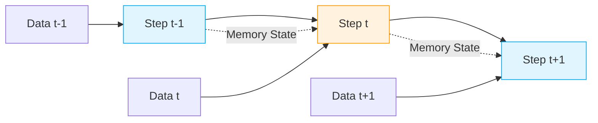

# 01 - Introduction To Sequential Data

> **Difficulty**: ⭐☆☆☆☆ Beginner | **Prerequisites**: None | **Estimated Reading Time**: 15 Minutes

---

## 📋 Table of Contents
1. [What Problem Does This Solve?](#1-what-problem-does-this-solve)
2. [Intuition](#2-intuition)
3. [Core Concepts](#3-core-concepts)
4. [Mathematics](#4-mathematics)
5. [Algorithm Workflow](#5-algorithm-workflow)
6. [Advantages and Limitations](#6-advantages-and-limitations)
7. [Industry Applications](#7-industry-applications)
8. [Interview Questions](#8-interview-questions)
9. [Key Takeaways](#9-key-takeaways)
10. [Next Topic](#10-next-topic)

---

# 1. What Problem Does This Solve?

Before we dive into the mathematics of Recurrent Neural Networks or the complexities of Transformers, we must define the problem space.

### 🟢 Beginner
Imagine trying to understand a movie by looking at a random pile of still frames scattered on the floor. You might recognize characters, but you would have absolutely no idea what the plot is. To understand the story, you must watch the frames *in order*. 

### 🟡 Intermediate
In traditional Machine Learning (like predicting house prices or classifying images), we operate under the assumption that data points are **Independent and Identically Distributed (I.I.D.)**. The price of House A has nothing to do with House B.

Sequential data breaks this fundamental assumption. Sequential data is any dataset where the **order of the elements is fundamental to the meaning of the data itself**. If you scramble the order, you destroy the meaning. We need models that understand *time* and *context*, rather than just isolated features.

### 🔴 Advanced
Formally, in sequential data, the probability distribution of a data point $x_t$ is conditionally dependent on previous data points $x_{t-1}, x_{t-2}, \dots, x_1$. 
Standard feedforward networks model $P(y | x)$. 
Sequential models must model the joint probability $P(x_1, x_2, \dots, x_T)$ or conditional probability $P(x_t | x_{<t})$.

---

# 2. Intuition

To truly understand why we need special architectures for sequences, consider the following two sentences:

1. **"The dog chased the cat."**
2. **"The cat chased the dog."**

Both sentences contain the exact same words. A traditional "Bag of Words" approach (which simply counts word frequencies) would represent both sentences identically:
`{"The": 2, "dog": 1, "chased": 1, "cat": 1}`

However, the meaning is entirely reversed based purely on the **order** of the words. Sequence models exist entirely to capture this contextual flow.

---

# 3. Core Concepts

There are several main types of sequential data that we encounter in Machine Learning:

### 🟢 Text (Natural Language Processing)
Language is inherently sequential. Words are spoken or written one after the other to form a coherent thought. Example: "I loved the movie."

### 🟡 Time Series Data
Any metric recorded at regular time intervals. The value at time $t$ is highly correlated with time $t-1$. Example: Stock market prices, server CPU usage, weather forecasting.

### 🔴 Continuous Signals (Audio/Video)
Sound is a continuous wave recorded over time. Speech recognition systems must process sequential audio frames to map them to phonemes and words. A video is a sequence of images ordered over time.

---

# 4. Mathematics

While the deep math comes later, the mathematical definition of a sequence is simple.

A sequence is an ordered set of vectors over time $T$:
$$X = (x^{\langle 1 \rangle}, x^{\langle 2 \rangle}, \dots, x^{\langle T \rangle})$$

Where:
- $X$ is the complete sequence (e.g., a sentence).
- $x^{\langle t \rangle}$ is the specific element at time step $t$ (e.g., the $t$-th word).
- $T$ is the total length of the sequence. Note that $T$ can vary drastically between different sequences!

---

# 5. Algorithm Workflow

When processing sequential data, the model must maintain a "state" or memory as it steps through time.

Unlike an image classifier that sees the whole image at once, a standard sequence model processes data step-by-step, updating its internal understanding as it goes.

---

# 6. Advantages and Limitations

Why is sequential modeling so challenging?

| Advantages of Sequence Data | Limitations & Challenges |
| --------------------------- | ------------------------ |
| Contains rich context and temporal dynamics | Variable lengths require complex padding logic |
| Can forecast into the future | Models suffer from short-term memory loss |
| Mimics human reasoning (speech/reading) | Inherently difficult to parallelize on GPUs |

---

# 7. Industry Applications

Sequential data is arguably the most lucrative area of modern AI:

* **Finance**: Algorithmic trading predicting stock prices based on historical ticks.
* **Healthcare**: Predicting patient mortality based on a sequence of ICU vital signs.
* **E-Commerce**: Recommender systems analyzing the sequence of products a user clicked.
* **NLP**: ChatGPT and Large Language Models generating text word-by-word.

---

# 8. Interview Questions

### Beginner
**Q: What is the defining characteristic of sequential data?**
A: The order of the data points matters. Scrambling the data destroys its meaning.

### Intermediate
**Q: Why does a standard Multilayer Perceptron (MLP) struggle with sequential data?**
A: MLPs assume inputs are independent and require fixed-size inputs. Sequential data points are highly dependent on previous points, and sequence lengths vary.

### Advanced
**Q: Explain the difference between modeling $P(y|x)$ and $P(x_t | x_{<t})$.**
A: $P(y|x)$ is standard classification mapping a fixed input to a label. $P(x_t | x_{<t})$ is autoregressive sequence modeling, predicting the next element in a series conditioned on all previous elements.

---

# 9. Key Takeaways

* **Sequential data** breaks the traditional I.I.D. assumption of machine learning.
* The meaning of the data is inherently tied to its **order**.
* Text, audio, video, and time series are the most common examples.
* We must design specialized neural network architectures that can handle variable lengths and maintain a "memory" of the past.

---

# 10. Next Topic

We know what sequential data is. Now we must formally understand exactly *why* our standard Multilayer Perceptrons (MLPs) and Convolutional Neural Networks (CNNs) fail to process it effectively.

[← Back to Index](README.md) | [Next Topic: Limitations Of Traditional Neural Networks →](02-Limitations-Of-Traditional-Neural-Networks.md)
