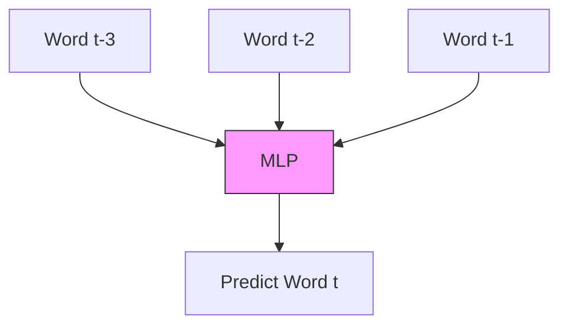

# 02 - Limitations Of Traditional Neural Networks

> **Difficulty**: ⭐⭐☆☆☆ Beginner/Intermediate | **Prerequisites**: 06-Neural-Networks-Foundations | **Estimated Reading Time**: 15 Minutes

---

## 📋 Table of Contents
1. [What Problem Does This Solve?](#1-what-problem-does-this-solve)
2. [Intuition](#2-intuition)
3. [Core Concepts](#3-core-concepts)
4. [Mathematics: The Parameter Explosion](#4-mathematics-the-parameter-explosion)
5. [Algorithm Workflow: Attempting the N-Gram Fix](#5-algorithm-workflow-attempting-the-n-gram-fix)
6. [Failure Cases](#6-failure-cases)
7. [Interview Questions](#7-interview-questions)
8. [Key Takeaways](#8-key-takeaways)
9. [Next Topic](#9-next-topic)

---

# 1. What Problem Does This Solve?

Before we design specialized sequence models like RNNs or Transformers, we must rigorously prove why our existing models (Multilayer Perceptrons and Convolutional Neural Networks) fail when processing sequences.

### 🟢 Beginner
If you ask a standard image classifier to look at a picture of a dog, it will output "Dog". If you ask it to look at a picture of a cat immediately afterward, it outputs "Cat". It instantly forgets the dog. It has no memory. It cannot connect the two images to understand that they are playing together. 

### 🟡 Intermediate
Traditional neural networks have two fatal flaws when applied to sequences:
1. **Fixed Input Sizes**: They require exactly $N$ inputs (e.g., exactly 10 features, or exactly a 256x256 image). Sequences are naturally variable in length.
2. **No Temporal Sharing**: They process inputs independently and do not share learned features across time steps.

### 🔴 Advanced
A standard feedforward network maps a vector $x \in \mathbb{R}^d$ to a vector $y \in \mathbb{R}^k$ using a fixed set of weights $\mathbf{W}$. Because the dimensions of $\mathbf{W}$ are fixed during initialization, the model mathematically cannot accept an input vector of dimension $d+1$. Furthermore, the lack of hidden state transitions prevents the modeling of Markovian or non-Markovian temporal dependencies.

---

# 2. Intuition

Imagine trying to read a book, but after reading each word, your memory is completely wiped. 

> *"I grew up in France, so I speak fluent ____"*

When you get to the blank, you need to predict the next word. But because your memory was wiped, you have completely forgotten the word "France". You might guess "English", "Spanish", or "Gibberish". 

A traditional neural network suffers from this exact form of amnesia. It has no mechanism to carry information (context) from step $t-1$ to step $t$.

---

# 3. Core Concepts

There are three primary reasons MLPs and CNNs fail on sequences.

### 🟢 The Variable Length Problem
A movie review might be 5 words long, or it might be 500 words long. An MLP cannot handle this. If we set the MLP to accept exactly 50 words, we have to artificially pad short reviews with zeros, and truncate long reviews, destroying information.

### 🟡 The Independence Assumption
When an MLP processes data point $x_t$, it assumes it has zero relationship to $x_{t-1}$. In sequences, the highest predictor of $x_t$ is almost always $x_{t-1}$.

### 🔴 The Lack of Parameter Sharing
If an MLP learns that the word "Apple" at position 1 refers to a fruit, it has to completely re-learn that "Apple" at position 10 also refers to a fruit. The weights are bound to spatial positions, not to the temporal features.

---

# 4. Mathematics: The Parameter Explosion

Suppose we try to force an MLP to accept variable sequences by just making the input layer incredibly large (e.g., accepting up to 100 words at once, padded with zeros).

Let's calculate the size of this network:
1. Represent each word as a 300-dimensional embedding vector: $d_{embed} = 300$
2. Set the maximum sequence length to 100 words: $T = 100$
3. The total input dimension is: $d_{in} = 300 \times 100 = 30,000$ neurons.

If our first hidden layer has 1,000 neurons, the weight matrix $\mathbf{W}^{(1)}$ for just the first layer will be:
$$\mathbf{W}^{(1)} \in \mathbb{R}^{30000 \times 1000}$$
Total parameters in layer 1 alone = **$30,000,000$ parameters**.

This leads to massive models that overfit immediately, train incredibly slowly, and still fail to understand that a word shifted by one position means the exact same thing!

---

# 5. Algorithm Workflow: Attempting the N-Gram Fix

What if we try to solve the parameter problem by using a sliding window? We could train an MLP to look at only the *last 3 words* to predict the 4th word.

This is called an *n-gram* or Markov approach. 

**Why it still fails:**
1. **Limited Context**: If the clue was 10 words ago (like the "France" example), the sliding window of size 3 completely misses it.
2. **Hard Cutoff**: If we increase the window size to 10 to catch more context, we run straight back into the parameter explosion problem.

---

# 6. Failure Cases

When you attempt to use traditional MLPs for sequential tasks (like predicting the stock market by just throwing the last 10 days of prices into an MLP), the failure modes are predictable:

* **Overfitting**: Because of the lack of parameter sharing, the model memorizes exact spatial patterns rather than temporal trends.
* **Shift Intolerance**: If a trend happens one day later than it did in the training set, the MLP will completely fail to recognize it, because the values hit different input neurons.

---

# 7. Interview Questions

### Beginner
**Q: Why can't we use a standard image classification CNN to translate text?**
A: A standard CNN requires fixed-size inputs and outputs, and doesn't maintain a memory state to track the sequence of words over time.

### Intermediate
**Q: Explain the problem with using a sliding window MLP (n-gram model) for language modeling.**
A: A sliding window MLP has a hard cutoff for context. If long-term dependencies exist outside the window, the model cannot capture them. Furthermore, it suffers from a lack of parameter sharing across positions.

---

# 8. Key Takeaways

* Traditional MLPs and CNNs require rigid, **fixed-length inputs**.
* They have **no internal memory** to pass context between sequence steps.
* Forcing them to accept sequences leads to **parameter explosion**.
* Sliding window approaches severely limit historical context and fail to share learned features across time.

---

# 9. Next Topic

We've established that we need a network architecture that can:
1. Accept sequences of any length.
2. Share parameters across time steps to prevent parameter explosion.
3. Most importantly, maintain a "memory" of what it saw previously.

Enter the Recurrent Neural Network.

[← Introduction to Sequential Data](01-Introduction-To-Sequential-Data.md) | [Back to Index](README.md) | [Next Topic: Recurrent Neural Networks (RNNs) →](03-Recurrent-Neural-Networks-RNNs.md)
