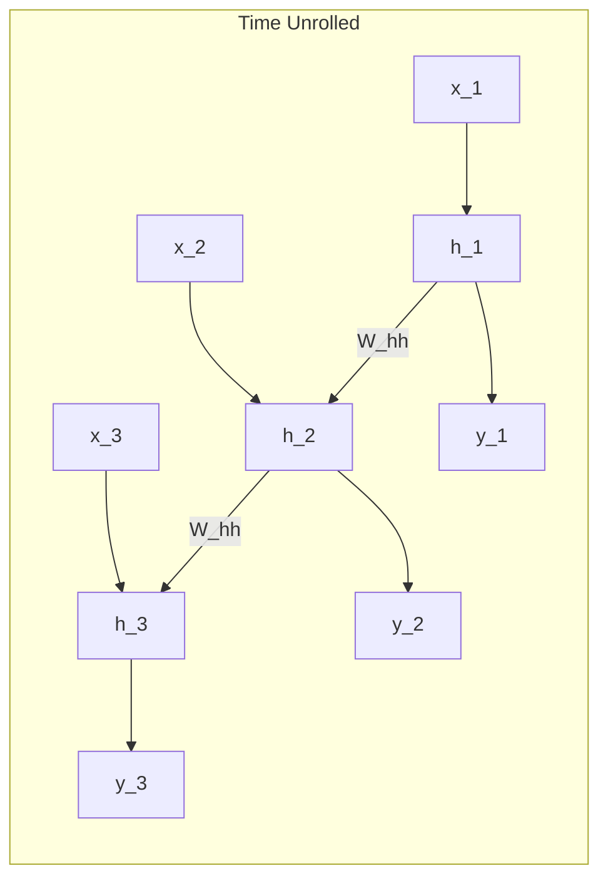

# 03 - Recurrent Neural Networks (RNNs)

> **Difficulty**: ⭐⭐⭐☆☆ Intermediate | **Prerequisites**: Matrix Math, MLP Basics | **Estimated Reading Time**: 30 Minutes

---

## 📋 Table of Contents
1. [What Problem Does This Solve?](#1-what-problem-does-this-solve)
2. [Intuition](#2-intuition)
3. [Core Concepts](#3-core-concepts)
4. [Mathematics](#4-mathematics)
5. [Algorithm Workflow](#5-algorithm-workflow)
6. [From Scratch Implementation](#6-from-scratch-implementation)
7. [Library Implementation](#7-library-implementation)
8. [Advantages and Limitations](#8-advantages-and-limitations)
9. [Interview Questions](#9-interview-questions)
10. [Key Takeaways](#10-key-takeaways)
11. [Next Topic](#11-next-topic)

---

# 1. What Problem Does This Solve?

Traditional feedforward neural networks (like MLPs and CNNs) assume that all inputs are independent of each other, and they require fixed-size inputs.

### 🟢 Beginner
If you're reading a book, you don't start from scratch at every single word. You understand the current word based on your memory of the previous words. Traditional Neural Networks cannot do this. They read a word, output a guess, and immediately wipe their memory blank. RNNs fix this by adding a "memory loop".

### 🟡 Intermediate
We need an architecture that can process variable-length sequences (sentences of 5 words or 500 words) while explicitly maintaining a state or "context" vector that carries information from time step $t-1$ to time step $t$.

### 🔴 Advanced
We need an architecture that uses **parameter sharing** across time. Instead of learning separate weights for position 1, position 2, and position 3, the network should apply the exact same function (with the exact same weights) at every time step, allowing it to generalize to sequences of lengths it has never seen during training.

---

# 2. Intuition

Imagine you are trying to guess the next note in a melody.
To guess the next note, you need to hear the current note. But the current note alone isn't enough; you also need to remember the "tune" that has been playing up until now.

An RNN works exactly like this. At every beat (time step), the RNN listens to two things:
1. The **Current Input** (the note playing right now).
2. The **Hidden State** (its memory of the tune so far).

It combines them to make a prediction, and updates its memory for the next beat.

---

# 3. Core Concepts

### 🟢 The Hidden State (Memory)
The core innovation of the RNN is the **Hidden State** ($h^{\langle t \rangle}$). You can think of the hidden state as the network's short-term memory. At time $t$, it summarizes everything the network has seen from time $1$ to $t-1$.

### 🟡 Sequence Modeling Types
Because the RNN loops over time, we can arrange the inputs and outputs to solve completely different families of problems:
- **Many-to-One**: Read a whole sentence, output one Sentiment Score at the end.
- **One-to-Many**: Read one Image, output a sequence of words (Captioning).
- **Many-to-Many**: Translate a French sequence to an English sequence.

### 🔴 Parameter Sharing
An RNN uses the *exact same weight matrices* at every single time step. This drastically reduces the number of parameters the network needs to learn compared to a giant MLP, preventing overfitting.

---

# 4. Mathematics

Let's look under the hood. At time step $t$, the RNN receives the input $x^{\langle t \rangle}$ and the previous hidden state $h^{\langle t-1 \rangle}$.

It calculates the new hidden state using this formula:
$$h^{\langle t \rangle} = \tanh(\mathbf{W}_{hh} h^{\langle t-1 \rangle} + \mathbf{W}_{hx} x^{\langle t \rangle} + \mathbf{b}_h)$$

**Variables:**
- $\mathbf{W}_{hx}$: The weight matrix applied to the current input.
- $\mathbf{W}_{hh}$: The weight matrix applied to the previous hidden state.
- $\mathbf{b}_h$: The bias vector.
- $\tanh$: The activation function (keeps values squished between -1 and 1 to prevent numbers from blowing up to infinity).

To make a prediction $\hat{y}^{\langle t \rangle}$ at time $t$, we apply another weight matrix to the new hidden state:
$$\hat{y}^{\langle t \rangle} = \text{Softmax}(\mathbf{W}_{yh} h^{\langle t \rangle} + \mathbf{b}_y)$$

---

# 5. Algorithm Workflow

The unrolled workflow of an RNN looks like a deep neural network laid out horizontally over time.



Input $\rightarrow$ Update Memory $\rightarrow$ Output Prediction $\rightarrow$ Pass Memory to Next Step.

---

# 6. From Scratch Implementation

Let's build a single Vanilla RNN step in pure Python/NumPy to see how simple the math actually is.

```python
import numpy as np

class NumpyRNNCell:
    def __init__(self, input_size, hidden_size):
        # Initialize weights randomly
        self.W_hx = np.random.randn(hidden_size, input_size) * 0.01
        self.W_hh = np.random.randn(hidden_size, hidden_size) * 0.01
        self.b_h = np.zeros((hidden_size, 1))
        
    def forward(self, x_t, h_prev):
        # 1. Apply weights to previous hidden state
        hidden_term = np.dot(self.W_hh, h_prev)
        
        # 2. Apply weights to current input
        input_term = np.dot(self.W_hx, x_t)
        
        # 3. Add them together with bias, and apply Tanh
        h_t = np.tanh(hidden_term + input_term + self.b_h)
        
        return h_t

# Example usage:
input_dim = 10
hidden_dim = 20

rnn_cell = NumpyRNNCell(input_dim, hidden_dim)

# Dummy data
x_t = np.random.randn(input_dim, 1)        # Current word embedding
h_prev = np.zeros((hidden_dim, 1))         # Previous memory (zeros at start)

new_memory = rnn_cell.forward(x_t, h_prev)
print(f"New Hidden State Shape: {new_memory.shape}") # (20, 1)
```

---

# 7. Library Implementation

In practice, you should never write an RNN in NumPy. We use PyTorch.

```python
import torch
import torch.nn as nn

class SimpleVanillaRNN(nn.Module):
    def __init__(self, input_size, hidden_size, output_size):
        super().__init__()
        
        # batch_first=True means inputs are shaped (batch, sequence_length, features)
        self.rnn = nn.RNN(input_size, hidden_size, batch_first=True)
        self.fc = nn.Linear(hidden_size, output_size)
        
    def forward(self, x):
        # out contains all hidden states across time
        # h_n contains just the final hidden state
        out, h_n = self.rnn(x)
        
        # If we are doing Many-to-One classification, we just want the final hidden state
        final_state = out[:, -1, :]
        prediction = self.fc(final_state)
        return prediction
```

---

# 8. Advantages and Limitations

| Advantages | Limitations |
| ---------- | ----------- |
| Can handle variable-length sequences. | Cannot look "forward" into the future (unless Bidirectional). |
| Massive parameter reduction via weight sharing. | Very slow to train (cannot parallelize steps on GPU). |
| Theoretically infinite memory length. | **Vanishing Gradient Problem** severely limits practical memory. |

---

# 9. Interview Questions

### Beginner
**Q: What is the purpose of the hidden state in an RNN?**
A: It acts as the network's short-term memory, carrying context from previous time steps to help process the current time step.

### Intermediate
**Q: Why do RNNs share weights across time steps?**
A: To allow the network to handle sequences of any length without parameter explosion, and to ensure the network recognizes patterns regardless of where they appear in the sequence.

### Advanced
**Q: Why is the `tanh` activation function used inside the RNN cell instead of `ReLU`?**
A: Because the hidden state is repeatedly multiplied by the weight matrix $\mathbf{W}_{hh}$ over many time steps. Without an activation function that squishes values between -1 and 1, the hidden state values would exponentially explode to infinity. `ReLU` does not bound positive values, making explosion highly likely in vanilla RNNs.

---

# 10. Key Takeaways

* RNNs solve the sequence problem by maintaining a **Hidden State** (memory).
* At step $t$, the model processes both the current input and the previous hidden state.
* RNNs share the exact same weights across all time steps, preventing parameter explosion.
* By altering how we read inputs and outputs, RNNs can handle One-to-Many, Many-to-One, and Many-to-Many tasks.

---

# 11. Next Topic

We know how an RNN processes data during the forward pass. But how on earth do we train a model that loops back on itself? We have to "unroll" it through time.

[← Limitations Of Traditional Neural Networks](02-Limitations-Of-Traditional-Neural-Networks.md) | [Back to Index](README.md) | [Next Topic: RNN Training & BPTT →](04-RNN-Training-And-BPTT.md)
