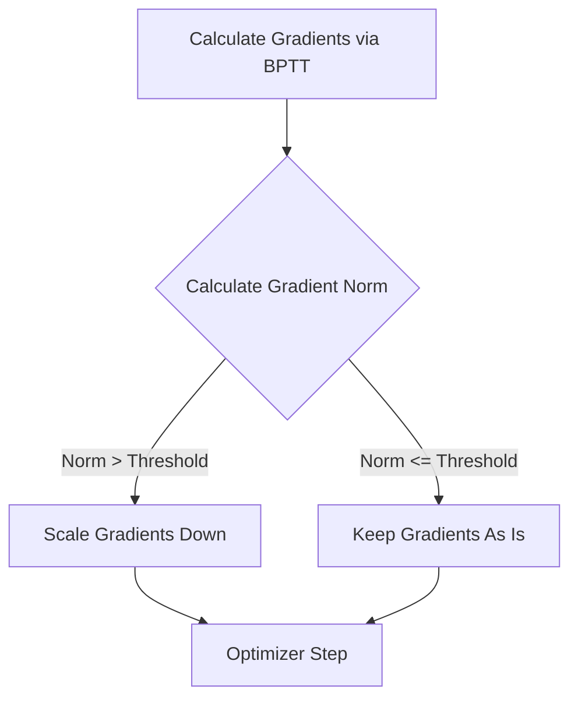

# 05 - Vanishing And Exploding Gradients

> **Difficulty**: ⭐⭐⭐⭐☆ Advanced | **Prerequisites**: 04-RNN-Training-And-BPTT | **Estimated Reading Time**: 20 Minutes

---

## 📋 Table of Contents
1. [What Problem Does This Solve?](#1-what-problem-does-this-solve)
2. [Intuition](#2-intuition)
3. [Core Concepts](#3-core-concepts)
4. [Mathematics: The Flaw in the Chain Rule](#4-mathematics-the-flaw-in-the-chain-rule)
5. [Algorithm Workflow: Gradient Clipping](#5-algorithm-workflow-gradient-clipping)
6. [Library Implementation](#6-library-implementation)
7. [Failure Cases](#7-failure-cases)
8. [Interview Questions](#8-interview-questions)
9. [Key Takeaways](#9-key-takeaways)
10. [Next Topic](#10-next-topic)

---

# 1. What Problem Does This Solve?

We have established that RNNs can theoretically remember the past, and that BPTT can theoretically train them. However, in practice, Vanilla RNNs are almost completely useless for sequences longer than 10-20 steps. 

### 🟢 Beginner
If a rumor is passed down a line of 100 people (like the game of Telephone), by the time it reaches the 100th person, the message is either completely lost (Vanishing) or distorted into something wildly dramatic (Exploding). Vanilla RNNs suffer from this exact problem when passing error signals back through time.

### 🟡 Intermediate
To learn long-term dependencies, the gradients from the loss function at the end of the sequence must travel backward through every single time step to update the weights at the beginning of the sequence. Due to repeated multiplication of the same weight matrix, these gradients usually exponentially decay to $0$ or explode to `NaN`.

### 🔴 Advanced
The Jacobian matrix $\frac{\partial h_i}{\partial h_{i-1}}$ dictates how gradients flow backward. If the largest singular value (or eigenvalue) of the recurrent weight matrix $\mathbf{W}_{hh}$ is strictly less than 1, the product of $T$ Jacobians decays exponentially. If it is greater than 1, the product explodes exponentially.

---

# 2. Intuition

Imagine you have a number, let's say $0.9$. 
If you multiply it by itself 10 times: $0.9^{10} \approx 0.34$.
If you multiply it by itself 100 times: $0.9^{100} \approx 0.000026$.

Now imagine you have $1.1$.
If you multiply it by itself 10 times: $1.1^{10} \approx 2.59$.
If you multiply it by itself 100 times: $1.1^{100} \approx 13,780$.

In Backpropagation Through Time, we are multiplying the exact same weight matrix by itself $T$ times. Because it is nearly impossible for the weight matrix to be perfectly balanced at $1.0$, the gradients will always eventually vanish to zero or explode to infinity for long sequences.

---

# 3. Core Concepts

### 🟢 Vanishing Gradients (Amnesia)
When gradients shrink to $0$, the network stops learning. The weights responsible for processing the early parts of the sequence are never updated. The network essentially suffers from "short-term memory loss" and cannot connect the end of a long sentence to the beginning.

### 🟡 Exploding Gradients (Destruction)
When gradients explode, they become massive numbers. When the optimizer takes a step using a massive gradient, it completely destroys the model's carefully learned weights. The loss shoots up to infinity (or `NaN`), and the model breaks.

### 🔴 Gradient Clipping
While we cannot easily fix vanishing gradients without changing the model architecture, we *can* fix exploding gradients using a hack called **Gradient Clipping**. We measure the "size" (norm) of the gradient. If it's too big, we just scale it down before taking a step.

---

# 4. Mathematics: The Flaw in the Chain Rule

Let's look at the BPTT chain rule from the previous lesson:
$$\frac{\partial h^{\langle t \rangle}}{\partial h^{\langle 1 \rangle}} = \prod_{i=2}^{t} \frac{\partial h^{\langle i \rangle}}{\partial h^{\langle i-1 \rangle}}$$

We know that $h^{\langle i \rangle} = \tanh(\mathbf{W}_{hh} h^{\langle i-1 \rangle} + \dots)$.
Taking the derivative, the local Jacobian is:
$$\frac{\partial h^{\langle i \rangle}}{\partial h^{\langle i-1 \rangle}} = \mathbf{W}_{hh}^T \cdot \text{diag}(\tanh'(...))$$

Therefore, the full chain rule is roughly proportional to:
$$\prod_{i=2}^{t} \mathbf{W}_{hh}^T \approx (\mathbf{W}_{hh}^T)^t$$

* If the largest eigenvalue $\lambda < 1$, then $\lim_{t \to \infty} \lambda^t = 0$ (Vanishing).
* If the largest eigenvalue $\lambda > 1$, then $\lim_{t \to \infty} \lambda^t = \infty$ (Exploding).

---

# 5. Algorithm Workflow: Gradient Clipping

To fix exploding gradients, we apply clipping *after* `.backward()` but *before* `.step()`.



**Formula for clipping by norm:**
If $||g|| > \text{threshold}$, then $g \leftarrow g \frac{\text{threshold}}{||g||}$

---

# 6. Library Implementation

In PyTorch, fixing exploding gradients takes exactly one line of code.

```python
import torch
import torch.nn as nn

model = nn.RNN(input_size=10, hidden_size=20)
optimizer = torch.optim.Adam(model.parameters(), lr=0.01)

# Forward and Backward pass
loss = calculate_loss(model)
optimizer.zero_grad()
loss.backward()

# --- GRADIENT CLIPPING ---
# We clip the gradients to a maximum norm of 1.0
nn.utils.clip_grad_norm_(model.parameters(), max_norm=1.0)

# Now it is safe to step!
optimizer.step()
```

---

# 7. Failure Cases

Because of the Vanishing Gradient problem, **Vanilla (Standard) RNNs are almost never used in industry for long sequences**. 

While we can easily fix exploding gradients with clipping, we cannot fix vanishing gradients using a simple hack. The math inherently forces the gradient to shrink. If the gradient vanishes, the model fails to learn long-term grammatical rules, coding syntax, or long-range time-series patterns.

---

# 8. Interview Questions

### Intermediate
**Q: How do you fix Exploding Gradients in an RNN?**
A: By using Gradient Clipping. You calculate the L2 norm of the gradients, and if it exceeds a predefined threshold, you scale the entire gradient vector down so its norm equals the threshold.

### Advanced
**Q: Why doesn't Gradient Clipping fix Vanishing Gradients?**
A: Gradient Clipping only scales down large numbers. It cannot magically create signal out of nothing. If the gradient has vanished to $0.000001$, scaling it up artificially doesn't restore the lost mathematical information about the early sequence steps; it just amplifies noise.

---

# 9. Key Takeaways

* BPTT requires multiplying the recurrent weight matrix by itself for every time step in the sequence.
* **Vanishing Gradients**: Gradients exponentially decay to 0, destroying long-term memory.
* **Exploding Gradients**: Gradients exponentially explode to NaN, destroying model weights.
* Exploding gradients are fixed via **Gradient Clipping**.
* Vanishing gradients cannot be fixed easily, rendering Vanilla RNNs obsolete for long sequences.

---

# 10. Next Topic

To fix the vanishing gradient problem, we must completely change the architecture of the hidden state to create an "uninterrupted highway" for gradients to flow backward. 

In 1997, researchers proposed a radical new architecture to do exactly this.

[← RNN Training & BPTT](04-RNN-Training-And-BPTT.md) | [Back to Index](README.md) | [Next Topic: Long Short-Term Memory (LSTMs) →](06-Long-Short-Term-Memory-LSTMs.md)
