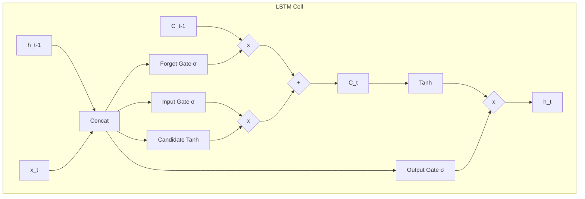

# 06 - Long Short-Term Memory (LSTMs)

> **Difficulty**: ⭐⭐⭐⭐☆ Advanced | **Prerequisites**: 05-Vanishing-And-Exploding-Gradients | **Estimated Reading Time**: 30 Minutes

---

## 📋 Table of Contents
1. [What Problem Does This Solve?](#1-what-problem-does-this-solve)
2. [Intuition](#2-intuition)
3. [Core Concepts](#3-core-concepts)
4. [Mathematics](#4-mathematics)
5. [Algorithm Workflow](#5-algorithm-workflow)
6. [From Scratch Implementation](#6-from-scratch-implementation)
7. [Library Implementation](#7-library-implementation)
8. [Advantages and Limitations](#8-advantages-and-limitations)
9. [Interview Questions](#9-interview-questions)
10. [Key Takeaways](#10-key-takeaways)
11. [Next Topic](#11-next-topic)

---

# 1. What Problem Does This Solve?

We proved in the previous lesson that standard RNNs are completely incapable of learning long-term dependencies because their gradients vanish to zero. 

### 🟢 Beginner
If a standard RNN reads the sentence: *"I grew up in France... [50 words later] ... so I speak fluent ____"*, it will guess "English" because it completely forgot the word "France". LSTMs fix this by adding a dedicated "long-term memory" storage that doesn't get wiped easily.

### 🟡 Intermediate
To solve the vanishing gradient problem, we need a mathematical path where gradients can flow backward through time without being repeatedly multiplied by weights $\mathbf{W} < 1$. We need an uninterrupted "highway" running through the network.

### 🔴 Advanced
Hochreiter and Schmidhuber (1997) proposed the LSTM. Instead of just a single hidden state $h^{\langle t \rangle}$, an LSTM introduces a second state: the **Cell State** ($C^{\langle t \rangle}$). The Cell State operates using only linear addition and pointwise multiplication. Because the derivative of addition is 1, gradients can flow down the Cell State backward through time indefinitely without vanishing!

---

# 2. Intuition

Think of an LSTM as a conveyor belt (the Cell State) running straight through a factory.

As the conveyor belt passes by, workers stand beside it. 
- Worker 1 (Forget Gate) decides if any old trash on the belt needs to be thrown off.
- Worker 2 (Input Gate) decides if any new, valuable parts should be placed onto the belt.
- Worker 3 (Output Gate) looks at the current belt and decides what the factory should actually output right now.

Because the belt itself just runs straight through, nothing gets lost unless a worker explicitly chooses to throw it away.

---

# 3. Core Concepts

### 🟢 The Two States
An LSTM has two distinct memory streams:
1. $h^{\langle t \rangle}$: The **Hidden State** (Short-term memory, outputted to the next layer).
2. $C^{\langle t \rangle}$: The **Cell State** (Long-term memory, the "conveyor belt").

### 🟡 The Three Gates
LSTMs control the flow of information using **Gates**. A gate is a neural network layer with a Sigmoid activation, outputting numbers between $0$ and $1$. 
- `0` means *"let nothing through"*.
- `1` means *"let everything through"*.

1. **Forget Gate**: What do we erase from the past?
2. **Input Gate**: What new information do we write?
3. **Output Gate**: What part of the long-term memory do we reveal right now?

### 🔴 The Candidate Cell
Before the Input Gate decides *how much* to write, we generate a vector of *what* we could potentially write. This is the **Candidate Cell** ($\tilde{C}^{\langle t \rangle}$), generated using a Tanh activation to keep values between -1 and 1.

---

# 4. Mathematics

Let's walk through the math step-by-step for a single time step $t$.

**Inputs:** $x^{\langle t \rangle}$ (Current data) and $h^{\langle t-1 \rangle}$ (Previous short-term memory).

**1. Forget Gate ($f_t$)**
$$f^{\langle t \rangle} = \sigma(\mathbf{W}_f [h^{\langle t-1 \rangle}, x^{\langle t \rangle}] + \mathbf{b}_f)$$

**2. Input Gate ($i_t$) & Candidate Cell ($\tilde{C}_t$)**
$$i^{\langle t \rangle} = \sigma(\mathbf{W}_i [h^{\langle t-1 \rangle}, x^{\langle t \rangle}] + \mathbf{b}_i)$$
$$\tilde{C}^{\langle t \rangle} = \tanh(\mathbf{W}_c [h^{\langle t-1 \rangle}, x^{\langle t \rangle}] + \mathbf{b}_c)$$

**3. Updating the Cell State ($C_t$)**
This is the most important equation in the LSTM. We multiply the old state by the forget gate, and add the new candidate scaled by the input gate.
$$C^{\langle t \rangle} = f^{\langle t \rangle} * C^{\langle t-1 \rangle} + i^{\langle t \rangle} * \tilde{C}^{\langle t \rangle}$$

**4. Output Gate ($o_t$) & New Hidden State ($h_t$)**
$$o^{\langle t \rangle} = \sigma(\mathbf{W}_o [h^{\langle t-1 \rangle}, x^{\langle t \rangle}] + \mathbf{b}_o)$$
$$h^{\langle t \rangle} = o^{\langle t \rangle} * \tanh(C^{\langle t \rangle})$$

*(Note: $*$ denotes Hadamard / element-wise multiplication).*

---

# 5. Algorithm Workflow



---

# 6. From Scratch Implementation

Let's implement a single LSTM step in pure NumPy to solidify the math.

```python
import numpy as np

def sigmoid(x): return 1 / (1 + np.exp(-x))

class NumpyLSTMCell:
    def __init__(self, input_size, hidden_size):
        self.h_size = hidden_size
        concat_size = input_size + hidden_size
        
        # Initialize weights for the 4 operations (f, i, C, o)
        self.W_f = np.random.randn(hidden_size, concat_size)
        self.W_i = np.random.randn(hidden_size, concat_size)
        self.W_c = np.random.randn(hidden_size, concat_size)
        self.W_o = np.random.randn(hidden_size, concat_size)
        
    def forward(self, x_t, h_prev, c_prev):
        # Concatenate x_t and h_prev vertically
        concat = np.vstack((h_prev, x_t))
        
        # 1. Forget Gate
        f_t = sigmoid(np.dot(self.W_f, concat))
        
        # 2. Input Gate and Candidate
        i_t = sigmoid(np.dot(self.W_i, concat))
        c_tilde = np.tanh(np.dot(self.W_c, concat))
        
        # 3. Update Cell State
        c_t = (f_t * c_prev) + (i_t * c_tilde)
        
        # 4. Output Gate and Hidden State
        o_t = sigmoid(np.dot(self.W_o, concat))
        h_t = o_t * np.tanh(c_t)
        
        return h_t, c_t
```

---

# 7. Library Implementation

In PyTorch, LSTMs are as easy as Vanilla RNNs. The only difference is that `.forward()` returns a tuple of `(hidden_state, cell_state)` instead of just `hidden_state`.

```python
import torch
import torch.nn as nn

class SentimentLSTM(nn.Module):
    def __init__(self, input_size, hidden_size, output_size):
        super().__init__()
        self.lstm = nn.LSTM(input_size, hidden_size, batch_first=True)
        self.fc = nn.Linear(hidden_size, output_size)
        
    def forward(self, x):
        # PyTorch returns (out, (h_n, c_n))
        out, (h_n, c_n) = self.lstm(x)
        
        # Pass the final hidden state to the classifier
        prediction = self.fc(h_n[-1])
        return prediction
```

---

# 8. Advantages and Limitations

| Advantages | Limitations |
| ---------- | ----------- |
| Eliminates the Vanishing Gradient problem. | Much slower to train than Vanilla RNNs. |
| Can learn extremely long-term dependencies (100+ steps). | High memory footprint due to 4 separate weight matrices per cell. |
| The undisputed king of sequential modeling from 2014-2018. | Inherently sequential; cannot be parallelized on modern GPUs. |

---

# 9. Interview Questions

### Intermediate
**Q: Explain the role of the Cell State in an LSTM.**
A: The Cell State is the long-term memory of the LSTM. It runs through the entire sequence with only linear interactions (addition and pointwise multiplication), creating an uninterrupted path that prevents gradients from vanishing.

### Advanced
**Q: Why does the Candidate Cell use a `tanh` activation while the Gates use a `sigmoid` activation?**
A: Gates must output values between $0$ and $1$ because they act as percentage filters (e.g., let 0% through, or 100% through). The Candidate Cell produces actual information to be added to the state; `tanh` centers this information around $0$ (between -1 and +1), preventing the cell state values from constantly drifting upwards to infinity.

---

# 10. Key Takeaways

* **LSTMs solve Vanishing Gradients** by replacing deep matrix multiplications with a linear addition path (the Cell State).
* **Forget Gate**: Erases irrelevant past memory.
* **Input Gate**: Writes relevant new memory.
* **Output Gate**: Reveals relevant memory to the next layer.
* LSTMs require roughly 4x the parameters of a Vanilla RNN.

---

# 11. Next Topic

LSTMs are powerful, but they are heavy. Is there a way to get the gradient-preserving benefits of an LSTM but with less math, fewer gates, and less memory?

[← Vanishing And Exploding Gradients](05-Vanishing-And-Exploding-Gradients.md) | [Back to Index](README.md) | [Next Topic: Gated Recurrent Units (GRUs) →](07-Gated-Recurrent-Units-GRUs.md)
