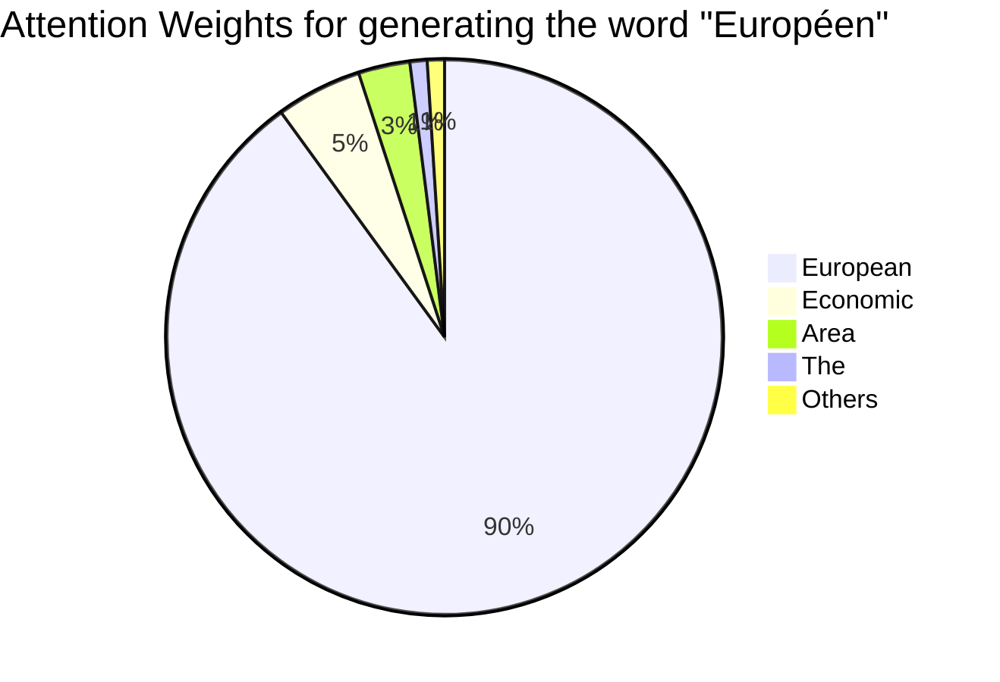
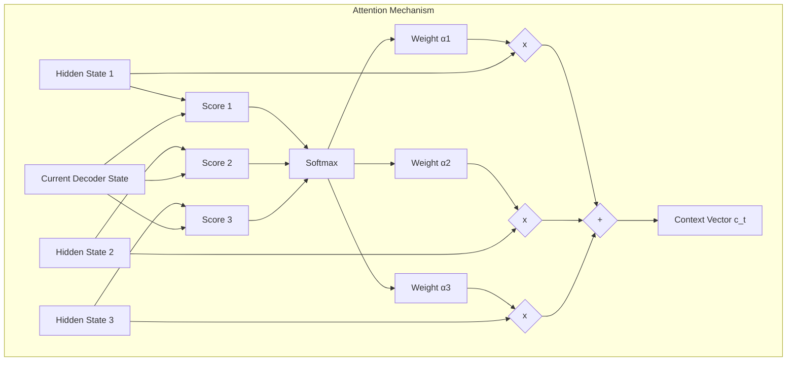

# 08 - Attention Mechanisms

> **Difficulty**: ⭐⭐⭐⭐⭐ Advanced | **Prerequisites**: 07-Gated-Recurrent-Units-GRUs | **Estimated Reading Time**: 25 Minutes

---

## 📋 Table of Contents
1. [What Problem Does This Solve?](#1-what-problem-does-this-solve)
2. [Intuition](#2-intuition)
3. [Core Concepts](#3-core-concepts)
4. [Mathematics: Bahdanau Attention](#4-mathematics-bahdanau-attention)
5. [Algorithm Workflow](#5-algorithm-workflow)
6. [Library Implementation](#6-library-implementation)
7. [Advantages and Limitations](#7-advantages-and-limitations)
8. [Interview Questions](#8-interview-questions)
9. [Key Takeaways](#9-key-takeaways)
10. [Next Topic](#10-next-topic)

---

# 1. What Problem Does This Solve?

Before 2014, if you wanted a neural network to translate a sentence from English to French, you used an LSTM. The network would read the English sentence word-by-word. When it finished, the final hidden state of the LSTM was supposed to contain the "meaning" of the entire sentence.

### 🟢 Beginner
Imagine trying to memorize a 50-word sentence exactly, and then translating it into another language entirely from memory without looking back at the original paper. It's incredibly difficult! You will likely forget the first few words by the time you reach the end. 

### 🟡 Intermediate
The network is forced to compress the exact meaning, grammar, subjects, and verbs of a 50-word sentence into a *single fixed-length vector* (e.g., 256 numbers). This creates a massive **Information Bottleneck**. It is mathematically impossible to not lose information. 

### 🔴 Advanced
In 2014, Dzmitry Bahdanau proposed a brilliant, paradigm-shifting solution: **Attention**. He asked: *Why are we throwing away all the intermediate hidden states of the network?* Instead of relying only on the final hidden state, let's keep **all** the hidden states generated for every single word in the input sentence. When generating the translation, the model dynamically calculates a weighted sum of all past hidden states based on their relevance to the current output step.

---

# 2. Intuition

Imagine you are translating the sentence: *"The agreement on the European Economic Area was signed in August 1992."* into French.

When you are about to output the French word for "European" (*Européen*), you don't need to remember the word "August". You only need to pay attention to the word "European" and maybe "Economic".

An Attention Mechanism calculates a **weight** (or score) for every single word in the input sequence. 
- If the weight is `0.95`, the model pays heavy attention to that word.
- If the weight is `0.01`, the model ignores that word.



By calculating these weights on the fly, the model creates a custom context vector for *every single output word*.

---

# 3. Core Concepts

### 🟢 Alignment Scores
How much should our generator care about a specific input word right now? The model calculates an "Alignment Score" between what it is currently trying to generate, and each word in the input sequence.

### 🟡 Attention Weights (Softmax)
The raw alignment scores are pushed through a Softmax function. This squishes all the scores so that they sum to exactly 1.0 (100%). These percentages are the Attention Weights.

### 🔴 The Context Vector
We take the original hidden state vector for each input word, multiply it by its Attention Weight, and sum them all together. This creates a single, highly-focused **Context Vector** that is customized for the exact word we are trying to generate right now.

---

# 4. Mathematics: Bahdanau Attention

Let $s^{\langle t-1 \rangle}$ be the current state of our translation generator.
Let $h_j$ be the memory state of the $j$-th word in the original input sentence.

**Step 1: Calculate Alignment Scores ($e_{t,j}$)**
We use a tiny Feedforward Neural Network (a single linear layer + Tanh) to calculate this score based on the current state and the word's memory state:
$$e_{t,j} = \mathbf{v}_a^T \tanh(\mathbf{W}_a s^{\langle t-1 \rangle} + \mathbf{U}_a h_j)$$

**Step 2: Calculate Attention Weights ($\alpha_{t,j}$)**
We push all the alignment scores through a Softmax function so they sum to 1.0.
$$\alpha_{t,j} = \frac{\exp(e_{t,j})}{\sum_{k=1}^{T_x} \exp(e_{t,k})}$$

**Step 3: Calculate the Context Vector ($c_t$)**
We multiply every original word's memory state by its attention weight, and sum them up. Words with high attention weights dominate the sum.
$$c_t = \sum_{j=1}^{T_x} \alpha_{t,j} h_j$$

This dynamic context vector $c_t$ is then fed into the generator to predict the next word.

---

# 5. Algorithm Workflow



---

# 6. Library Implementation

In PyTorch, we can implement the Bahdanau Attention mechanism step-by-step:

```python
import torch
import torch.nn as nn
import torch.nn.functional as F

class BahdanauAttention(nn.Module):
    def __init__(self, hidden_size):
        super().__init__()
        # W_a and U_a from the math formula
        self.W_a = nn.Linear(hidden_size, hidden_size)
        self.U_a = nn.Linear(hidden_size, hidden_size)
        self.v_a = nn.Linear(hidden_size, 1, bias=False)
        
    def forward(self, decoder_state, encoder_states):
        # encoder_states: [batch, seq_len, hidden_size]
        # decoder_state: [batch, hidden_size]
        
        # We need to broadcast the decoder state across the seq_len
        seq_len = encoder_states.size(1)
        decoder_state_expanded = decoder_state.unsqueeze(1).repeat(1, seq_len, 1)
        
        # 1. Calculate Alignment Scores (e_tj)
        energy = torch.tanh(self.W_a(decoder_state_expanded) + self.U_a(encoder_states))
        scores = self.v_a(energy).squeeze(-1) # [batch, seq_len]
        
        # 2. Calculate Attention Weights (alpha_tj)
        attention_weights = F.softmax(scores, dim=1) # [batch, seq_len]
        
        # 3. Calculate Context Vector (c_t)
        # Using batch matrix multiplication (bmm) to do the weighted sum
        attention_weights = attention_weights.unsqueeze(1) # [batch, 1, seq_len]
        context_vector = torch.bmm(attention_weights, encoder_states).squeeze(1) # [batch, hidden_size]
        
        return context_vector, attention_weights
```

---

# 7. Advantages and Limitations

| Advantages | Limitations |
| ---------- | ----------- |
| Eliminates the Information Bottleneck for long sequences. | High computational cost: Must calculate scores for *every* input token at *every* output step ($O(N \times M)$ complexity). |
| Provides Explainability: We can plot the Attention Matrix to see exactly what the model was looking at. | Does not eliminate the inherently sequential nature of RNNs. |

---

# 8. Interview Questions

### Intermediate
**Q: What specific problem in standard Encoder-Decoder architectures does Attention solve?**
A: It solves the Information Bottleneck problem. Standard architectures force the encoder to compress an entire input sequence into a single, fixed-length context vector, causing information loss for long sequences.

### Advanced
**Q: Explain the difference between Bahdanau Attention and Luong Attention.**
A: Bahdanau Attention (Additive) uses a small Feedforward Neural Network (with `tanh`) to calculate alignment scores. Luong Attention (Multiplicative) simplifies this by using a direct dot product between the decoder state and encoder states, which is much faster to compute on modern GPUs while achieving similar performance.

---

# 9. Key Takeaways

* Forcing an entire sequence into a single vector creates an **Information Bottleneck**.
* **Attention** solves this by keeping all past states and dynamically calculating weights to decide which past states are most relevant at the current moment.
* The output is a **Context Vector** generated via a weighted sum.
* This allows models to handle infinitely long sequences without forgetting early information, because they can just "look back" at it.

---

# 10. Next Topic

Now that we understand the math of Attention, let's zoom out and look at the actual architecture of the models that use it. We will formally define the Encoder-Decoder architecture, known as Sequence-to-Sequence.

[← Gated Recurrent Units (GRUs)](07-Gated-Recurrent-Units-GRUs.md) | [Back to Index](README.md) | [Next Topic: Sequence-To-Sequence Models →](09-Sequence-To-Sequence-Models.md)
