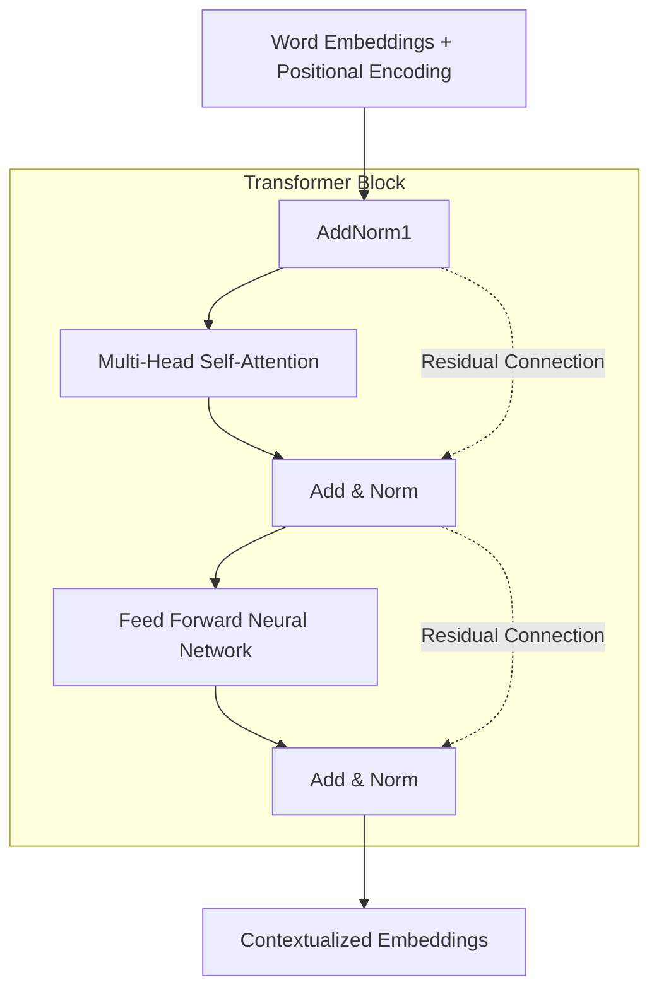

# 10 - Transformers

> **Difficulty**: ⭐⭐⭐⭐⭐ Advanced | **Prerequisites**: 08-Attention-Mechanisms | **Estimated Reading Time**: 35 Minutes

---

## 📋 Table of Contents
1. [What Problem Does This Solve?](#1-what-problem-does-this-solve)
2. [Intuition: The Cocktail Party](#2-intuition-the-cocktail-party)
3. [Core Concepts](#3-core-concepts)
4. [Mathematics: Scaled Dot-Product Attention](#4-mathematics-scaled-dot-product-attention)
5. [Algorithm Workflow: The Transformer Block](#5-algorithm-workflow-the-transformer-block)
6. [Library Implementation](#6-library-implementation)
7. [Visualizations](#7-visualizations)
8. [Advantages and Limitations](#8-advantages-and-limitations)
9. [Interview Questions](#9-interview-questions)
10. [Key Takeaways](#10-key-takeaways)
11. [Next Topic](#11-next-topic)

---

# 1. What Problem Does This Solve?

The RNN was the undisputed king of Sequence Modeling. But it had a fatal, mathematically unsolvable flaw: **It is strictly sequential.**

### 🟢 Beginner
If you have a 1,000-word essay, an RNN *must* read word 1, then word 2, all the way to word 1,000. It cannot read word 500 until it finishes word 499. If you have a supercomputer with 10,000 processors, 9,999 processors will sit idle waiting for the 1 processor to finish word 499. 

### 🟡 Intermediate
In 2017, researchers at Google published *"Attention Is All You Need"*. They realized that if you completely remove the recurrent loops and *only* use Attention mechanisms, you can process the entire sentence simultaneously (in parallel). 

### 🔴 Advanced
The Transformer replaces recurrence $h_t = f(h_{t-1}, x_t)$ with Self-Attention. Self-Attention calculates an $O(N^2)$ covariance-like matrix where every single token in the sequence looks at every other token simultaneously. This allows $O(1)$ sequential operations, unlocking massive parallelization across GPU clusters.

---

# 2. Intuition: The Cocktail Party

Imagine you are at a crowded cocktail party. There are 50 people talking at once. 

If you are a **Query** (a person looking for information), you have a specific question: *"Where is the bathroom?"*
Every person in the room has a **Key** (a name tag describing what they know): *"I know about food"*, *"I know about bathrooms"*, *"I know about music"*.
Every person also has a **Value** (the actual answer): *"The pizza is here"*, *"The bathroom is down the hall"*.

You (the Query) compare your question to everyone's name tag (the Keys). You find the person whose Key matches your Query. You pay 99% of your attention to them, and extract their Value.

This is **Query-Key-Value (QKV)** Attention. In Self-Attention, every word in a sentence acts as a Query, Key, and Value simultaneously to figure out how it relates to every other word.

---

# 3. Core Concepts

### 🟢 Self-Attention
In traditional attention (Seq2Seq), the Decoder looks at the Encoder. In **Self-Attention**, a sentence looks at *itself*. 
Example: *"The bank of the river"*. The word "bank" looks at "river" to understand that it means land, not a financial institution.

### 🟡 Multi-Head Attention
Instead of just looking at the sentence one way, the Transformer splits its attention into multiple "Heads". 
- Head 1 might look at Grammar (verbs looking at nouns).
- Head 2 might look at Vocabulary (pronouns looking at subjects).
- Head 3 might look at Rhyme scheme.

### 🔴 Positional Encoding
Because Transformers process all words at the exact same time, they have no concept of order. The sentence *"Dog bites man"* is processed identically to *"Man bites dog"*. To fix this, we inject mathematical sine and cosine waves into the word embeddings to give every word a unique "timestamp" based on its position.

---

# 4. Mathematics: Scaled Dot-Product Attention

Every word embedding $X$ is multiplied by three learned weight matrices to create three new vectors:
- **Q (Query)**: What am I looking for? ($X \mathbf{W}^Q$)
- **K (Key)**: What do I contain? ($X \mathbf{W}^K$)
- **V (Value)**: What is my actual meaning? ($X \mathbf{W}^V$)

The Attention formula is:
$$\text{Attention}(Q, K, V) = \text{softmax}\left(\frac{Q K^T}{\sqrt{d_k}}\right) V$$

**Step-by-Step:**
1. **$Q K^T$**: The dot product compares every Query with every Key. If they are similar, the dot product is high. This creates an $N \times N$ matrix of raw scores.
2. **$\sqrt{d_k}$**: We scale the scores down by the square root of the embedding dimension to prevent the Softmax function from exploding into regions with 0 gradient.
3. **Softmax**: Converts scores into percentages (Attention Weights).
4. **$\times V$**: We multiply the weights by the Values to get the final Context Vector for every word.

---

# 5. Algorithm Workflow: The Transformer Block

A standard Transformer Encoder block consists of two main parts, wrapped in Residual Connections and Layer Normalization.



*(Note: The Decoder block is similar, but includes "Masked" Self-Attention so it cannot look into the future, and "Cross-Attention" to look at the Encoder).*

---

# 6. Library Implementation

In PyTorch, the core Multi-Head Attention mechanism is fully implemented for us.

```python
import torch
import torch.nn as nn

# Define embedding dimensions
embed_dim = 256
num_heads = 8

# Create the Multi-Head Attention Layer
mha = nn.MultiheadAttention(embed_dim, num_heads, batch_first=True)

# Dummy sequence: (Batch Size, Sequence Length, Embedding Dim)
# e.g. 1 sentence, 10 words, 256 embedding dimension
sequence = torch.randn(1, 10, 256)

# In Self-Attention, the Query, Key, and Value are ALL the exact same sequence!
attn_output, attn_weights = mha(query=sequence, key=sequence, value=sequence)

print(f"Output Shape: {attn_output.shape}") 
# Output: [1, 10, 256] -> The sequence, perfectly contextualized!
```

---

# 7. Visualizations

If we visualize the $N \times N$ Attention Matrix for the sentence *"The animal didn't cross the street because it was too tired"*:

We will see that the word **"it"** has a massive attention weight (e.g., 0.90) specifically focused on the word **"animal"**, and almost 0 attention on "street". 

If the sentence was *"because it was too wide"*, the attention for **"it"** would instantly shift to **"street"**. The Transformer mathematically resolves pronouns and context in a single matrix multiplication!

---

# 8. Advantages and Limitations

| Advantages | Limitations |
| ---------- | ----------- |
| $O(1)$ sequential operations. Massively parallelizable on GPUs. | $O(N^2)$ memory and compute complexity relative to sequence length. |
| Virtually no "forgetting" over long sequences; every word is just 1 matrix multiplication away from every other word. | Requires absolutely massive amounts of data to train compared to CNNs or RNNs. |

---

# 9. Interview Questions

### Beginner
**Q: What is the main difference between an RNN and a Transformer?**
A: An RNN processes words sequentially, updating a hidden state one step at a time. A Transformer processes all words simultaneously in parallel using Self-Attention.

### Intermediate
**Q: Why do Transformers need Positional Encodings?**
A: Because they process all words simultaneously in a massive matrix multiplication, they have no inherent concept of word order. Positional Encodings add unique mathematical signatures to the word embeddings so the network knows where each word is located in the sequence.

### Advanced
**Q: Why do we divide by $\sqrt{d_k}$ in the Attention formula?**
A: As the dimension $d_k$ grows, the dot product $Q K^T$ grows larger in magnitude. If these values become too large, the `softmax` function is pushed into regions where its gradient is extremely close to 0 (vanishing gradients). Scaling by $\sqrt{d_k}$ keeps the variance of the dot products around 1, ensuring stable gradients.

---

# 10. Key Takeaways

* **Transformers** discarded RNN loops entirely in favor of **Self-Attention**.
* Self-Attention uses **Queries, Keys, and Values (QKV)** to let every word look at every other word simultaneously.
* **Multi-Head Attention** allows the network to look at different contextual relationships (grammar, vocabulary) in parallel.
* They suffer from $O(N^2)$ complexity, meaning extremely long documents require astronomical amounts of GPU RAM.

---

# 11. Next Topic

The Transformer architecture changed the world in 2017. But the original paper only proposed an Encoder-Decoder model for translation. 

Within a year, companies realized they could rip the Transformer in half, creating the two distinct branches of AI that rule the modern world: BERT and GPT.

[← Sequence-To-Sequence Models](09-Sequence-To-Sequence-Models.md) | [Back to Index](README.md) | [Next Topic: Modern Transformer Architectures →](11-Modern-Transformer-Architectures.md)
