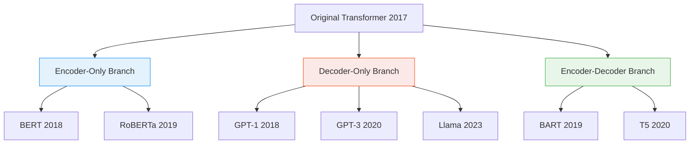

# 11 - Modern Transformer Architectures

> **Difficulty**: ⭐⭐⭐☆☆ Intermediate | **Prerequisites**: 10-Transformers | **Estimated Reading Time**: 20 Minutes

---

## 📋 Table of Contents
1. [What Problem Does This Solve?](#1-what-problem-does-this-solve)
2. [Intuition: Reading vs Speaking](#2-intuition-reading-vs-speaking)
3. [Core Concepts](#3-core-concepts)
4. [Algorithm Workflow: The Three Branches](#4-algorithm-workflow-the-three-branches)
5. [Library Implementation (Hugging Face)](#5-library-implementation-hugging-face)
6. [Advantages and Limitations](#6-advantages-and-limitations)
7. [Industry Applications](#7-industry-applications)
8. [Interview Questions](#8-interview-questions)
9. [Key Takeaways](#9-key-takeaways)
10. [Next Topic](#10-next-topic)

---

# 1. What Problem Does This Solve?

The original Transformer (2017) was designed exclusively for Translation (Seq2Seq). It had a massive Encoder and a massive Decoder. But translation is just one tiny corner of Natural Language Processing.

### 🟢 Beginner
What if I just want to classify an email as Spam or Not Spam? Using a massive translation machine is overkill. What if I just want a chatbot to generate a story? Half of the translation machine is useless. We needed specialized versions of the Transformer for specific tasks.

### 🟡 Intermediate
By 2018, researchers realized that the Encoder and Decoder are fundamentally different mathematical tools. The Encoder has **Bi-directional Attention** (it looks at the whole sentence at once, making it great for reading comprehension). The Decoder has **Causal/Masked Attention** (it can only look at the past, making it great for generation). 

### 🔴 Advanced
Instead of training from scratch for every task, the industry moved to **Transfer Learning**. You take a massive corpus of unannotated text (like the entire internet), train a deep Transformer on a self-supervised objective (like predicting masked words), and then fine-tune it on downstream tasks. This birthed the era of Foundation Models: BERT (Encoder-only) and GPT (Decoder-only).

---

# 2. Intuition: Reading vs Speaking

Think of the human brain. 
- When you **read a book**, your eyes dart back and forth. You look at the end of a sentence to figure out the context of a confusing word at the beginning. You have full access to the page. This is the **Encoder**.
- When you **speak a sentence**, time moves strictly forward. Once you say a word, you can't take it back. You must generate the next word based *only* on what you have already said. This is the **Decoder**.

Modern AI splits these functions:
- Need to "read" a contract to find a specific clause? Use an Encoder (BERT).
- Need to "speak" a creative story? Use a Decoder (GPT).

---

# 3. Core Concepts

### 🟢 Encoder-Only (Auto-encoding)
Models like **BERT**, RoBERTa, and ALBERT.
They use bi-directional attention. Their goal is deep understanding. 
**Use cases:** Text classification, Sentiment analysis, Named Entity Recognition, Extractive Question Answering.

### 🟡 Decoder-Only (Autoregressive)
Models like **GPT-1/2/3/4**, Llama, and Claude.
They use masked (causal) attention. They cannot look into the future. Their goal is text generation.
**Use cases:** Chatbots, Code generation, Creative writing.

### 🔴 Encoder-Decoder (Seq2Seq)
Models like **T5** and **BART**.
They keep the original 2017 architecture. They read a full context, and generate a full output based on it.
**Use cases:** Translation, Text Summarization, Abstractive Question Answering.

---

# 4. Algorithm Workflow: The Three Branches



---

# 5. Library Implementation (Hugging Face)

We rarely write Transformers from scratch in PyTorch anymore. The industry standard is the `transformers` library by Hugging Face.

```python
# pip install transformers
from transformers import pipeline

# 1. Encoder-Only Task (Sentiment Analysis using DistilBERT)
classifier = pipeline("sentiment-analysis", model="distilbert-base-uncased")
result = classifier("I absolutely love this new architecture!")
print("BERT Classification:", result)

# 2. Decoder-Only Task (Text Generation using GPT-2)
generator = pipeline("text-generation", model="gpt2")
text = generator("In a shocking turn of events, the AI decided to", max_length=20)
print("GPT Generation:", text[0]['generated_text'])

# 3. Encoder-Decoder Task (Summarization using BART)
summarizer = pipeline("summarization", model="facebook/bart-large-cnn")
long_text = "Transformers changed the world. Initially created for translation, they were quickly adapted into models like BERT and GPT..."
summary = summarizer(long_text, max_length=15, min_length=5)
print("BART Summary:", summary[0]['summary_text'])
```

---

# 6. Advantages and Limitations

| Model Type | Advantages | Limitations |
| ---------- | ---------- | ----------- |
| **Encoder (BERT)** | Deepest understanding of context. Excels at classification. | Cannot generate text fluently. |
| **Decoder (GPT)** | Incredible at few-shot prompting and fluent text generation. | Struggles with tasks requiring looking "forward" in the text. |
| **Enc-Dec (T5)** | Highly versatile for text-to-text transformations. | Very heavy; highest parameter count for equivalent performance. |

---

# 7. Industry Applications

* **Google Search**: Uses BERT to understand the exact intent behind confusing search queries.
* **OpenAI ChatGPT**: Uses GPT architectures trained with Reinforcement Learning from Human Feedback (RLHF) to act as conversational assistants.
* **GitHub Copilot**: Uses specialized Decoder models (Codex/StarCoder) to autocomplete programming code sequentially.

---

# 8. Interview Questions

### Beginner
**Q: What is the main difference between BERT and GPT?**
A: BERT is an Encoder-only model designed for reading comprehension and classification. GPT is a Decoder-only model designed for generating text.

### Intermediate
**Q: Why can't BERT generate a story like ChatGPT?**
A: BERT is trained using Masked Language Modeling (MLM), where it randomly hides 15% of the words in a sentence and tries to guess them using both the left and right context simultaneously. Because it relies on future context, it cannot perform autoregressive generation (predicting the next word purely from the past).

### Advanced
**Q: Explain how the attention mechanism differs between the Encoder and the Decoder.**
A: The Encoder uses Bi-directional Self-Attention, allowing every token to attend to every other token ($j \in [1, T]$). The Decoder uses Masked (Causal) Self-Attention. A triangular mask containing $-\infty$ is added to the attention scores before the softmax operation, strictly preventing token $t$ from attending to any token $j > t$.

---

# 9. Key Takeaways

* The original Transformer was split into specialized branches based on the task.
* **Encoders (BERT)**: Use bi-directional attention. Best for classification and understanding.
* **Decoders (GPT)**: Use masked causal attention. Best for generation.
* **Encoder-Decoders (T5)**: Use both. Best for text-to-text tasks like translation and summarization.
* The Hugging Face `transformers` library is the industry standard for utilizing these models.

---

# 10. Next Topic

We have covered the cutting edge of NLP sequence models. But what about sequences of numbers? Stock prices, server loads, and weather data don't have grammar or vocabulary.

Let's step out of the NLP domain and look at Time Series Forecasting.

[← Transformers](10-Transformers.md) | [Back to Index](README.md) | [Next Topic: Time Series Forecasting →](12-Time-Series-Forecasting.md)
