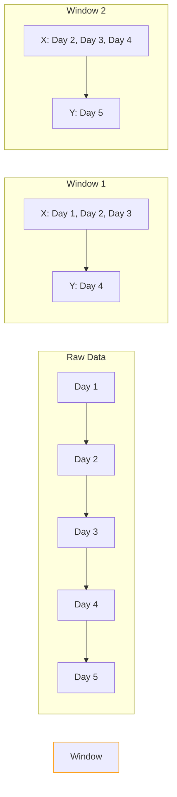

# 12 - Time Series Forecasting

> **Difficulty**: ⭐⭐⭐☆☆ Intermediate | **Prerequisites**: 06-Long-Short-Term-Memory-LSTMs | **Estimated Reading Time**: 20 Minutes

---

## 📋 Table of Contents
1. [What Problem Does This Solve?](#1-what-problem-does-this-solve)
2. [Intuition: The Weather Forecast](#2-intuition-the-weather-forecast)
3. [Core Concepts](#3-core-concepts)
4. [Algorithm Workflow: The Sliding Window](#4-algorithm-workflow-the-sliding-window)
5. [Mathematics: Normalization](#5-mathematics-normalization)
6. [Library Implementation](#6-library-implementation)
7. [Visualizations](#7-visualizations)
8. [Advantages and Limitations](#8-advantages-and-limitations)
9. [Interview Questions](#9-interview-questions)
10. [Key Takeaways](#10-key-takeaways)
11. [Next Topic](#11-next-topic)

---

# 1. What Problem Does This Solve?

We've spent the last few lessons discussing Natural Language Processing (NLP). But the world is full of sequential data that isn't made of words—it's made of numbers. 

### 🟢 Beginner
If you want to know how many people will visit your website tomorrow, you can't just guess randomly. You look at how many people visited today, yesterday, and the day before. Time series forecasting is the science of predicting the future by mathematically analyzing the past.

### 🟡 Intermediate
Traditional statistical methods like ARIMA (AutoRegressive Integrated Moving Average) are great for simple, single-variable forecasts with clear seasonality. But when we have a dozen different variables interacting non-linearly (e.g., predicting stock prices based on volume, interest rates, and sentiment), ARIMA fails. We need Neural Networks like LSTMs.

### 🔴 Advanced
Time series forecasting poses unique challenges for Deep Learning: The data is often non-stationary (the mean and variance shift over time), highly noisy, and subject to covariate shift. Furthermore, autoregressive multi-step forecasting suffers from rapid error accumulation, where a small error at step $t+1$ compounds exponentially by step $t+10$.

---

# 2. Intuition: The Weather Forecast

Imagine trying to predict tomorrow's temperature. 
If today is 80°F, tomorrow is likely to be near 80°F. This is an **Autoregressive** property (the future depends on its own past).

But what if you also know that the humidity is 95% and the barometric pressure is plummeting? These are **Exogenous Variables**. Even though they aren't the temperature, they severely impact the temperature. 

Neural networks excel at time series because they can easily ingest these massive multivariate inputs (temperature, humidity, pressure, time of day) and find hidden correlations that human meteorologists might miss.

---

# 3. Core Concepts

### 🟢 Univariate vs. Multivariate
- **Univariate**: Predicting one variable using only its own history (Predicting Apple stock using only past Apple stock prices).
- **Multivariate**: Predicting one or more variables using multiple histories (Predicting Apple stock using Apple price, Microsoft price, and the S&P 500 index).

### 🟡 Single-Step vs. Multi-Step
- **Single-Step**: Look at the past 10 days, predict exactly 1 day into the future.
- **Multi-Step**: Look at the past 10 days, predict the next 5 days. Much harder due to error accumulation.

### 🔴 Stationarity
Neural networks struggle if the data's baseline constantly shifts. If you train a model on Bitcoin prices from 2013 (when it was $100) and test it in 2024 (when it's $60,000), the network will fail because the absolute values are completely out of distribution. We must make data stationary via differencing or normalization.

---

# 4. Algorithm Workflow: The Sliding Window

Deep Learning frameworks do not understand "time". They only understand arrays. To train an LSTM on a time series, we must chop the continuous timeline into bite-sized **Sliding Windows**.



*Note: The window "slides" forward by 1 step, creating a supervised learning dataset $(X, y)$ from a single continuous list of numbers.*

---

# 5. Mathematics: Normalization

Because neural networks use activation functions like `tanh` and `sigmoid` (which saturate outside of $[-1, 1]$), feeding raw stock prices like `45,000` into an LSTM will instantly destroy the gradients.

We must scale the data using **Min-Max Scaling** or **Standardization**.

**Min-Max Scaling:**
$$X_{scaled} = \frac{X - X_{min}}{X_{max} - X_{min}}$$

**Standardization (Z-Score):**
$$X_{scaled} = \frac{X - \mu}{\sigma}$$

*Crucial Rule:* You must fit your scaler **ONLY** on the training data, and then apply it to the test data. If you fit it on the entire dataset, you commit **Data Leakage** by letting the model peek at the future maximum values!

---

# 6. Library Implementation

Here is how we create a sliding window dataset for PyTorch using Pandas and NumPy.

```python
import numpy as np
import torch

def create_sliding_windows(data, window_size):
    """
    data: numpy array of shape (Total_Time_Steps, Features)
    window_size: How many past days to look at
    """
    X, y = [], []
    # Loop from start to the end minus the window size
    for i in range(len(data) - window_size):
        # Extract the window
        window = data[i : i + window_size]
        # Extract the target (the very next step)
        target = data[i + window_size]
        
        X.append(window)
        y.append(target)
        
    # Convert to PyTorch tensors
    # X shape: (Batch, Sequence Length, Features)
    return torch.tensor(X, dtype=torch.float32), torch.tensor(y, dtype=torch.float32)

# Example usage: 100 days of 3 features (Temperature, Humidity, Pressure)
dummy_data = np.random.randn(100, 3) 
X_train, y_train = create_sliding_windows(dummy_data, window_size=7)

print(f"X shape: {X_train.shape}") # (93, 7, 3)
print(f"y shape: {y_train.shape}") # (93, 3)
```

---

# 7. Visualizations

When evaluating time series forecasts, never look at a single aggregate metric like MSE. Always plot the true values against the predicted values.

Look closely at the peaks and troughs. 
- Is the model actually predicting the trend? 
- Or is it just predicting $y_t = y_{t-1}$? (This is a common failure where the prediction curve looks exactly like the true curve, but shifted one day to the right. The model learned nothing except "guess what happened yesterday").

---

# 8. Advantages and Limitations

| Advantages of Deep Learning for Time Series | Limitations |
| ------------------------------------------- | ----------- |
| Captures complex, non-linear interactions across dozens of variables effortlessly. | Requires far more data than traditional methods like ARIMA. |
| Does not require manual feature engineering of seasonality or trend components. | Highly susceptible to overfitting and "shifted-by-one" lazy predictions. |

---

# 9. Interview Questions

### Beginner
**Q: What is the difference between Univariate and Multivariate time series forecasting?**
A: Univariate predicts a value based solely on its own history. Multivariate predicts a value based on its history alongside the history of other related, interacting variables.

### Intermediate
**Q: Why must you scale time series data before feeding it into an LSTM?**
A: LSTMs use `tanh` and `sigmoid` activation functions internally. Large raw values (like stock prices in the thousands) will push these activations into saturated regions, causing the gradients to vanish and the network to stop learning.

### Advanced
**Q: Explain how Data Leakage occurs during time series scaling.**
A: If you apply a scaler (like Min-Max) to the *entire* timeline before splitting into train/test, the training data gets normalized using the global maximum from the test set (the future). The training data now implicitly contains information about the future, invalidating the test results.

---

# 10. Key Takeaways

* Time series forecasting maps historical numerical sequences to future numerical values.
* We transform continuous timelines into supervised $(X, y)$ datasets using the **Sliding Window** technique.
* **Normalization** is strictly required, and must be applied carefully to avoid **Data Leakage**.
* Multi-step forecasting is significantly harder than single-step forecasting due to compounding errors.

---

# 11. Next Topic

We know how to build NLP models and Time Series models. But how do we prove they are actually good? We can't just use standard "Accuracy" for a generated translation. We need specialized sequence metrics.

[← Modern Transformer Architectures](11-Modern-Transformer-Architectures.md) | [Back to Index](README.md) | [Next Topic: Sequence Model Evaluation →](13-Sequence-Model-Evaluation.md)
