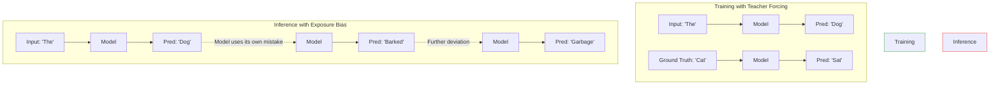

# 14 - Common Failure Cases

> **Difficulty**: ⭐⭐⭐☆☆ Intermediate | **Prerequisites**: 09-Sequence-To-Sequence-Models | **Estimated Reading Time**: 20 Minutes

---

## 📋 Table of Contents
1. [What Problem Does This Solve?](#1-what-problem-does-this-solve)
2. [Intuition](#2-intuition)
3. [Core Concepts](#3-core-concepts)
4. [Algorithm Workflow: Exposure Bias](#4-algorithm-workflow-exposure-bias)
5. [Industry Solutions](#5-industry-solutions)
6. [Interview Questions](#6-interview-questions)
7. [Key Takeaways](#7-key-takeaways)
8. [Next Topic](#8-next-topic)

---

# 1. What Problem Does This Solve?

Deploying a sequence model into the real world is terrifying. Unlike an image classifier that is just wrong once, a text generator can spiral out of control, generating an infinite loop of garbage or confidently stating outright lies. 

### 🟢 Beginner
If you've ever used a predictive text keyboard on your phone and just kept pressing the middle button over and over, you know it quickly devolves into loops like *"I am going to be a little late but I will be a little late but I will be..."* We need to understand why models get trapped in these loops and how to fix them.

### 🟡 Intermediate
Sequence generation is an autoregressive process. A mistake at step $t=5$ is fed into the model as input for step $t=6$. This creates a compounding error cascade. 

### 🔴 Advanced
During training, we use **Teacher Forcing** (feeding the ground truth $y_{t-1}$ to predict $y_t$). During inference, the model must rely on its own generated $\hat{y}_{t-1}$. This mismatch between the training distribution and inference distribution is called **Exposure Bias**. It guarantees that the model will eventually drift into an unrecoverable state space.

---

# 2. Intuition

Imagine you are learning to ride a bike with training wheels (Teacher Forcing). Every time you start to lean too far left, the training wheels instantly correct you. You never experience what it actually feels like to fall over.

The day you take the training wheels off (Inference), you lean slightly to the left. Because you have never experienced this state before, you panic, lean *more* to the left, and crash.

Sequence models trained with strict Teacher Forcing do the exact same thing. The moment they generate a slightly "weird" word, they enter an internal state they never saw during training, panic, and output garbage.

---

# 3. Core Concepts

### 🟢 Hallucinations
When a sequence model confidently generates information that is factually incorrect. Because the model is just a giant probability calculator trying to predict the most likely next word, it doesn't actually "know" facts; it just knows what words usually appear next to each other.

### 🟡 Repetition Loops
Models often get trapped outputting the same phrase forever. This happens because of a positive feedback loop: the more the model generates a word, the more that word fills up the immediate context window, which artificially inflates the probability of generating that word *again*.

### 🔴 Catastrophic Forgetting
When you fine-tune a massive Transformer on a new, highly specific dataset (like medical records), the weight updates can completely overwrite the model's fundamental understanding of grammar or its previous general knowledge. 

---

# 4. Algorithm Workflow: Exposure Bias

The mechanism of compounding errors.

---

# 5. Industry Solutions

How do AI engineers actually fix these problems in production?

### 1. Fixing Exposure Bias: Scheduled Sampling
Instead of 100% Teacher Forcing, we slowly reduce the training wheels. At the start of training, we use Teacher Forcing 100% of the time. By the end of training, we force the model to use its own predictions 50% of the time. This forces it to learn how to recover from its own mistakes.

### 2. Fixing Repetition: Repetition Penalties & Temperature
During inference, we don't just greedily pick the absolute highest probability word. We apply a mathematical penalty to words the model has recently used. We also increase **Temperature**, which flattens the probability distribution and forces the model to take more creative risks instead of looping.

### 3. Fixing Hallucinations: RAG (Retrieval-Augmented Generation)
We stop relying on the model's internal memory. Instead, we give the model a search engine. The model queries a database for facts, pastes those facts into its prompt, and then summarizes them.

---

# 6. Interview Questions

### Beginner
**Q: Why do language models sometimes hallucinate fake facts?**
A: Because they are designed to predict the most statistically probable next word, not to access a database of truth. If a fake fact sounds statistically plausible, the model will generate it confidently.

### Intermediate
**Q: What is Exposure Bias?**
A: The difference between how a model is trained (using perfect ground-truth inputs via Teacher Forcing) and how it is used in reality (using its own imperfect predictions). This causes compounding errors during generation.

### Advanced
**Q: How does Temperature affect sequence generation?**
A: The output of a language model is a set of logits $z_i$, which are converted to probabilities via softmax: $\frac{\exp(z_i / T)}{\sum \exp(z_j / T)}$. 
If $T=1$, it's standard softmax. 
If $T \to 0$, the highest logit dominates completely (greedy decoding, highly repetitive). 
If $T > 1$, the distribution flattens, increasing the chance of sampling lower-probability words (higher creativity, less repetition).

---

# 7. Key Takeaways

* **Exposure Bias** causes compounding errors because the model relies on its own imperfect outputs during inference.
* **Scheduled Sampling** eases the model off Teacher Forcing to help it learn to recover from mistakes.
* **Repetition Loops** are fixed by adjusting Temperature and applying repetition penalties during decoding.
* **Hallucinations** are a fundamental flaw of autoregressive generation, largely mitigated by external RAG systems today.

---

# 8. Next Topic

We now understand exactly how these models work and exactly how they break. It's time to step out of the theoretical math and into the real world. Let's look at the actual industry applications of sequence models.

[← Sequence Model Evaluation](13-Sequence-Model-Evaluation.md) | [Back to Index](README.md) | [Next Topic: Modern Applications →](15-Modern-Applications.md)
