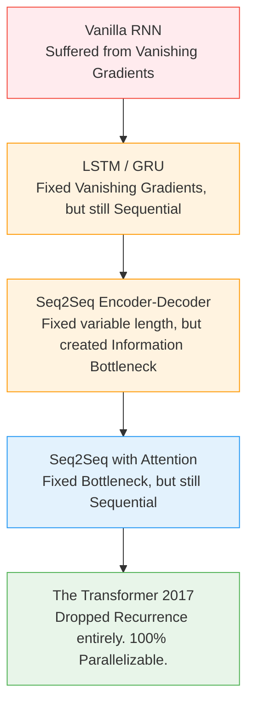

# 01 - Why Transformers?

> **Difficulty**: ⭐⭐☆☆☆ Intermediate | **Prerequisites**: Sequence Models (Module 08) | **Estimated Reading Time**: 15 Minutes

---

## 📋 Table of Contents
1. [What Problem Exists?](#1-what-problem-exists)
2. [Intuition: The Assembly Line vs. The Matrix](#2-intuition-the-assembly-line-vs-the-matrix)
3. [The Four Fatal Flaws of RNNs](#3-the-four-fatal-flaws-of-rnns)
4. [The Evolution of Sequence Models](#4-the-evolution-of-sequence-models)
5. [Industry Applications](#5-industry-applications)
6. [Key Takeaways](#6-key-takeaways)
7. [Next Topic](#7-next-topic)

---

# 1. What Problem Exists?

Before 2017, the Deep Learning world had a consensus: If you want to process images, use Convolutional Neural Networks (CNNs). If you want to process text, time-series, or anything sequential, use Recurrent Neural Networks (RNNs) or LSTMs.

### 🟢 Beginner
Imagine you have a book with 100,000 words. You want an AI to read it and summarize it. 
An RNN is forced to read the book exactly like a human: word by word, left to right. It cannot look at word 50,000 until it has finished processing word 49,999. If reading one word takes 1 millisecond, reading the book takes 100 seconds. 
What if you have a massive supercomputer with 10,000 processors? It doesn't matter. 9,999 processors will sit idle waiting for the 1 processor to finish the previous word.

### 🟡 Intermediate
The fundamental architecture of RNNs, LSTMs, and GRUs requires the hidden state $h_t$ to be computed using the previous hidden state $h_{t-1}$. 
$$h_t = f(h_{t-1}, x_t)$$
Because $h_t$ strictly depends on $h_{t-1}$, the computation cannot be parallelized across the time dimension. This sequential bottleneck made it impossible to train large models on massive datasets like the entire internet.

### 🔴 Advanced
Beyond the training speed bottleneck, RNNs suffer from **Path Length**. To connect the context of word 1 to word 1,000, the gradients must flow backwards through 1,000 sequential matrix multiplications during Backpropagation Through Time (BPTT). Even with the gating mechanisms of LSTMs, the signal decays or explodes ($O(N)$ path length), resulting in severe **catastrophic forgetting** of long-term dependencies.

---

# 2. Intuition: The Assembly Line vs. The Matrix

**The RNN (The Assembly Line)**
Imagine a factory building a car. Worker 1 builds the chassis. Worker 2 attaches the wheels. Worker 3 paints it. Worker 3 *must* wait for Worker 2. If you hire 1,000 painters, they still can't paint until the wheels are on. The process is strictly sequential.

**The Transformer (The Matrix)**
Imagine instead a magical room where 1,000 workers instantly look at the blueprint, grab their specific parts, and build the *entire car simultaneously in one second*. Every worker can see what every other worker is doing in real-time, instantly adjusting their work.

This is what researchers achieved in 2017. They found a way to process a sequence of 1,000 words simultaneously in a single, massive matrix multiplication, dropping the "sequential" requirement entirely.

---

# 3. The Four Fatal Flaws of RNNs

To understand why Transformers were necessary, we must understand exactly how RNNs failed.

1.  **Sequential Computation Bottleneck**: As discussed, $h_t$ depends on $h_{t-1}$, completely blocking parallelization. Modern GPUs are designed to do 10,000 things at once, making RNNs a terrible hardware fit.
2.  **Long-Term Dependencies (Path Length $O(N)$)**: An RNN must pass information step-by-step. A Transformer connects *every* word to *every* other word directly, creating a path length of exactly $O(1)$.
3.  **The Information Bottleneck**: Standard Encoder-Decoder RNNs force the entire meaning of an input sentence into a single, fixed-size vector (the final hidden state). If the sentence is 100 words long, compressing it into 256 numbers causes massive information loss.
4.  **Slow Training**: Because of the lack of parallelization, training an LSTM on the entire Wikipedia dataset would take years, even on a supercomputer.

---

# 4. The Evolution of Sequence Models

The journey to the Transformer was a steady progression of solving these flaws one by one.

---

# 5. Industry Applications

When the Transformer paper (*"Attention Is All You Need"*) was published by Google in 2017, the AI industry pivoted overnight.

*   **2017**: Transformers were used strictly to improve Google Translate.
*   **2018**: Researchers realized the architecture scaled infinitely. OpenAI created **GPT-1**, and Google created **BERT**.
*   **2020**: OpenAI scaled the model up to 175 Billion parameters to create **GPT-3**, proving that simply making Transformers larger unlocks emergent "reasoning" capabilities.
*   **2022+**: The release of **ChatGPT** ignited the Generative AI revolution, proving that Transformers had effectively solved Natural Language Processing.

---

# 6. Key Takeaways

*   RNNs and LSTMs are mathematically forced to process data **sequentially** ($h_t$ depends on $h_{t-1}$).
*   This sequential nature prevents GPU parallelization, making it impossible to train them on massive internet-scale datasets.
*   RNNs suffer from long $O(N)$ path lengths, causing them to forget early parts of long documents.
*   The **Transformer** discarded the recurrent loop entirely, unlocking $O(1)$ path lengths and infinite parallelization.

---

# 7. Next Topic

To build a Transformer, we must first understand the magic mathematical mechanism that allowed researchers to throw away the recurrent loops. We must understand how an AI can look at an entire sentence at once and know which words are important.

[Back to Index](README.md) | [Next Topic: The Attention Mechanism →](02-Attention-Mechanism.md)
