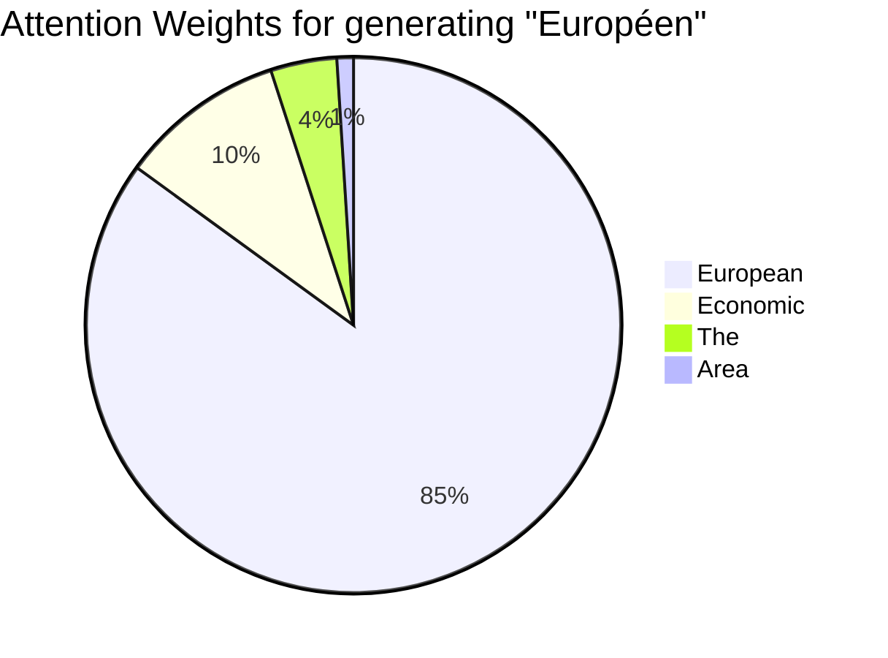

# 02 - The Attention Mechanism

> **Difficulty**: ⭐⭐⭐☆☆ Intermediate | **Prerequisites**: 01-Why-Transformers | **Estimated Reading Time**: 20 Minutes

---

## 📋 Table of Contents
1. [What Problem Does Attention Solve?](#1-what-problem-does-attention-solve)
2. [Intuition: Translating a Sentence](#2-intuition-translating-a-sentence)
3. [The Query, Key, Value Paradigm](#3-the-query-key-value-paradigm)
4. [Mathematics of Attention](#4-mathematics-of-attention)
5. [Visualizing Attention Weights](#5-visualizing-attention-weights)
6. [Library Implementation (PyTorch)](#6-library-implementation-pytorch)
7. [Key Takeaways](#7-key-takeaways)
8. [Next Topic](#8-next-topic)

---

# 1. What Problem Does Attention Solve?

Before Transformers, sequence translation was handled by an **Encoder-Decoder RNN** (Seq2Seq).

### 🟢 Beginner
Imagine asking a friend to translate a 500-word essay from English to French. But there are rules:
1. They must read the entire English essay.
2. They must close the book and never look at the English words again.
3. They must write the entire French translation from memory.

This is impossible. A human translator reads a few English words, writes the French translation, and then *looks back* at the English text for the next few words. They pay **attention** to different parts of the source text at different times. 

### 🟡 Intermediate
The original Seq2Seq model had an **Encoder Bottleneck Problem**. The Encoder processed the entire input sequence and compressed all its meaning into a single, fixed-length vector (the final hidden state). The Decoder had to generate the entire output sequence using *only* that single vector. For long sentences, compressing the meaning into one vector caused massive information loss.

### 🔴 Advanced
The **Attention Mechanism** (introduced by Bahdanau et al. in 2014) solved this by completely eliminating the bottleneck. Instead of throwing away all the intermediate hidden states of the Encoder, Attention keeps them all. When the Decoder is generating the $t$-th output word, it calculates a weighted sum over *all* Encoder hidden states, creating a dynamic, custom context vector specifically tailored for the word it is currently trying to generate.

---

# 2. Intuition: Translating a Sentence

Imagine generating the French translation for: *"The European Economic Area was signed in August 1992."*

When the AI is about to generate the French word for "European" (*Européen*):
- It does not care about the word "August".
- It does not care about the word "1992".
- It pays 90% of its **attention** to the word "European".
- It pays 10% of its **attention** to the word "Economic" (for grammatical context).

The network mathematically calculates an **Attention Weight** (a percentage from 0.0 to 1.0) for every single word in the source sentence. Words with a high weight are factored heavily into the next prediction. Words with a low weight are ignored.

---

# 3. The Query, Key, Value Paradigm

To understand how these weights are calculated, we must understand the core paradigm of modern Information Retrieval: **Query, Key, and Value (QKV)**.

Think of searching for a video on YouTube:
1.  **Query (What you want)**: You type *"Cute cat videos"* into the search bar. This is your Query.
2.  **Key (What the data is labeled as)**: YouTube checks the title, tags, and description of every video in its database. These are the Keys.
3.  **Value (The actual content)**: Once YouTube finds a Key that matches your Query, it plays the video. The video itself is the Value.

In Neural Attention:
- **Query ($Q$)**: The Decoder says, *"I am currently trying to translate a noun relating to geography."*
- **Key ($K$)**: Every word in the Encoder holds up a sign. "European" holds up a sign saying, *"I am a geographic adjective!"* "August" holds up a sign saying, *"I am a month!"*
- **Value ($V$)**: The actual hidden state embedding of the word.

The network compares the $Q$ to every $K$. If $Q$ and $K$ match, the network pays high attention, and extracts that word's $V$.

---

# 4. Mathematics of Attention

Let's break down the exact equation used in modern Transformers (Scaled Dot-Product Attention).

$$\text{Attention}(Q, K, V) = \text{softmax}\left(\frac{Q K^T}{\sqrt{d_k}}\right) V$$

### Step 1: Alignment Scores ($Q K^T$)
We take the dot product of the Query matrix with the transposed Key matrix. 
- The dot product is a measure of similarity. 
- If $Q$ and $K$ are very similar, their dot product is a large positive number.
- If they are unrelated, it is near zero.
This creates a massive grid of raw "alignment scores" between every Query and every Key.

### Step 2: Scaling ($\sqrt{d_k}$)
We divide the raw scores by the square root of the embedding dimension ($d_k$). 
Why? If the vectors are very large, the dot products explode into massive numbers (e.g., 5000, 8000). Huge numbers cause the Softmax function to output exactly 1.0 or 0.0, which kills the gradients (Vanishing Gradient Problem). Scaling fixes this.

### Step 3: Attention Weights (Softmax)
We apply the Softmax function. This squishes all the raw scores so that they sum to exactly 1.0. 
A score of `3.4` might become `0.85` (85% attention). A score of `-1.2` might become `0.01` (1% attention).

### Step 4: Context Vector ($\times V$)
We multiply these percentages by the Value matrix ($V$). 
If "European" got 85% attention, we take 85% of its vector. If "August" got 1%, we take 1% of its vector. We add them all together to create the final Context Vector.

---

# 5. Visualizing Attention Weights

Because Attention creates a grid of probabilities, we can visualize it as a heatmap. This provides incredible explainability—we can actually *see* what the AI was thinking.



If we plot a heatmap for English $\to$ French translation, we will see a bright diagonal line, because the word order is mostly the same. 
However, when the English phrase is *"European Economic Area"* (Adjective $\to$ Adjective $\to$ Noun) and the French phrase is *"Zone Économique Européenne"* (Noun $\to$ Adjective $\to$ Adjective), the Attention heatmap will cleanly show the network crossing its attention backwards to resolve the grammar!

---

# 6. Library Implementation (PyTorch)

Here is how we implement the exact Scaled Dot-Product Attention formula from scratch in PyTorch.

```python
import torch
import torch.nn.functional as F
import math

def scaled_dot_product_attention(query, key, value):
    """
    Computes Scaled Dot-Product Attention.
    Shapes:
        query: [batch_size, seq_len, d_k]
        key:   [batch_size, seq_len, d_k]
        value: [batch_size, seq_len, d_v]
    """
    d_k = query.size(-1)
    
    # 1. Alignment Scores: Q * K^T
    # We use transpose(-2, -1) to swap the last two dimensions (seq_len and d_k)
    scores = torch.matmul(query, key.transpose(-2, -1))
    
    # 2. Scaling
    scaled_scores = scores / math.sqrt(d_k)
    
    # 3. Attention Weights via Softmax
    attention_weights = F.softmax(scaled_scores, dim=-1)
    
    # 4. Context Vector: Weights * V
    context_vector = torch.matmul(attention_weights, value)
    
    return context_vector, attention_weights

# Example usage
batch_size, seq_len, d_k = 2, 5, 64
Q = torch.randn(batch_size, seq_len, d_k)
K = torch.randn(batch_size, seq_len, d_k)
V = torch.randn(batch_size, seq_len, d_k)

output, weights = scaled_dot_product_attention(Q, K, V)
print("Output shape:", output.shape)     # [2, 5, 64]
print("Weights shape:", weights.shape)   # [2, 5, 5] (The N x N attention matrix!)
```

---

# 7. Key Takeaways

*   **Attention** fixes the Information Bottleneck by allowing the network to look back at the entire input sequence at every step.
*   It operates on the **Query, Key, Value (QKV)** paradigm, similar to a database search.
*   The raw dot-product scores are **scaled** to prevent vanishing gradients during the softmax operation.
*   The output is a dynamic **Context Vector** generated by taking a weighted sum of the Values.
*   Attention matrices can be visualized, providing deep explainability into the AI's reasoning.

---

# 8. Next Topic

We now understand how a Decoder pays attention to an Encoder during translation. But what if there is no Decoder? What if a sentence just needs to understand *itself*? 

This leads us to the core innovation of the Transformer: **Self-Attention**.

[← Why Transformers?](01-Why-Transformers.md) | [Back to Index](README.md) | [Next Topic: Self-Attention →](03-Self-Attention.md)
