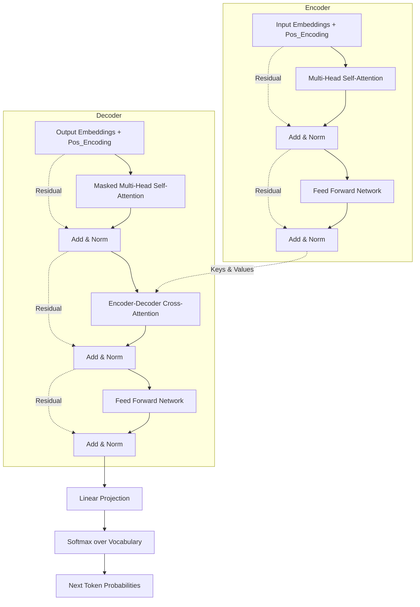

# 06 - Transformer Architecture

> **Difficulty**: ⭐⭐⭐⭐⭐ Advanced | **Prerequisites**: 05-Positional-Encoding | **Estimated Reading Time**: 35 Minutes

---

## 📋 Table of Contents
1. [What Problem Does This Solve?](#1-what-problem-does-this-solve)
2. [The Big Picture: Encoder vs Decoder](#2-the-big-picture-encoder-vs-decoder)
3. [The Encoder Block](#3-the-encoder-block)
4. [The Decoder Block (Masked Attention)](#4-the-decoder-block-masked-attention)
5. [Feed Forward Networks (FFN)](#5-feed-forward-networks-ffn)
6. [Residual Connections & Layer Normalization](#6-residual-connections--layer-normalization)
7. [Visualizing the Full Architecture](#7-visualizing-the-full-architecture)
8. [Key Takeaways](#8-key-takeaways)
9. [Next Topic](#9-next-topic)

---

# 1. What Problem Does This Solve?

We have defined the core mathematical engines: Embeddings, Positional Encoding, and Multi-Head Self-Attention. But an engine is not a car. 

### 🟢 Beginner
If we just pass a sentence through one Attention layer, the AI only learns simple relationships (like "dog" goes with "barked"). To understand complex grammar, sarcasm, and logic, the AI needs to process the text multiple times, getting deeper and deeper with each pass. We need to stack these layers like pancakes.

### 🟡 Intermediate
Furthermore, Self-Attention is strictly a linear combination of existing vectors. It cannot introduce non-linearities (like ReLU) to learn complex features. If we only stack Attention layers, the entire network collapses into a single linear matrix multiplication. 

### 🔴 Advanced
The full **Transformer Architecture** wraps the Multi-Head Attention mechanism inside a robust block containing Feed Forward Networks (for non-linearity), Residual Connections (to prevent vanishing gradients in deep stacks), and Layer Normalization (to stabilize training). It splits these blocks into two distinct stacks: an **Encoder** (for reading) and a **Decoder** (for generating).

---

# 2. The Big Picture: Encoder vs Decoder

The original 2017 Transformer was built for Translation (Seq2Seq). Therefore, it has two halves.

*   **The Encoder (The Reader):** Takes the source sentence (English) and processes it through 6 stacked blocks. It uses **Bi-directional Self-Attention** (every word looks at every other word). Its goal is pure comprehension.
*   **The Decoder (The Writer):** Takes the target sentence so far (French) and processes it through 6 stacked blocks. It uses **Masked Causal Attention** (words can only look at the past, not the future). Its goal is to predict the *next* word.

*Note: The Decoder also contains a special "Cross-Attention" layer where it looks over at the Encoder's final output to figure out what to translate.*

---

# 3. The Encoder Block

The Encoder is a stack of $N$ identical blocks (usually $N=6$ or $N=12$). Each block has two main sub-layers:

1.  **Multi-Head Self-Attention**: The sentence looks at itself to resolve grammar, context, and pronouns.
2.  **Position-wise Feed Forward Network (FFN)**: A standard MLP (Linear $\to$ ReLU $\to$ Linear) applied to *every single word individually*. 

Why an FFN? Attention just mixes vectors together. The FFN actually transforms those mixed vectors into higher-level logical representations.

---

# 4. The Decoder Block (Masked Attention)

The Decoder is also a stack of $N$ identical blocks, but each block has *three* sub-layers:

1.  **Masked Multi-Head Self-Attention**: When the Decoder is generating text during training, we feed it the entire correct output sentence all at once for speed. But it's not allowed to "cheat" and look at word 5 when trying to predict word 4. We apply a mathematical mask (setting future attention scores to $-\infty$) to ensure the self-attention is strictly **Causal**.
2.  **Encoder-Decoder Cross-Attention**: The Queries come from the Decoder (what I am currently translating). The Keys and Values come from the Encoder (the original English sentence). This is the bridge between the two languages.
3.  **Position-wise Feed Forward Network (FFN)**: Same as the Encoder.

---

# 5. Feed Forward Networks (FFN)

The FFN inside the Transformer is uniquely powerful. 
If our embedding dimension is $d_{model} = 512$, the FFN usually expands the hidden dimension by a factor of 4 ($d_{ff} = 2048$).

$$FFN(x) = \text{ReLU}(xW_1 + b_1)W_2 + b_2$$

This creates a massive expansion-and-compression bottleneck. 
- The expansion ($512 \to 2048$) acts as a massive "memory bank" where the Transformer stores facts and logical rules.
- The compression ($2048 \to 512$) forces the network to only keep the most critical information before passing it to the next block.

---

# 6. Residual Connections & Layer Normalization

If we stack 12 of these massive blocks, the network becomes incredibly deep. Deep networks suffer from vanishing gradients. 

To fix this, **Residual Connections** (also called Skip Connections) are added around every single sub-layer.
$$\text{Output} = \text{LayerNorm}(x + \text{SubLayer}(x))$$

1.  **Add ($x + \dots$)**: The original input $x$ is added directly to the output of the Attention or FFN layer. This creates a clear, uninterrupted highway for gradients to flow all the way from the final output back to the first layer.
2.  **Norm (Layer Normalization)**: Standardizes the activations across the features for each word, keeping the numbers bounded and stable, which allows for much higher learning rates.

---

# 7. Visualizing the Full Architecture

Here is the complete, high-level map of the original Transformer.

---

# 8. Key Takeaways

*   The full Transformer is comprised of an **Encoder** stack and a **Decoder** stack.
*   The **Encoder** uses bi-directional Self-Attention to deeply comprehend an input sequence.
*   The **Decoder** uses **Masked** Self-Attention to prevent cheating (looking into the future) during generation.
*   The **Cross-Attention** layer bridges the Encoder and Decoder.
*   **Feed Forward Networks (FFNs)** provide the non-linear "memory banks" of the model.
*   **Residual Connections** and **Layer Normalization** ensure stable gradients across dozens of deep layers.

---

# 9. Next Topic

We have looked at the theory and architecture of every single component. 

Now, let's open up PyTorch and actually write the code to build this entire massive architecture step-by-step from scratch.

[← Positional Encoding](05-Positional-Encoding.md) | [Back to Index](README.md) | [Next Topic: Building A Transformer Step-By-Step →](07-Building-A-Transformer-Step-By-Step.md)
