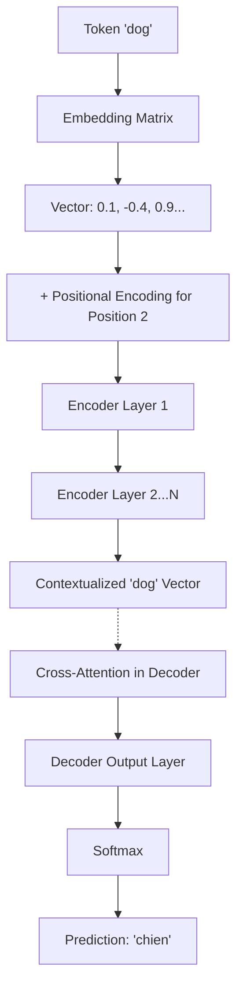

# 07 - Building A Transformer Step-By-Step

> **Difficulty**: ⭐⭐⭐⭐⭐ Advanced | **Prerequisites**: 06-Transformer-Architecture | **Estimated Reading Time**: 30 Minutes

---

## 📋 Table of Contents
1. [What Problem Does This Solve?](#1-what-problem-does-this-solve)
2. [Workflow: The Life of a Token](#2-workflow-the-life-of-a-token)
3. [Step 1: Input Embedding & Positional Encoding](#3-step-1-input-embedding--positional-encoding)
4. [Step 2: The Encoder Block](#4-step-2-the-encoder-block)
5. [Step 3: The Decoder Block](#5-step-3-the-decoder-block)
6. [Step 4: The Final Output Layer](#6-step-4-the-final-output-layer)
7. [The Complete Model (PyTorch)](#7-the-complete-model-pytorch)
8. [Key Takeaways](#8-key-takeaways)
9. [Next Topic](#9-next-topic)

---

# 1. What Problem Does This Solve?

We have discussed the theoretical components of a Transformer: Embeddings, Positional Encoding, Multi-Head Attention, and Feed-Forward Networks. 

### 🟢 Beginner
Reading about car parts (an engine, a steering wheel, tires) is not the same as building a car. If you want to truly understand how an AI works, you must watch exactly what happens to a word as it travels from the input, through the layers, to the output.

### 🟡 Intermediate
To demystify the "black box" of Deep Learning, we need to trace the exact tensor shapes and mathematical transformations as data flows through the PyTorch computational graph.

### 🔴 Advanced
This lesson serves as a capstone for the fundamental architecture. We will construct a minimal, fully functional Seq2Seq Transformer in PyTorch. This forces us to address practical engineering details like vocabulary sizing, masking matrices (padding masks vs. causal masks), and sequence broadcasting.

---

# 2. Workflow: The Life of a Token

Imagine we are training an English-to-French translation model.
The input is: `["The", "dog", "barked"]`
The target output is: `["<SOS>", "Le", "chien", "a", "aboyé"]`



---

# 3. Step 1: Input Embedding & Positional Encoding

Before any attention happens, we must convert words into numbers, and inject time.

```python
import torch
import torch.nn as nn
import math

class EmbeddingsAndPosition(nn.Module):
    def __init__(self, vocab_size, d_model, max_len=5000):
        super().__init__()
        # 1. Word Embeddings
        self.embed = nn.Embedding(vocab_size, d_model)
        
        # 2. Positional Encoding (Fixed Sinusoidal)
        pe = torch.zeros(max_len, d_model)
        position = torch.arange(0, max_len).unsqueeze(1).float()
        div_term = torch.exp(torch.arange(0, d_model, 2).float() * (-math.log(10000.0) / d_model))
        pe[:, 0::2] = torch.sin(position * div_term)
        pe[:, 1::2] = torch.cos(position * div_term)
        self.register_buffer('pe', pe.unsqueeze(0))
        
        self.d_model = d_model

    def forward(self, x):
        # x is a batch of integer token IDs. Shape: [batch, seq_len]
        # Multiply by sqrt(d_model) to scale the embeddings before adding position
        seq_len = x.size(1)
        x_emb = self.embed(x) * math.sqrt(self.d_model)
        
        # Add the positional barcode
        x_emb = x_emb + self.pe[:, :seq_len, :]
        return x_emb
```

---

# 4. Step 2: The Encoder Block

The Encoder block comprehends the English text. We need Multi-Head Attention, an FFN, and LayerNorms.

```python
class EncoderBlock(nn.Module):
    def __init__(self, d_model, heads, d_ff, dropout=0.1):
        super().__init__()
        self.self_attn = nn.MultiheadAttention(d_model, heads, dropout=dropout, batch_first=True)
        
        # Feed Forward Network
        self.ffn = nn.Sequential(
            nn.Linear(d_model, d_ff),
            nn.ReLU(),
            nn.Dropout(dropout),
            nn.Linear(d_ff, d_model)
        )
        
        self.norm1 = nn.LayerNorm(d_model)
        self.norm2 = nn.LayerNorm(d_model)
        self.dropout = nn.Dropout(dropout)

    def forward(self, x, src_mask=None):
        # 1. Multi-Head Self Attention
        # Q, K, V are all x
        attn_out, _ = self.self_attn(x, x, x, key_padding_mask=src_mask)
        
        # 2. Add & Norm
        x = self.norm1(x + self.dropout(attn_out))
        
        # 3. Feed Forward
        ffn_out = self.ffn(x)
        
        # 4. Add & Norm
        x = self.norm2(x + self.dropout(ffn_out))
        return x
```

---

# 5. Step 3: The Decoder Block

The Decoder block generates the French text. It requires a Causal Mask to prevent cheating.

```python
class DecoderBlock(nn.Module):
    def __init__(self, d_model, heads, d_ff, dropout=0.1):
        super().__init__()
        self.self_attn = nn.MultiheadAttention(d_model, heads, dropout=dropout, batch_first=True)
        self.cross_attn = nn.MultiheadAttention(d_model, heads, dropout=dropout, batch_first=True)
        
        self.ffn = nn.Sequential(
            nn.Linear(d_model, d_ff),
            nn.ReLU(),
            nn.Dropout(dropout),
            nn.Linear(d_ff, d_model)
        )
        
        self.norm1 = nn.LayerNorm(d_model)
        self.norm2 = nn.LayerNorm(d_model)
        self.norm3 = nn.LayerNorm(d_model)
        self.dropout = nn.Dropout(dropout)

    def forward(self, x, enc_out, tgt_mask=None, src_mask=None):
        # 1. Masked Self-Attention (Cannot look into the future)
        attn_out1, _ = self.self_attn(x, x, x, attn_mask=tgt_mask)
        x = self.norm1(x + self.dropout(attn_out1))
        
        # 2. Cross-Attention (Q is Decoder x, K and V are Encoder enc_out)
        attn_out2, _ = self.cross_attn(query=x, key=enc_out, value=enc_out, key_padding_mask=src_mask)
        x = self.norm2(x + self.dropout(attn_out2))
        
        # 3. Feed Forward
        ffn_out = self.ffn(x)
        x = self.norm3(x + self.dropout(ffn_out))
        
        return x
```

---

# 6. Step 4: The Final Output Layer

After the Decoder processes all blocks, it outputs a highly contextualized vector of size `d_model`. We must project this vector back up to the `vocab_size` (e.g., 50,000 words) to figure out which exact French word to output.

```python
# Typically just a single Linear layer
# generator = nn.Linear(d_model, vocab_size)
```

---

# 7. The Complete Model (PyTorch)

Finally, we wrap the pieces together into the master `Seq2SeqTransformer` class.

*(Note: In production, you would use PyTorch's built-in `nn.Transformer`. This from-scratch implementation is for educational understanding).*

```python
class Seq2SeqTransformer(nn.Module):
    def __init__(self, src_vocab, tgt_vocab, d_model=512, heads=8, d_ff=2048, num_layers=6):
        super().__init__()
        
        self.src_embed = EmbeddingsAndPosition(src_vocab, d_model)
        self.tgt_embed = EmbeddingsAndPosition(tgt_vocab, d_model)
        
        # Create N stacked Encoder blocks
        self.encoders = nn.ModuleList([EncoderBlock(d_model, heads, d_ff) for _ in range(num_layers)])
        
        # Create N stacked Decoder blocks
        self.decoders = nn.ModuleList([DecoderBlock(d_model, heads, d_ff) for _ in range(num_layers)])
        
        # Final output projection
        self.generator = nn.Linear(d_model, tgt_vocab)
        
    def generate_causal_mask(self, sz):
        # Creates a triangular matrix of -inf to block future attention
        mask = (torch.triu(torch.ones(sz, sz)) == 1).transpose(0, 1)
        mask = mask.float().masked_fill(mask == 0, float('-inf')).masked_fill(mask == 1, float(0.0))
        return mask

    def forward(self, src, tgt):
        # 1. Embeddings
        e_out = self.src_embed(src)
        d_out = self.tgt_embed(tgt)
        
        # 2. Pass through Encoders
        for encoder in self.encoders:
            e_out = encoder(e_out)
            
        # 3. Create Causal Mask for Decoder
        tgt_mask = self.generate_causal_mask(tgt.size(1)).to(tgt.device)
            
        # 4. Pass through Decoders
        for decoder in self.decoders:
            d_out = decoder(x=d_out, enc_out=e_out, tgt_mask=tgt_mask)
            
        # 5. Generate final logits
        return self.generator(d_out)

# Create a tiny model for testing
model = Seq2SeqTransformer(src_vocab=1000, tgt_vocab=1000, d_model=64, heads=2, num_layers=2)
dummy_english = torch.randint(0, 1000, (1, 10)) # 1 sentence, 10 words
dummy_french = torch.randint(0, 1000, (1, 8))   # 1 sentence, 8 words

logits = model(dummy_english, dummy_french)
print("Final Output Shape:", logits.shape) # [1, 8, 1000] -> For each of the 8 output positions, a 1000-class probability distribution!
```

---

# 8. Key Takeaways

*   **Modularity**: The Transformer is highly modular. You can easily adjust the number of blocks ($N$), heads ($h$), and embedding dimensions ($d_{model}$).
*   **The Mask**: The Decoder's causal mask is a triangular matrix filled with $-\infty$. Because Softmax uses exponents ($e^{-\infty} \to 0$), the attention weight for future tokens is mathematically forced to 0.
*   **The Generator**: The entire massive architecture ultimately just outputs a vector of size $d_{model}$, which is then linearly projected to output a vocabulary probability distribution.

---

# 9. Next Topic

We now deeply understand the original 2017 Seq2Seq translation machine.

But in 2018, researchers asked a brilliant question: *What if we throw away the Decoder, and just use the Encoder to train an AI to truly understand reading comprehension?*

This led to the creation of BERT.

[← Transformer Architecture](06-Transformer-Architecture.md) | [Back to Index](README.md) | [Next Topic: BERT & Encoder Models →](08-BERT.md)
