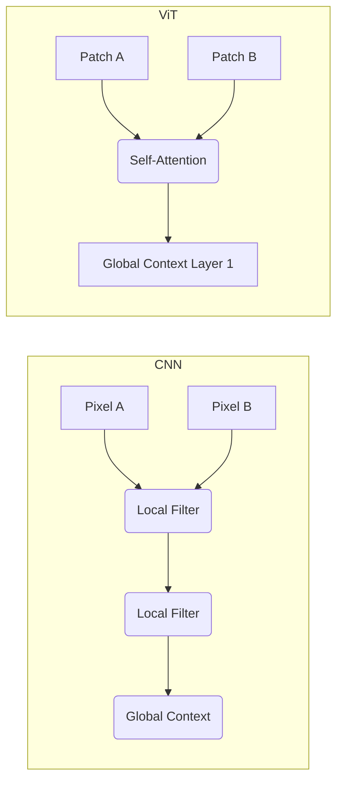

# 15 - Vision Transformers (ViT)

> **Difficulty**: ⭐⭐⭐⭐☆ Advanced | **Prerequisites**: 06-Transformer-Architecture | **Estimated Reading Time**: 20 Minutes

---

## 📋 Table of Contents
1. [What Problem Does This Solve?](#1-what-problem-does-this-solve)
2. [The Fall of the CNN](#2-the-fall-of-the-cnn)
3. [Intuition: An Image is just a Sentence of Patches](#3-intuition-an-image-is-just-a-sentence-of-patches)
4. [The ViT Architecture](#4-the-vit-architecture)
5. [Why ViTs Beat CNNs at Scale](#5-why-vits-beat-cnns-at-scale)
6. [Library Implementation (Hugging Face)](#6-library-implementation-hugging-face)
7. [Key Takeaways](#7-key-takeaways)
8. [Next Topic](#8-next-topic)

---

# 1. What Problem Does This Solve?

For nearly a decade (2012-2020), Convolutional Neural Networks (CNNs) like ResNet and VGG were the undisputed kings of Computer Vision. 

### 🟢 Beginner
A CNN looks at an image through a tiny sliding window (a 3x3 filter). It slowly scans the image, looking for edges, then shapes, then objects. This is mathematically efficient, but it means the network has severe "tunnel vision". It struggles to connect a pixel in the top-left corner directly to a pixel in the bottom-right corner.

### 🟡 Intermediate
To connect distant parts of an image, a CNN has to pass the data through dozens of layers of pooling and downsampling. This creates an enormous path length for gradients. We learned in NLP that long path lengths destroy context. If Self-Attention solved this in NLP, why couldn't we use Self-Attention on images?

### 🔴 Advanced
**Vision Transformers (ViT)**, introduced by Google in 2020, proved that reliance on CNNs was unnecessary. By slicing an image into a sequence of flattened 2D patches, applying linear projections to embed them, and feeding them directly into a standard, unmodified NLP Transformer Encoder, ViTs achieved state-of-the-art results. The ViT possesses a global receptive field from Layer 1, completely breaking the spatial restrictions of convolutions.

---

# 2. The Fall of the CNN

CNNs have a strong **Inductive Bias** called *translation invariance*. A CNN assumes that a cat in the top-left corner is mathematically the exact same thing as a cat in the bottom-right corner, because the same 3x3 filter slides over both. 

This inductive bias is amazing for small datasets because it prevents overfitting. 

But as datasets scaled to billions of images (like JFT-300M), researchers realized that inductive bias was actually a *handicap*. If you have infinite data, you don't want the architecture to force assumptions (biases) onto the data. You want the architecture to be as flexible and unconstrained as possible (like a Transformer), and let the data teach the model everything.

---

# 3. Intuition: An Image is just a Sentence of Patches

How do we feed a 224x224 RGB image into a Transformer that expects a sentence of words?

If we treat every single pixel as a word, the sequence length would be $224 \times 224 = 50,176$.
Because Attention scales quadratically $O(N^2)$, the math would literally crash the GPU. A sequence of 50,000 tokens requires an Attention matrix of 2.5 Billion elements *per head, per layer*.

**The Solution: Patches**
Instead of pixels, we slice the image into 16x16 grids (like a chessboard). 
A 224x224 image sliced into 16x16 patches yields exactly **196 patches**.
A sequence length of 196 is trivial for a Transformer.

---

# 4. The ViT Architecture

Here is the exact pipeline of a Vision Transformer:

1.  **Patch Extraction:** Chop the image into 196 patches (each patch is $16 \times 16 \times 3$ RGB pixels).
2.  **Linear Projection (Flattening):** Flatten each patch into a 1D vector ($16 \times 16 \times 3 = 768$ numbers). Pass it through a standard Linear layer to project it into the model's embedding dimension.
3.  **Add Positional Encoding:** Just like words, the patches are processed simultaneously. The Transformer doesn't know that Patch 5 is next to Patch 6. We add a learned 1D positional encoding to every patch vector.
4.  **Prepend the `[CLS]` Token:** Just like BERT, we add a dummy `[CLS]` token to the beginning of the sequence.
5.  **Transformer Encoder:** Pass the sequence of 197 vectors through a standard stack of Transformer Encoder blocks (Multi-Head Self Attention + FFN + LayerNorm).
6.  **Classification Head:** Take the final output vector of the `[CLS]` token and pass it through a Linear layer to classify the image (e.g., "Dog" or "Cat").

---

# 5. Why ViTs Beat CNNs at Scale

When a ViT is trained on a small dataset (like ImageNet, 1M images), it actually performs *worse* than a CNN like ResNet. It lacks the CNN's inductive bias and easily overfits.

But when trained on 300 Million images, the ViT absolutely destroys the CNN. 

Because the ViT has a **Global Receptive Field** from Layer 1, the Self-Attention mechanism can instantly correlate a tire in Patch 12 with a steering wheel in Patch 185. A CNN wouldn't be able to connect those two features until Layer 50.



---

# 6. Library Implementation (Hugging Face)

Implementing a ViT is identical to implementing BERT, thanks to the Hugging Face API.

```python
# pip install transformers torch torchvision
from transformers import ViTImageProcessor, ViTForImageClassification
from PIL import Image
import requests

# 1. Load Image
url = 'http://images.cocodataset.org/val2017/000000039769.jpg'
image = Image.open(requests.get(url, stream=True).raw)

# 2. Load the Processor (Acts like a Tokenizer, chops the image into patches) and the Model
processor = ViTImageProcessor.from_pretrained('google/vit-base-patch16-224')
model = ViTForImageClassification.from_pretrained('google/vit-base-patch16-224')

# 3. Process the Image
inputs = processor(images=image, return_tensors="pt")

# 4. Predict
outputs = model(**inputs)
logits = outputs.logits
predicted_class_idx = logits.argmax(-1).item()

print("Predicted class:", model.config.id2label[predicted_class_idx])
```

---

# 7. Key Takeaways

*   **ViT (Vision Transformer)** applies the NLP Transformer architecture directly to Computer Vision.
*   It works by chopping an image into $16 \times 16$ **Patches**, flattening them, and treating them exactly like words in a sentence.
*   ViTs have no spatial **Inductive Bias** (unlike CNNs), meaning they require massive datasets to train without overfitting.
*   Once trained on massive data, ViTs outperform CNNs because their Self-Attention mechanism provides a **Global Receptive Field** starting at Layer 1.

---

# 8. Next Topic

We have reached the end of the architectural journey. We have seen Encoders, Decoders, RAG systems, and Vision Transformers.

In our final lesson, we will zoom out and look at the state of the industry today: The era of massive, open-source **Foundation Models**.

[← Multimodal Transformers](14-Multimodal-Transformers.md) | [Back to Index](README.md) | [Next Topic: Modern Foundation Models →](16-Modern-Foundation-Models.md)
