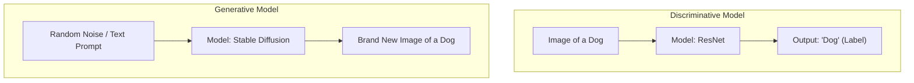

# 01 - Introduction To Generative AI

> **Difficulty**: ⭐☆☆☆☆ Beginner | **Prerequisites**: None | **Estimated Reading Time**: 15 Minutes

---

## 📋 Table of Contents
1. [What Problem Does This Solve?](#1-what-problem-does-this-solve)
2. [What is Generative AI?](#2-what-is-generative-ai)
3. [Generative vs. Discriminative Models](#3-generative-vs-discriminative-models)
4. [Types of Generative AI](#4-types-of-generative-ai)
5. [Why Now? The Generative Boom](#5-why-now-the-generative-boom)
6. [Key Takeaways](#6-key-takeaways)
7. [Next Topic](#7-next-topic)

---

# 1. What Problem Does This Solve?

For decades, Artificial Intelligence was primarily used as an analytical tool. It was used to look at data and make a decision: 
- "Is this email spam or not?"
- "Is this a picture of a cat or a dog?"
- "Will this customer churn next month?"

### 🟢 Beginner
Analytical AI is incredibly useful, but it has a massive limitation: **It cannot create.** If you ask a standard image classifier to draw you a picture of a cat, it will fail. It only knows how to *recognize* cats, not how to *build* them.

### 🟡 Intermediate
In traditional Supervised Learning, we map inputs $X$ (an image) to outputs $Y$ (a label) by learning the conditional probability $P(Y|X)$. This restricts the model to a fixed set of predefined classes. If we want an AI to write a novel, compose a symphony, or design a new pharmaceutical drug, we need a fundamentally different mathematical approach. 

### 🔴 Advanced
To create new data, we must move away from learning $P(Y|X)$ and instead learn the joint probability distribution $P(X, Y)$ or the underlying data distribution $P(X)$. If a neural network can perfectly map the multi-dimensional manifold of "what makes a human face look like a human face," we can sample from that mathematical space to generate a brand new, photorealistic face of a person who has never existed. This is the domain of **Generative AI**.

---

# 2. What is Generative AI?

**Generative AI** refers to a class of machine learning models designed to generate new, original content that resembles the data they were trained on.

Instead of classifying data, they *synthesize* data. 
If trained on Shakespeare, they write new plays in his style. If trained on Van Gogh, they paint new post-impressionist artwork.

---

# 3. Generative vs. Discriminative Models

To truly understand Generative AI, we must contrast it with Discriminative AI.

| Feature | Discriminative AI | Generative AI |
| :--- | :--- | :--- |
| **Primary Goal** | Classify or predict an outcome based on input. | Create entirely new data samples. |
| **Math Objective** | Learn the boundary *between* classes ($P(Y|X)$). | Learn the distribution *of* the classes ($P(X)$). |
| **Example Use Case**| Identifying fraudulent bank transactions. | Generating synthetic bank data to train fraud models without violating privacy. |
| **Classic Models** | Logistic Regression, Random Forest, CNNs. | VAEs, GANs, Diffusion Models, LLMs. |

**The Intuition:**
Imagine you are trying to learn a new language. 
- A **Discriminative** approach is a multiple-choice test. You can look at a Spanish sentence and correctly guess its English translation.
- A **Generative** approach is an essay test. You are handed a blank piece of paper and asked to write a fluent, original Spanish essay from scratch. 

Generative tasks are inherently much harder and require a far deeper understanding of the underlying data distribution.

---

# 4. Types of Generative AI

Generative models are not limited to a single domain. They have conquered nearly every modality of human media:

1.  **Text Generation (LLMs)**: Models like GPT-4, Llama, and Claude. They write code, draft emails, summarize documents, and act as conversational agents.
2.  **Image Generation**: Models like Stable Diffusion, Midjourney, and DALL-E. They generate photorealistic images or stylized art from text descriptions.
3.  **Audio Generation**: Models like Suno or ElevenLabs. They clone voices, generate highly realistic Text-To-Speech (TTS), or compose original music with vocals.
4.  **Video Generation**: Models like Sora. They generate temporally consistent, highly realistic video clips from text prompts.
5.  **Scientific Generation**: Models like AlphaFold (creating new protein structures) or drug discovery models synthesizing novel molecular compounds.

---

# 5. Why Now? The Generative Boom

The theoretical math for Generative AI has existed for decades. Why did it suddenly explode into the mainstream in the 2020s?

1.  **Massive Compute (GPUs)**: Training a foundation model requires tens of thousands of GPUs running continuously for months. This level of compute was simply not available or affordable in the 2010s.
2.  **Massive Data**: The internet provided a nearly infinite repository of text, images, and code. Models are now trained on trillions of tokens (words) and billions of image-caption pairs.
3.  **Architectural Breakthroughs**: The invention of the **Transformer** (2017) solved the sequential bottleneck of RNNs, allowing text models to scale infinitely. The invention of **Diffusion Models** (2020) stabilized image generation, replacing the notoriously unstable GAN architectures.

---

# 6. Key Takeaways

*   **Discriminative models** draw boundaries between data classes to classify them.
*   **Generative models** learn the underlying distribution of the data to create brand new samples.
*   Generative AI spans multiple modalities: text, image, audio, video, and scientific structures.
*   The recent boom is driven by the convergence of massive GPU clusters, internet-scale datasets, and breakthrough architectures like Transformers and Diffusion.

---

# 7. Next Topic

To understand how an AI can generate a face out of thin air, we must first understand the fundamental mathematical principle that makes it possible: **Probability Distributions**. 

Before we build complex neural networks, we must understand how to sample from a distribution.

[Back to Index](README.md) | [Next Topic: Probability & Generative Modeling →](02-Probability-And_Generative_Modeling.md)
