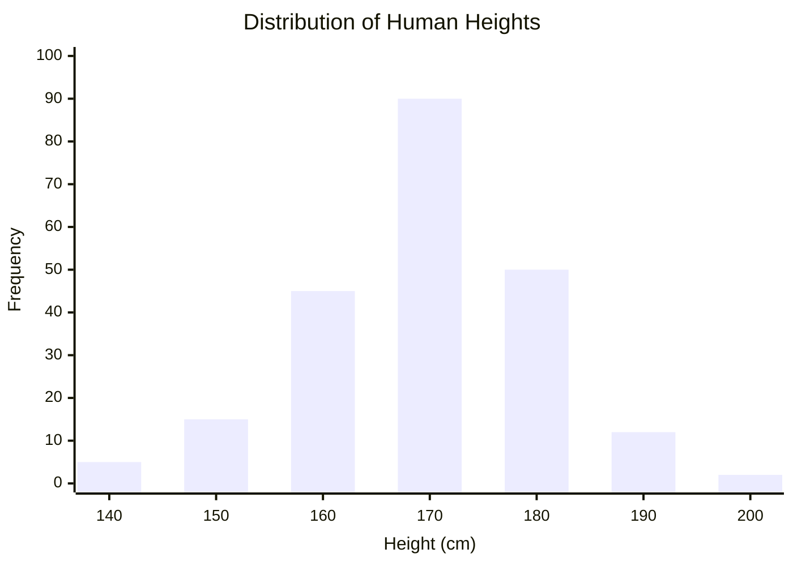

# 02 - Probability & Generative Modeling

> **Difficulty**: ⭐⭐☆☆☆ Intermediate | **Prerequisites**: 01-Introduction-To-Generative-AI | **Estimated Reading Time**: 20 Minutes

---

## 📋 Table of Contents
1. [Why Probability Matters](#1-why-probability-matters)
2. [Data Distributions: Visual Intuition](#2-data-distributions-visual-intuition)
3. [Likelihood & Maximum Likelihood Estimation (MLE)](#3-likelihood--maximum-likelihood-estimation-mle)
4. [Sampling: How AI Actually "Creates"](#4-sampling-how-ai-actually-creates)
5. [The Curse of Dimensionality](#5-the-curse-of-dimensionality)
6. [Key Takeaways](#6-key-takeaways)
7. [Next Topic](#7-next-topic)

---

# 1. Why Probability Matters

If you want to build a machine that paints original artwork, you cannot use hardcoded `if/else` statements. You cannot say: `if pixel_1 is red, then pixel_2 must be blue`. 

### 🟢 Beginner
There are nearly infinite ways to draw a face. Some faces have big eyes, some have small eyes. Both are valid. We don't want an AI that just memorizes *one* exact face. We want an AI that understands the *rules* of what a face looks like, and can draw a million different valid variations. To do this, the AI must understand **Probability**.

### 🟡 Intermediate
Generative AI treats reality as a probability distribution. Out of all the possible ways to arrange pixels on a 256x256 screen, 99.999% of them look like random TV static. A very tiny, specific cluster of those pixel arrangements looks like a human face. Generative modeling is the mathematical quest to find that tiny, specific cluster in high-dimensional space.

### 🔴 Advanced
Formally, we assume our dataset (e.g., millions of photos of faces) was generated by some unknown true data distribution $P_{data}(x)$. 
Our goal is to build a neural network with parameters $\theta$ that approximates this distribution: $P_\theta(x) \approx P_{data}(x)$. 
If our approximation is good enough, we can **sample** from $P_\theta(x)$ to generate new images that look like they came from the original training set, even though they are completely original.

---

# 2. Data Distributions: Visual Intuition

Let's start simple. Imagine we want to generate synthetic data for human heights.

We go to a city and measure 1,000 people. We plot those heights on a graph.

This bell curve is our **Data Distribution**. 
To "generate" a new, fake human height, we don't just pick a random number between 0 and 1,000. That might give us a 500 cm tall human! 

Instead, we **sample** from this bell curve. 
Because the curve is highest around 170 cm, our random generator will most frequently output numbers near 170 cm. It will occasionally output 190 cm, and it will almost never output 250 cm.

Generative AI does this exact same thing, but instead of 1-dimensional height, it works with 3-dimensional colors across 1 million pixels (a 3-million-dimensional bell curve!).

---

# 3. Likelihood & Maximum Likelihood Estimation (MLE)

How do we actually train a neural network to learn a distribution? We use **Maximum Likelihood Estimation (MLE)**.

Let's say our AI model currently guesses that all human faces are completely random green static. 
We feed it a real photograph of a human face from our training set, and we ask the AI: 
*"According to your current internal probability rules, what was the likelihood (chance) of this specific image existing?"*

Because the AI currently thinks faces are green static, it will say: *"The probability of that real face existing is 0.00000001%."*

**The Training Loop:**
1.  We calculate the **Likelihood** of the real data under the model's current assumptions.
2.  We calculate the gradient (the error).
3.  We update the model's weights to *increase* the probability it assigns to that real image.
4.  We repeat this for millions of images.

Eventually, the model's internal probability distribution $P_\theta(x)$ shifts to perfectly overlap the true distribution $P_{data}(x)$.

$$\theta^* = \arg\max_\theta \sum_{i=1}^N \log P_\theta(x_i)$$

*(Note: We use Log-Likelihood because multiplying millions of tiny probabilities together causes computer hardware to underflow to zero. Taking the `log` allows us to add the numbers instead).*

---

# 4. Sampling: How AI Actually "Creates"

Once the model has learned the distribution $P_\theta(x)$, how do we get a picture out of it?

We use a Random Number Generator. 
We feed a random vector of noise (e.g., `[0.4, -0.2, 0.9...]`) into the network. The network mathematically transforms that random noise, bending it and shifting it until it lands in a high-probability zone of the distribution (a valid face).

Because we start with *random* noise every time, the network transforms it into a *different* valid face every time. This is why you can prompt an AI 10 times and get 10 different results.

---

# 5. The Curse of Dimensionality

If MLE is so simple, why didn't we have photorealistic AI in 2010?

Because of **The Curse of Dimensionality**.
A 256x256 color image has $256 \times 256 \times 3 = 196,608$ pixel values. 
Trying to calculate the probability distribution across 196,608 dimensions directly is mathematically impossible. The mathematical space is so unimaginably massive that our training data (even 100 million images) is just a tiny speck of dust in an infinite void.

To make Generative AI work, we cannot operate in raw pixel space. We must compress the data into a smaller, dense, semantic space before we try to learn its probability. We call this compressed space a **Latent Space**.

---

# 6. Key Takeaways

*   Generative models view the world through **Probability Distributions**.
*   We train them using **Maximum Likelihood Estimation (MLE)**, which forces the model to assign high probability to real training data.
*   We generate new data by **Sampling** random noise and letting the model map that noise into a high-probability region (like generating a face).
*   Raw images have too many pixels (dimensions) to model probability directly. We must compress them first.

---

# 7. Next Topic

To beat the curse of dimensionality, we need a neural network that acts like a zip file. It must compress a massive 196,000-pixel image down into a tiny vector of just 512 numbers (the Latent Space), while preserving all its semantic meaning.

This foundational architecture is called the **Autoencoder**.

[← Introduction To Generative AI](01-Introduction-To-Generative-AI.md) | [Back to Index](README.md) | [Next Topic: Autoencoders →](03-Autoencoders.md)
