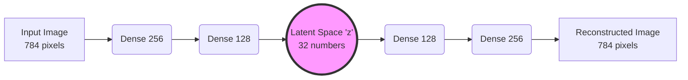

# 03 - Autoencoders

> **Difficulty**: ⭐⭐☆☆☆ Intermediate | **Prerequisites**: 02-Probability-And_Generative_Modeling | **Estimated Reading Time**: 20 Minutes

---

## 📋 Table of Contents
1. [What Problem Does This Solve?](#1-what-problem-does-this-solve)
2. [The Autoencoder Architecture](#2-the-autoencoder-architecture)
3. [The Latent Space (The Bottleneck)](#3-the-latent-space-the-bottleneck)
4. [Training an Autoencoder](#4-training-an-autoencoder)
5. [Applications of Autoencoders](#5-applications-of-autoencoders)
6. [Why Autoencoders Are NOT Good Generative Models](#6-why-autoencoders-are-not-good-generative-models)
7. [Key Takeaways](#7-key-takeaways)
8. [Next Topic](#8-next-topic)

---

# 1. What Problem Does This Solve?

We established that dealing with raw, high-dimensional pixels (like a 256x256 image with 196,608 numbers) is a mathematical nightmare for probability models. 

### 🟢 Beginner
Imagine you want to describe your friend to a sketch artist over the phone. You don't read off the RGB hex code of every single pixel of their face. You say: *"Brown hair, green eyes, square jaw, glasses."* You have **compressed** millions of visual details into just 4 key concepts. 

### 🟡 Intermediate
Neural networks can do this too. We want to build a network that takes a 196,608-dimensional image and compresses it into a tiny array of 512 numbers (the "concepts"). If the network is smart enough to compress the image, it should also be smart enough to decompress those 512 numbers back into the original image.

### 🔴 Advanced
This architecture is called an **Autoencoder (AE)**. It is an unsupervised learning model designed to learn efficient data codings (representations). It forces the data through a low-dimensional bottleneck, stripping away noise and redundancy, and retaining only the most critical principal components required for reconstruction.

---

# 2. The Autoencoder Architecture

An Autoencoder consists of two distinct neural networks glued together:

1.  **The Encoder:** Compresses the input $x$ into a smaller, dense representation $z$. 
    $z = f_{encoder}(x)$
2.  **The Decoder:** Decompresses the dense representation $z$ back into the original input space $\hat{x}$.
    $\hat{x} = f_{decoder}(z)$

---

# 3. The Latent Space (The Bottleneck)

The bottleneck in the middle is the most important part of the network. It is called the **Latent Space**.

If the input is 784 pixels, and the bottleneck is 784 numbers, the network will just memorize the data by copying the input directly to the output. It learns nothing.

By forcing the bottleneck to be very small (e.g., 32 numbers), the network panics. It cannot memorize 784 pixels in 32 slots. It is forced to learn patterns. It might learn that dimension 1 in the latent space represents "brightness", dimension 2 represents "curved edges", and dimension 3 represents "horizontal lines".

This compressed, dense representation is highly semantic.

---

# 4. Training an Autoencoder

Unlike most networks, an Autoencoder doesn't need labels (like "Dog" or "Cat"). It learns by trying to recreate its own input.

**The Loss Function:**
We use **Mean Squared Error (MSE)** between the original image and the reconstructed image.

$$L(x, \hat{x}) = ||x - \hat{x}||^2$$

If the network reconstructs a blurry mess, the MSE is high, and backpropagation adjusts the weights of both the Encoder and Decoder. If the reconstruction is perfect, the loss is zero.

---

# 5. Applications of Autoencoders

While we are studying them for Generative AI, Autoencoders are incredibly useful in traditional Data Science:

1.  **Image Compression:** They act like an AI-powered `.jpg` or `.zip` algorithm.
2.  **Denoising:** If you train an Autoencoder by feeding it noisy/blurry images as input, but calculating the loss against clean/sharp images, the network learns to mathematically subtract noise.
3.  **Anomaly Detection:** Train an Autoencoder exclusively on photos of perfectly manufactured car parts. If a broken car part comes down the assembly line, the Autoencoder will fail to reconstruct the crack (because it has never seen a crack before). A massive spike in Reconstruction MSE triggers an alarm!

---

# 6. Why Autoencoders Are NOT Good Generative Models

We have a Latent Space. Can we use it to generate new data?

What if we just cut off the Encoder, pick 32 random numbers, feed them into the Decoder, and see what it draws?

**It will fail spectacularly.** It will likely draw garbage static. Why?

Because a standard Autoencoder does not organize its Latent Space. 
During training, the Encoder might map the digit "1" to the coordinates `[10, 50]` and the digit "2" to `[-400, 2]`. The space between them `[0, 25]` is an unmapped, empty void. The Decoder has never seen those coordinates before and doesn't know what to do with them.

A standard Autoencoder is a *memorization* tool, not a *probability* tool. Its latent space is jagged, disconnected, and full of empty holes.

---

# 7. Key Takeaways

*   **Autoencoders** compress high-dimensional data into a low-dimensional **Latent Space**.
*   They consist of an **Encoder** (compression) and a **Decoder** (reconstruction).
*   They are trained without labels using **Reconstruction Loss (MSE)**.
*   They are amazing at Anomaly Detection and Denoising, but terrible at Generation because their latent space is discontinuous.

---

# 8. Next Topic

To generate new data, we must force the Encoder to organize the Latent Space. We need to smooth out the mathematical terrain so there are no empty voids. We need to bridge Probability with Autoencoders.

This leads us to one of the most elegant architectures in Deep Learning: **The Variational Autoencoder (VAE)**.

[← Probability & Generative Modeling](02-Probability-And_Generative_Modeling.md) | [Back to Index](README.md) | [Next Topic: Variational Autoencoders (VAEs) →](04-Variational-Autoencoders-VAEs.md)
