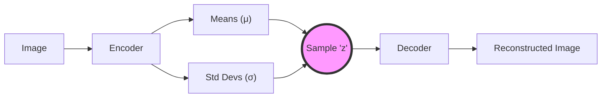

# 04 - Variational Autoencoders (VAEs)

> **Difficulty**: ⭐⭐⭐⭐☆ Advanced | **Prerequisites**: 03-Autoencoders | **Estimated Reading Time**: 30 Minutes

---

## 📋 Table of Contents
1. [What Problem Does This Solve?](#1-what-problem-does-this-solve)
2. [Why Standard Autoencoders Fail at Generation](#2-why-standard-autoencoders-fail-at-generation)
3. [The VAE Solution: Outputting Distributions](#3-the-vae-solution-outputting-distributions)
4. [The Reparameterization Trick](#4-the-reparameterization-trick)
5. [The Loss Function: Reconstruction + KL Divergence](#5-the-loss-function-reconstruction--kl-divergence)
6. [Visualizing the Latent Space](#6-visualizing-the-latent-space)
7. [Common Failure Cases (Posterior Collapse)](#7-common-failure-cases-posterior-collapse)
8. [Key Takeaways](#8-key-takeaways)
9. [Next Topic](#9-next-topic)

---

# 1. What Problem Does This Solve?

We built a standard Autoencoder. It compressed an image of a handwritten "8" into the coordinates `[2.5, -1.3]` in the latent space. We then fed `[2.5, -1.3]` to the Decoder, and it successfully drew an "8".

### 🟢 Beginner
If we want to generate a *brand new* number that the network has never seen before, maybe a hybrid between an "8" and a "3", we should logically be able to pick a coordinate exactly halfway between them. If "3" is at `[2.5, 5.0]`, we should pick `[2.5, 1.85]`. 

### 🟡 Intermediate
But if we feed `[2.5, 1.85]` to a standard Autoencoder's Decoder, it doesn't draw a hybrid number. It draws complete garbage. The standard Autoencoder never learned what to do with the "empty space" between the numbers. Its latent space is severely discontinuous.

### 🔴 Advanced
To turn an Autoencoder into a Generative Model, we must force the latent space to be **continuous** and **complete**. 
- *Continuous*: Two close points in the latent space should decode to two similar images.
- *Complete*: Any point sampled from the latent distribution should yield a valid, meaningful image.
We achieve this mathematically using the **Variational Autoencoder (VAE)**.

---

# 2. Why Standard Autoencoders Fail at Generation

A standard Autoencoder learns a deterministic mapping. 
Image A $\to$ Coordinate A.
Image B $\to$ Coordinate B.

Because the network only wants to minimize Reconstruction Error, it actively pushes Coordinate A and Coordinate B as far away from each other as possible, to avoid any confusion. This creates massive, unmapped voids between data points.

---

# 3. The VAE Solution: Outputting Distributions

A Variational Autoencoder makes a fundamental architectural change.

Instead of the Encoder outputting a single, fixed coordinate (e.g., `[2.5, -1.3]`), the Encoder outputs **two vectors**:
1.  A vector of Means ($\mu$).
2.  A vector of Standard Deviations ($\sigma$).

These two vectors define a **Probability Distribution** (specifically, a Gaussian/Normal distribution).

Now, when we encode the image of the "8", we don't get a single point. We get a glowing, fuzzy "cloud" of probability centered at `[2.5, -1.3]`.

During training, we sample a random point from inside this fuzzy cloud and feed *that* point to the Decoder. Because the cloud is fuzzy, the Decoder is forced to learn how to decode *every* point inside the cloud into a valid "8". This smooths out the latent space, completely filling in the empty voids!

---

# 4. The Reparameterization Trick

We have a massive engineering problem.

We need to sample $z$ randomly from the distribution defined by $\mu$ and $\sigma$. 
$$z \sim \mathcal{N}(\mu, \sigma^2)$$

But **Backpropagation cannot flow through a random node!** You cannot calculate the derivative of "randomness". If we just use `random.normal()`, the gradients will die at the sampling step, and the Encoder will never learn.

**The Solution: The Reparameterization Trick.**
Instead of sampling $z$ directly from the complex distribution, we sample a random variable $\epsilon$ from a standard Normal distribution (Mean=0, StdDev=1). Then, we shift and scale it using our learned parameters:

$$z = \mu + \sigma \odot \epsilon$$

Now, the randomness ($\epsilon$) is just a side-input. The gradients can easily flow backward through addition ($+$) and multiplication ($\times$) straight into $\mu$ and $\sigma$. The network can train!

---

# 5. The Loss Function: Reconstruction + KL Divergence

To train a VAE, we need a two-part Loss Function.

1.  **Reconstruction Loss (MSE or Binary Cross Entropy):**
    Just like a standard AE, we punish the network if the decoded output doesn't match the input. This ensures the model learns to draw well.

2.  **KL Divergence Loss:**
    If we only use Reconstruction Loss, the network will cheat. It will make the Standard Deviation ($\sigma$) infinitesimally small, turning the "fuzzy cloud" back into a single point (reverting to a standard AE). 
    We add **Kullback-Leibler (KL) Divergence** to the loss. This mathematical penalty forces the Encoder's distributions to look as close as possible to a standard Normal distribution $\mathcal{N}(0, 1)$. 

**The Balance:**
- Reconstruction Loss forces the clouds to separate so they don't get mixed up.
- KL Divergence forces all the clouds to pack tightly together around the center of the graph `[0,0]`.
- The result is a beautifully packed, dense sphere of probability clouds with zero empty voids between them.

---

# 6. Visualizing the Latent Space

Because the clouds are forced to overlap, the Decoder learns smooth, continuous transitions.

If we map the latent space of a VAE trained on human faces, we can perform **Latent Space Arithmetic**.

Let's find the coordinate for a "Man with Glasses". Let's subtract the coordinate for a "Man without Glasses". The resulting vector mathematically represents "Glasses".

If we take the coordinate for a "Woman without Glasses", and add the "Glasses" vector, the VAE will generate a flawless image of a Woman *with* Glasses!

$$ \text{Man (Glasses)} - \text{Man} + \text{Woman} = \text{Woman (Glasses)} $$

This proves the VAE didn't just memorize pixels. It learned abstract, semantic concepts.

---

# 7. Common Failure Cases (Posterior Collapse)

VAEs are famously difficult to train because of the two-part loss function.

If the KL Divergence weight is set too high, the network experiences **Posterior Collapse**. The network realizes it is too hard to reconstruct the image perfectly, so it gives up. It forces all of the $\mu$ and $\sigma$ vectors to be exactly 0 and 1, perfectly satisfying the KL penalty. 

The latent space completely collapses. The model ignores the input image entirely and just generates a blurry, average "blob" for every single request.

*(Fix: Use KL-Annealing, where you start the KL weight at 0 and slowly increase it during training).*

---

# 8. Key Takeaways

*   Standard Autoencoders fail at generation because their latent spaces are discontinuous and full of unmapped voids.
*   **VAEs (Variational Autoencoders)** solve this by forcing the Encoder to output Probability Distributions ($\mu$ and $\sigma$) instead of fixed points.
*   The **Reparameterization Trick** allows backpropagation to flow through random sampling.
*   The Loss function balances **Reconstruction** (making the image look good) with **KL Divergence** (packing the latent space tightly together).
*   A well-trained VAE allows for smooth interpolation and latent arithmetic (e.g., adding a "smile" vector to a neutral face).

---

# 9. Next Topic

VAEs are mathematically elegant, but their images are notoriously blurry. Because they optimize for Mean Squared Error (MSE), they tend to average out fine details like fur or hair, creating a "smudged" look.

If we want incredibly sharp, photorealistic images, we must abandon MSE entirely. We need a network that learns by fighting another network. 

[← Autoencoders](03-Autoencoders.md) | [Back to Index](README.md) | [Next Topic: Generative Adversarial Networks (GANs) →](05-Generative-Adversarial-Networks-GANs.md)
