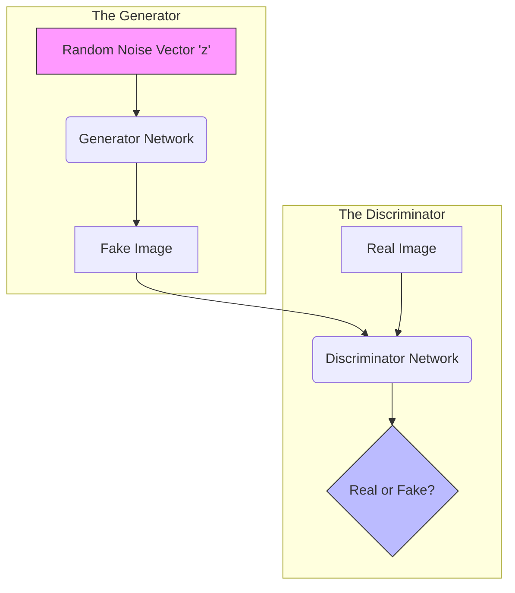

# 05 - Generative Adversarial Networks (GANs)

> **Difficulty**: ⭐⭐⭐☆☆ Intermediate | **Prerequisites**: 04-Variational-Autoencoders-VAEs | **Estimated Reading Time**: 25 Minutes

---

## 📋 Table of Contents
1. [What Problem Does This Solve?](#1-what-problem-does-this-solve)
2. [The Intuition: The Counterfeiter and The Police](#2-the-intuition-the-counterfeiter-and-the-police)
3. [The GAN Architecture](#3-the-gan-architecture)
4. [Adversarial Training Dynamics](#4-adversarial-training-dynamics)
5. [The Mathematics of the Minimax Game](#5-the-mathematics-of-the-minimax-game)
6. [Common Failure Cases (Mode Collapse)](#6-common-failure-cases-mode-collapse)
7. [Key Takeaways](#7-key-takeaways)
8. [Next Topic](#8-next-topic)

---

# 1. What Problem Does This Solve?

Variational Autoencoders (VAEs) are mathematically beautiful. They guarantee a perfectly organized latent space. But if you look at a face generated by a VAE, it looks slightly blurry.

### 🟢 Beginner
VAEs are trained using **Mean Squared Error (MSE)**. MSE hates being "completely wrong." If the VAE isn't sure exactly where to place a sharp strand of hair, it will safely draw a fuzzy, gray blur instead of risking drawing a sharp black line in the wrong spot. To get ultra-realistic, razor-sharp images, we have to stop punishing the AI for being slightly off by a few pixels. We need a completely different way to grade its homework.

### 🟡 Intermediate
Instead of grading the AI using a strict math formula (MSE), what if we hired *another* AI to grade the homework? We can build a second neural network whose only job is to look at an image and say: *"Does this look real, or does it look fake?"* This allows the generator to take risks and draw sharp details, because as long as it *looks* realistic, the grader will approve.

### 🔴 Advanced
Introduced by Ian Goodfellow in 2014, **Generative Adversarial Networks (GANs)** completely abandon explicit probability density estimation (like VAEs). Instead, they learn implicitly via a **Minimax Game**. Two neural networks are trained simultaneously in a zero-sum game. This completely removes the "blurriness" of MSE, leading to the first truly photorealistic AI images.

---

# 2. The Intuition: The Counterfeiter and The Police

The most famous analogy for a GAN is the Art Forger (Counterfeiter) and the Art Detective (Police).

*   **The Generator (The Forger):** Starts out completely blind. It scribbles random static on a canvas and hands it to the Detective. Its goal is to trick the Detective into thinking the painting is a real Picasso.
*   **The Discriminator (The Detective):** Is shown a mix of *real* Picasso paintings and the Forger's *fake* scribbles. Its goal is to correctly label them as Real or Fake.

**The Loop:**
1.  The Forger draws static. The Detective easily spots the fake.
2.  The Forger learns that Picasso used a lot of blue. It draws a blue blob. The Detective learns that real Picassos have geometric shapes, not blobs, and spots the fake.
3.  The Forger learns geometric shapes. The Detective learns brush strokes.

They are locked in an evolutionary arms race. As the Detective gets better at spotting fakes, the Forger is forced to become a master artist to trick the Detective. 

Eventually, the Forger becomes so incredibly good that it draws a perfect Picasso. At this point, the Detective is completely guessing (50/50 chance), and training is complete.

---

# 3. The GAN Architecture

1.  **The Generator ($G$):** Takes in a random noise vector $z$ (e.g., 100 random numbers). It uses Transposed Convolutions (Deconvolutions) to upscale those numbers into a full image.
2.  **The Discriminator ($D$):** A standard Convolutional Neural Network (CNN). It takes in an image, downsamples it, and outputs a single probability between 0 and 1 (0 = Fake, 1 = Real).

---

# 4. Adversarial Training Dynamics

Training a GAN is notoriously difficult because you are training two networks simultaneously.

**Step 1: Train the Discriminator**
- Freeze the Generator's weights.
- Give the Discriminator a batch of Real images (Label = 1).
- Give the Discriminator a batch of Fake images generated by the frozen Generator (Label = 0).
- Update the Discriminator's weights using Binary Cross Entropy to improve its accuracy.

**Step 2: Train the Generator**
- Freeze the Discriminator's weights.
- Generate a new batch of Fake images.
- Pass them through the Discriminator.
- **The Trick:** Calculate the loss using Label = 1 (Real). We are calculating how badly the Generator *failed to trick* the Discriminator.
- Update the Generator's weights to make it better at tricking the frozen Discriminator.

Repeat Steps 1 and 2 thousands of times.

---

# 5. The Mathematics of the Minimax Game

The entire GAN architecture is defined by a single value function $V(D, G)$:

$$ \min_G \max_D V(D, G) = \mathbb{E}_{x \sim p_{data}(x)} [\log D(x)] + \mathbb{E}_{z \sim p_z(z)} [\log (1 - D(G(z)))] $$

*   The Discriminator ($D$) wants to **maximize** this equation (make $D(x)$ close to 1, and $D(G(z))$ close to 0).
*   The Generator ($G$) wants to **minimize** this equation (make $D(G(z))$ close to 1, forcing the right side of the equation to $\log(0) \to -\infty$).

---

# 6. Common Failure Cases (Mode Collapse)

Because GANs are a delicate balancing act between two networks, they break easily.

1.  **The Discriminator Wins Too Early:** If the Discriminator gets too smart too fast, it will perfectly identify every fake image with 100% confidence. The Generator will receive a gradient of 0. It won't know *how* to improve, so it will stop learning entirely.
2.  **Mode Collapse:** The Generator is lazy. Let's say it is trying to generate numbers from 0 to 9. By pure luck, it generates a really good "7" that tricks the Discriminator. The Generator realizes: *"Why bother trying to draw a 3 or an 8? I'll just draw a 7 every single time to get a perfect score!"* The Generator collapses to a single mode (outputting the exact same image forever).

*(Fix: Advanced architectures like Wasserstein GANs (WGAN) use alternative mathematical distance metrics to prevent gradients from vanishing and heavily discourage Mode Collapse).*

---

# 7. Key Takeaways

*   **GANs** abandon MSE blurriness in favor of an **Adversarial** game.
*   The **Generator** tries to create realistic fakes to trick the Discriminator.
*   The **Discriminator** tries to accurately classify Real vs. Fake.
*   This **Minimax** game results in incredibly sharp, photorealistic images, but is highly unstable to train.
*   **Mode Collapse** is the most common failure state, where the Generator produces the exact same image repeatedly.

---

# 8. Next Topic

The original GAN from 2014 was tiny and could only generate small, low-resolution black-and-white digits. Over the next five years, researchers invented dozens of GAN variants to generate massive, high-resolution faces, translate images from day to night, and control exactly what the GAN was drawing.

[← Variational Autoencoders](04-Variational-Autoencoders-VAEs.md) | [Back to Index](README.md) | [Next Topic: GAN Variants →](06-GAN-Variants.md)
