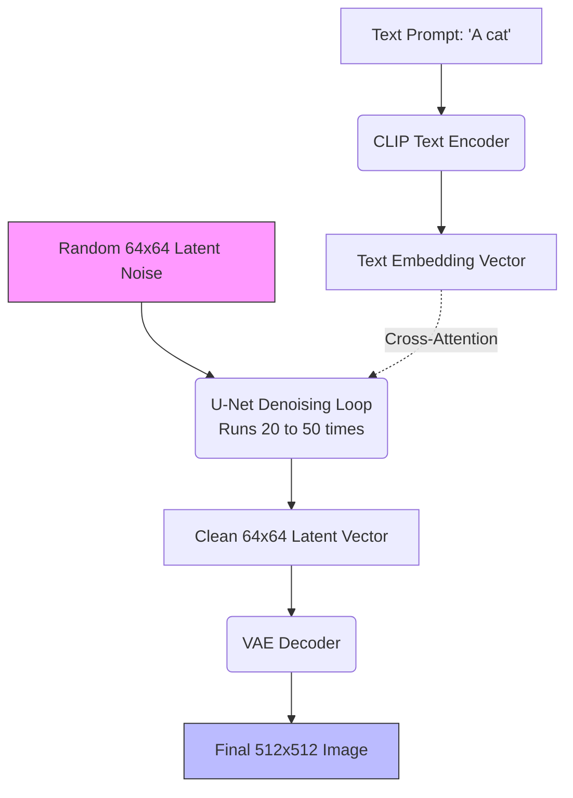

# 09 - Stable Diffusion

> **Difficulty**: ⭐⭐⭐⭐☆ Advanced | **Prerequisites**: 08-Diffusion-Models | **Estimated Reading Time**: 20 Minutes

---

## 📋 Table of Contents
1. [What Problem Does This Solve?](#1-what-problem-does-this-solve)
2. [Latent Diffusion: Compressing Reality](#2-latent-diffusion-compressing-reality)
3. [Text Conditioning (How Prompts Work)](#3-text-conditioning-how-prompts-work)
4. [The Stable Diffusion Pipeline](#4-the-stable-diffusion-pipeline)
5. [Key Takeaways](#5-key-takeaways)
6. [Next Topic](#6-next-topic)

---

# 1. What Problem Does This Solve?

Standard Diffusion Models (like DDPMs) mathematically proved that iterative denoising works perfectly. But they had a massive bottleneck.

### 🟢 Beginner
If you want to generate a $1024 \times 1024$ image, a standard Diffusion model has to run its massive neural network on over 1 million pixels. It doesn't just do this once. It has to do it 1,000 times in a row to slowly remove the noise. Generating a single image could take several minutes on an expensive server GPU, making the technology inaccessible to everyday people.

### 🟡 Intermediate
To make Diffusion fast enough to run on a consumer laptop, we have to reduce the number of pixels it processes. But if we generate a tiny $64 \times 64$ image, it looks terrible. We need a way to perform diffusion on a tiny, computationally cheap grid, but still somehow output a massive $1024 \times 1024$ photorealistic image.

### 🔴 Advanced
**Stable Diffusion (Latent Diffusion Models)** solved this by combining the compression power of a VAE with the iterative denoising power of a Diffusion Model. Instead of running diffusion in high-dimensional *pixel space*, Stable Diffusion runs diffusion entirely inside the compressed *latent space* of a VAE. This reduces the computational cost by 98% while maintaining identical visual fidelity.

---

# 2. Latent Diffusion: Compressing Reality

Here is the brilliant architectural hack behind Stable Diffusion:

1.  **Pre-train a VAE:** First, train a massive Variational Autoencoder on millions of images. 
2.  **The Encoder:** This VAE can take a $512 \times 512$ image ($262,144$ pixels) and compress it down into a $64 \times 64$ latent vector (only $4,096$ numbers).
3.  **The Decoder:** The VAE can perfectly decompress that $64 \times 64$ vector back into the sharp $512 \times 512$ image.

**The Latent Diffusion Trick:**
We freeze the VAE so its weights never change. 
When training our U-Net Diffusion Model, we don't feed it pixels. We pass our training images through the VAE Encoder first. We add Gaussian noise to the $64 \times 64$ *latent vector*, and we train the U-Net to remove noise from the *latent vector*.

Because the U-Net is only processing a $64 \times 64$ grid, it runs incredibly fast. Once the U-Net finishes denoising the latent vector, we pass that vector through the VAE Decoder to blow it back up to $512 \times 512$ pixels!

---

# 3. Text Conditioning (How Prompts Work)

A fast Diffusion model is great, but how do we tell it *what* to draw? If I type *"A cyberpunk city in the rain"*, how does the U-Net know what that means?

Stable Diffusion uses a **Text Encoder (CLIP)**.

1.  When you type a prompt, it is tokenized and passed through a pre-trained language model (usually OpenAI's CLIP Text Encoder).
2.  CLIP outputs a dense mathematical embedding (vector) that perfectly captures the semantic meaning of your sentence.
3.  **Cross-Attention:** Inside the U-Net, there are special layers called Cross-Attention layers. As the U-Net is trying to remove noise from the image, it constantly looks at the CLIP Text Vector. The math essentially says: *"Only remove the noise in a way that aligns with the concept of a cyberpunk city."*

---

# 4. The Stable Diffusion Pipeline

When you hit "Generate" on your computer, here is the exact step-by-step pipeline:

1.  Your prompt is converted into a **Text Vector**.
2.  The computer generates a tiny $64 \times 64$ block of pure random static (**Latent Noise**).
3.  The **U-Net** looks at the noise, looks at the Text Vector, and guesses what noise to subtract. It does this ~30 times.
4.  The clean $64 \times 64$ latent vector is passed to the **VAE Decoder**.
5.  The final $512 \times 512$ image appears on your screen.

---

# 5. Key Takeaways

*   Standard Diffusion is too slow because it operates in raw pixel space.
*   **Stable Diffusion (Latent Diffusion)** is fast because it uses a VAE to compress images, runs the diffusion process in the tiny latent space, and then decompresses the result.
*   **Text Prompts** work by converting your words into a dense vector using CLIP, and injecting that vector into the U-Net via Cross-Attention.
*   The three core components of Stable Diffusion are: The **VAE** (for compression/decompression), the **U-Net** (for denoising), and the **Text Encoder** (for prompt understanding).

---

# 6. Next Topic

We have just seen how Cross-Attention allows a text prompt to control an image generator. 
But where did Attention come from? How do text models actually understand grammar, logic, and code?

We must now leave Computer Vision and return to Natural Language Processing to explore the most important architecture of the 21st century: The Transformer.

[← Diffusion Models](08-Diffusion-Models.md) | [Back to Index](README.md) | [Next Topic: Transformers In Generative AI →](10-Transformers-In-Generative-AI.md)
