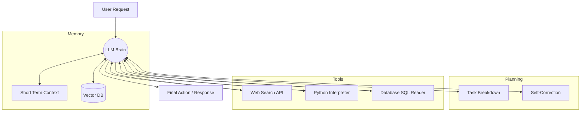

# 15 - AI Agents & Tool Use

> **Difficulty**: ⭐⭐⭐⭐☆ Advanced | **Prerequisites**: 14-Multimodal-Generative-AI | **Estimated Reading Time**: 25 Minutes

---

## 📋 Table of Contents
1. [What Problem Does This Solve?](#1-what-problem-does-this-solve)
2. [What Are AI Agents?](#2-what-are-ai-agents)
3. [The Core Architecture of an Agent](#3-the-core-architecture-of-an-agent)
4. [Tool Calling (Function Calling)](#4-tool-calling-function-calling)
5. [Planning and Workflows (ReAct)](#5-planning-and-workflows-react)
6. [Key Takeaways](#6-key-takeaways)
7. [Next Topic](#7-next-topic)

---

# 1. What Problem Does This Solve?

Until now, we have treated Generative AI as a "black box" that takes an input and produces an output. You talk to it, and it talks back.

### 🟢 Beginner
If you ask ChatGPT: *"What is the weather in Tokyo right now, and can you book me a flight for tomorrow?"*, a standard LLM will fail. It cannot know the current weather because its training data cut off months ago. It cannot book a flight because it does not have an internet browser or a credit card. It is trapped inside a text box.

### 🟡 Intermediate
We want an AI that can *act*. If the AI needs to know the weather, it should be able to write a python script, ping a weather API, read the JSON response, and tell us the answer. If it needs to book a flight, it should be able to navigate Expedia.com autonomously. 

### 🔴 Advanced
An **AI Agent** is an LLM wrapper that grants the LLM access to external tools, memory, and a planning loop. The LLM acts as the "Brain" of the system, but it is hooked up to "Hands" (APIs, Terminals, Browsers). By combining *Chain-of-Thought* reasoning with *Tool Calling*, the AI transitions from being a passive conversationalist to an autonomous software engineer, data scientist, or personal assistant.

---

# 2. What Are AI Agents?

An AI Agent is a system where a Large Language Model dictates the control flow of the application.

In traditional software engineering, the human writes the logic:
`If user clicks button -> Fetch Weather API -> Return data.`

In Agentic AI, the human simply provides the tools, and the LLM figures out the logic:
`User: "Should I wear a coat in Tokyo tomorrow?"`
`Agent Logic: Let me search the web for Tokyo's weather -> It will be 40°F -> Let me search my knowledge base for coat recommendations -> Output: "Yes, wear a heavy coat."`

---

# 3. The Core Architecture of an Agent

A modern AI Agent consists of four pillars:

1.  **Profile / Persona:** The System Prompt defining the agent's goal (e.g., "You are an autonomous DevOps engineer").
2.  **Memory:**
    *   *Short-Term Memory:* The current Context Window (the ongoing conversation).
    *   *Long-Term Memory:* A Vector Database (RAG) storing past experiences, documents, and user preferences.
3.  **Planning:** The ability to break a massive goal into smaller sub-tasks, self-reflect, and correct errors if a step fails.
4.  **Tools:** The executable APIs the agent can call to interact with the outside world.



---

# 4. Tool Calling (Function Calling)

How does an LLM actually "use" a tool? 
It doesn't physically click buttons. It generates highly structured JSON.

When you send a prompt to an Agent, you also send a list of available tools formatted as a JSON schema.

**Example Tool Definition provided to the LLM:**
```json
{
  "name": "get_current_weather",
  "description": "Get the current weather in a given location",
  "parameters": {
    "location": "string (e.g. Tokyo, Japan)"
  }
}
```

If the user asks about the weather, the LLM will recognize that it needs to use the tool. Instead of generating a conversational response, the LLM generates a JSON string:
`{"name": "get_current_weather", "arguments": {"location": "Tokyo, Japan"}}`

The backend Python server intercepts this JSON, executes the actual `requests.get()` to the real Weather API, gets the temperature (e.g., `45°F`), and injects that temperature back into the LLM's prompt. The LLM then reads the 45°F and finally replies to the user.

---

# 5. Planning and Workflows (ReAct)

If a task is complex, the Agent must plan. The industry standard framework for agent planning is **ReAct (Reasoning and Acting)**.

In ReAct, the LLM is forced to output a continuous loop of:
1.  **Thought:** What do I need to do next?
2.  **Action:** Which tool should I use?
3.  **Observation:** What was the result of the tool?

**Example ReAct Trace:**
*   **User:** *"What is the square root of the population of the capital of France?"*
*   **Thought 1:** I need to find the capital of France.
*   **Action 1:** `WebSearch("Capital of France")`
*   **Observation 1:** Paris.
*   **Thought 2:** I need to find the population of Paris.
*   **Action 2:** `WebSearch("Population of Paris 2024")`
*   **Observation 2:** 2.1 million.
*   **Thought 3:** I need to calculate the square root of 2,100,000. I cannot do this in my head. I will use the calculator tool.
*   **Action 3:** `Calculator(sqrt(2100000))`
*   **Observation 3:** 1449.13
*   **Thought 4:** I have the final answer.
*   **Output:** The square root of the population of Paris is approximately 1,449.

By forcing this loop, the AI becomes an autonomous problem solver.

---

# 6. Key Takeaways

*   **AI Agents** are systems where an LLM controls the application flow autonomously.
*   Agents require **Memory** (Context and RAG) and **Planning** (breaking down complex tasks).
*   **Tool Calling** allows an LLM to interact with the real world by generating strictly formatted JSON, which the host server executes.
*   The **ReAct** framework (Thought $\to$ Action $\to$ Observation) allows agents to logically solve multi-step problems that would be impossible for a standard LLM to solve in a single response.

---

# 7. Next Topic

We have reached the absolute cutting edge of AI capability. We have models that can generate photorealistic video, write production-grade code, and autonomously act on the internet.

With this immense power comes immense risk. In our final chapter, we will discuss the critical limitations, ethical concerns, and the future of **Responsible Generative AI**.

[← Multimodal Generative AI](14-Multimodal-Generative-AI.md) | [Back to Index](README.md) | [Next Topic: Responsible Generative AI →](16-Responsible-Generative-AI.md)
