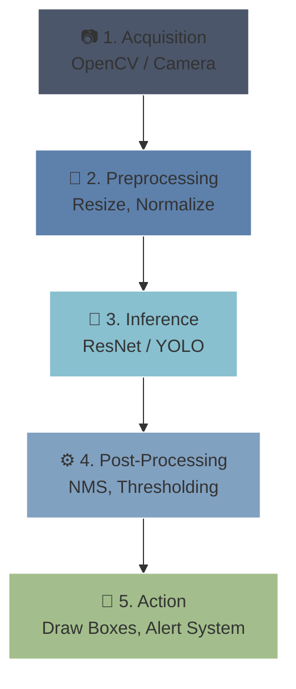

# 🖼️ Computer Vision Pipeline

> **Difficulty**: ⭐☆☆☆☆ Beginner | **Prerequisites**: Convolutional Neural Networks (CNNs) | **Estimated Reading Time**: 20 Minutes

---

## 📋 Table of Contents
1. [What Problem Does This Solve?](#1-what-problem-does-this-solve)
2. [Intuition](#2-intuition)
3. [Pipeline Architecture](#3-pipeline-architecture)
4. [Visual Explanation](#4-visual-explanation)
5. [PyTorch Implementation](#5-pytorch-implementation)
6. [Hardware & Bottleneck Deep Dive](#6-hardware--bottleneck-deep-dive)
7. [Failure Cases](#7-failure-cases)
8. [What's Next?](#8-whats-next)

---

## 1. What Problem Does This Solve?

Training a Computer Vision model is only a small part of the battle. If you feed raw, unprocessed camera images directly into a neural network in a real-world scenario, the model will fail entirely. The **Computer Vision Pipeline** solves the problem of how to take a raw image from a hardware sensor, prepare it mathematically for a deep learning model, generate a prediction, and translate that prediction into a useful business outcome.

**Real-World Use Cases:**
- **Autonomous Vehicles**: Streaming 60 FPS video into a pipeline that triggers the brakes.
- **Factory QA**: Capturing images of PCBs, running inference, and physically rejecting defective boards.

---

## 2. Intuition

### 🟢 Beginner
Imagine you are baking a cake. You don't just throw raw flour and eggs into the oven. You have to measure the ingredients, mix them, bake them, and finally frost the cake before serving it. A Computer Vision Pipeline is the exact same process: we capture the raw image (ingredients), clean it up (mixing), pass it to the AI (baking), and then display the results on a screen (serving).

### 🟡 Intermediate
A standard CV pipeline is deterministic and flows sequentially. It must handle the translation between physical hardware (camera sensors) and software (NumPy arrays). Because cameras generate noise, and AI models require perfectly standardized inputs (e.g., $224 \times 224$ tensors), the pipeline acts as the strict gateway that normalizes reality before the AI sees it.

### 🔴 Advanced
In production, these pipelines must operate strictly within computational budgets. If a camera streams at 60 Frames Per Second (FPS), your entire pipeline (Acquisition $\rightarrow$ Action) must execute in under **16.6 milliseconds** per frame. This requires extreme optimization: running preprocessing on the CPU asynchronously, keeping inference strictly on the GPU (via TensorRT or ONNX Runtime), and minimizing Host-to-Device (CPU to GPU) memory transfers.

---

## 3. Pipeline Architecture

The pipeline consists of five distinct stages:
1. **Acquisition**: Reading an image from a disk or an RTSP live video stream.
2. **Preprocessing**: Resizing, normalizing, and converting color spaces.
3. **Inference**: Passing the tensor through the CNN (forward pass).
4. **Post-Processing**: Filtering raw outputs (e.g., Non-Maximum Suppression, Softmax thresholds).
5. **Action/Deployment**: Rendering boxes to a dashboard, or sending a JSON payload to a database.

---

## 4. Visual Explanation



---

## 5. PyTorch Implementation

```python
import cv2
import torch
from torchvision import transforms
import numpy as np

# 1. Acquisition
# OpenCV reads in BGR format
image = cv2.imread('factory_line.jpg') 

# 2. Preprocessing
# Convert BGR to RGB (required for PyTorch)
image_rgb = cv2.cvtColor(image, cv2.COLOR_BGR2RGB)

# Define pipeline transformations
transform = transforms.Compose([
    transforms.ToTensor(), # Converts [0, 255] to [0.0, 1.0]
    transforms.Resize((224, 224)),
    transforms.Normalize(mean=[0.485, 0.456, 0.406], 
                         std=[0.229, 0.224, 0.225])
])
# Add batch dimension and move to GPU
input_tensor = transform(image_rgb).unsqueeze(0).to('cuda') 

# 3. Inference
# Load pretrained ResNet
model = torch.hub.load('pytorch/vision', 'resnet18', pretrained=True).to('cuda')
model.eval() # Disable dropout/batchnorm updates

with torch.no_grad(): # Disable gradient calculation for speed
    output = model(input_tensor)

# 4. Post-processing
probabilities = torch.nn.functional.softmax(output[0], dim=0)
top_prob, top_class = torch.max(probabilities, dim=0)

# 5. Action
if top_prob.item() > 0.85:
    print(f"High Confidence Detection! Class: {top_class.item()}")
else:
    print("Low confidence. Ignoring prediction.")
```

---

## 6. Hardware & Bottleneck Deep Dive

The most common mistake in building CV pipelines is ignoring the hardware architecture. 
*   **The CPU/GPU Divide**: OpenCV runs on the CPU. PyTorch runs on the GPU. When you call `.to('cuda')`, you trigger a PCIe bus transfer. If you do this too often, the memory transfer will take longer than the actual neural network inference!
*   **Solution**: Tools like NVIDIA DALI move the *preprocessing* steps directly onto the GPU, completely eliminating the CPU bottleneck for high-performance video pipelines.

---

## 7. Failure Cases

1. **Color Space Mismatches**: OpenCV loads images in **BGR** format. PyTorch/TensorFlow models are trained on **RGB** images. If you forget `cv2.cvtColor`, your model will see a blue apple and confidently predict it is a blueberry.
2. **The Blocking Loop**: If your camera grabs frames in the main `while` loop, and inference takes 50ms, your camera buffer will overflow, causing video lag. Acquisition must happen on a separate background thread.

---

## 8. What's Next?

### Summary
We have established the 5-step framework required for every Computer Vision system in existence. An AI model is utterly useless without Acquisition to feed it and Post-Processing to interpret it.

### Why it matters
Understanding this pipeline is the difference between an AI Researcher (who just trains the model) and an MLOps Engineer (who makes the model actually work in a real business environment).

### Next Topic
Now that we understand the pipeline, we need to look closely at Step 2. How do we mathematically prepare an image before the CNN sees it? We will explore **Image Preprocessing** using OpenCV.

[← Return to Module Index](./README.md) | [Next: Image Preprocessing →](./02-Image-Preprocessing.md)
