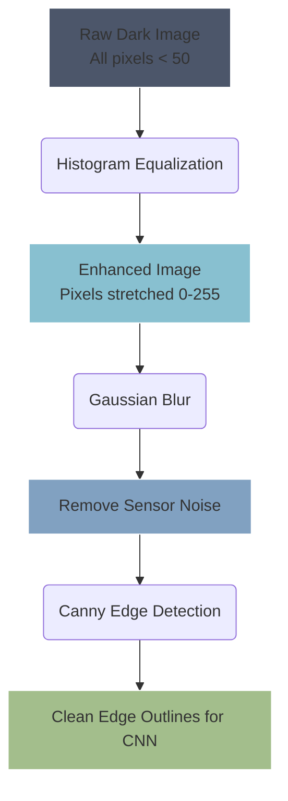

# 🧽 Image Preprocessing & OpenCV

> **Difficulty**: ⭐⭐☆☆☆ Intermediate | **Prerequisites**: NumPy, Pipeline Basics | **Estimated Reading Time**: 25 Minutes

---

## 📋 Table of Contents
1. [What Problem Does This Solve?](#1-what-problem-does-this-solve)
2. [Intuition](#2-intuition)
3. [Core Mathematics](#3-core-mathematics)
4. [Visual Explanation](#4-visual-explanation)
5. [Algorithm Workflow](#5-algorithm-workflow)
6. [OpenCV Implementation](#6-opencv-implementation)
7. [Failure Cases](#7-failure-cases)
8. [What's Next?](#8-whats-next)

---

## 1. What Problem Does This Solve?

Images captured in the real world are messy. They are taken in low light, at weird angles, contain significant sensor noise, and are completely different sizes. If you feed these messy, variable images directly into a neural network, the model's loss will explode, or it will struggle to find meaningful patterns.

**Image Preprocessing** solves this by using classical mathematical algorithms to "clean" the image, enhance the contrast, filter out noise, and standardize the matrix size before Deep Learning takes over.

---

## 2. Intuition

### 🟢 Beginner
Think of image preprocessing like wearing polarized sunglasses on a painfully bright day. Your eyes (the neural network) function perfectly fine, but the glare (noise) makes it impossible to see the road. Preprocessing algorithms filter out the glare so the network can easily see the actual object.

### 🟡 Intermediate
At its core, an image is just a large 3D NumPy array `[Height, Width, Channels]`. Preprocessing involves applying mathematical matrix operations:
- **Resizing**: Shrinking the matrix.
- **Cropping**: Slicing the matrix.
- **Grayscale**: Averaging the RGB channels to reduce the data size by 3x.
- **Thresholding**: Converting the image into pure black and white (binary masks) to separate objects from the background.

### 🔴 Advanced
One of the most important preprocessing steps for low-light environments is **Histogram Equalization**. If an image is underexposed, all its pixel values are clustered near 0 (black). By calculating the Cumulative Distribution Function (CDF) of the pixel intensities, we can mathematically stretch the histogram across the entire 0-255 spectrum. This dramatically enhances local contrast without destroying the underlying edges, which is vital because CNNs rely heavily on edge detection in their early layers.

---

## 3. Core Mathematics

### The Math of Normalization (Z-Score)
To prevent gradients from exploding during CNN training, we normalize images to have a mean ($\mu$) of 0 and a standard deviation ($\sigma$) of 1. This centers the data around the origin of the activation functions.
$$ X_{norm} = \frac{X - \mu}{\sigma} $$

### The Math of Grayscale
OpenCV doesn't just take a simple average of RGB. It uses a weighted sum that mimics human eye sensitivity (our eyes have more green cones, so we see green better than blue):
$$ Y = 0.299 \cdot R + 0.587 \cdot G + 0.114 \cdot B $$

---

## 4. Visual Explanation



---

## 5. Algorithm Workflow

When preparing an image for an OCR (Optical Character Recognition) engine:
1. **Read**: Load the image in memory.
2. **Grayscale**: Color provides no value for reading text, so discard it to save memory.
3. **Blur**: Apply a $5 \times 5$ Gaussian kernel to smooth out tiny camera sensor grain.
4. **Threshold**: Apply Adaptive Thresholding to turn the image strictly black and white, eliminating shadows falling across the page.
5. **Morphology**: Apply Dilation (to make text thicker) or Erosion (to remove tiny white noise dots).

---

## 6. OpenCV Implementation

```python
import cv2
import numpy as np
import matplotlib.pyplot as plt

# 1. Read Image (BGR format)
img = cv2.imread('messy_receipt.jpg')

# 2. Convert to Grayscale
gray = cv2.cvtColor(img, cv2.COLOR_BGR2GRAY)

# 3. Apply Gaussian Blur to remove high-frequency noise
blurred = cv2.GaussianBlur(gray, (5, 5), 0)

# 4. Adaptive Thresholding (Crucial for shadows on documents)
# It calculates the threshold locally for 11x11 pixel neighborhoods
thresh = cv2.adaptiveThreshold(
    blurred, 
    maxValue=255, 
    adaptiveMethod=cv2.ADAPTIVE_THRESH_GAUSSIAN_C, 
    thresholdType=cv2.THRESH_BINARY_INV, 
    blockSize=11, 
    C=2 # Constant subtracted from the mean
)

# 5. Canny Edge Detection (Optional, depending on downstream task)
edges = cv2.Canny(thresh, threshold1=100, threshold2=200)

cv2.imshow('Clean Text Mask', thresh)
cv2.waitKey(0)
```

---

## 7. Failure Cases

1. **Hard Thresholding Failures**: If you use a global threshold (e.g., "turn every pixel < 127 to black"), it works perfectly on evenly lit images. But if half the receipt is in a shadow, the shadowed text will turn completely black and disappear. Always use `cv2.adaptiveThreshold`.
2. **Blurring Important Details**: Applying too heavy of a Gaussian Blur (e.g., `31x31` kernel) will eliminate noise, but it will also destroy the sharp edges of the object. Since CNNs rely heavily on edges, your model accuracy will plummet.
3. **Aspect Ratio Distortion**: If you `cv2.resize()` a $1920 \times 1080$ rectangle into a $224 \times 224$ square, the objects inside become squished. Always pad images with black borders to maintain the aspect ratio before resizing!

---

## 8. What's Next?

### Summary
We have learned how to use OpenCV to manipulate the raw NumPy matrices that make up an image. By applying blurring, thresholding, and normalization, we ensure our neural networks receive clean, mathematical data.

### Why it matters
The phrase "Garbage In, Garbage Out" is absolute law in Deep Learning. A state-of-the-art neural network will perform worse than a basic algorithm if the preprocessing pipeline is poorly designed.

### Next Topic
Now that we know how to feed a clean image into a network, it's time to find objects inside it. We will move beyond simple Image Classification and learn the foundational mathematics of **Object Detection**.

[← Computer Vision Pipeline](01-Computer-Vision-Pipeline.md) | [Return to Module Index](./README.md) | [Next: Object Detection Fundamentals →](03-Object-Detection-Fundamentals.md)
