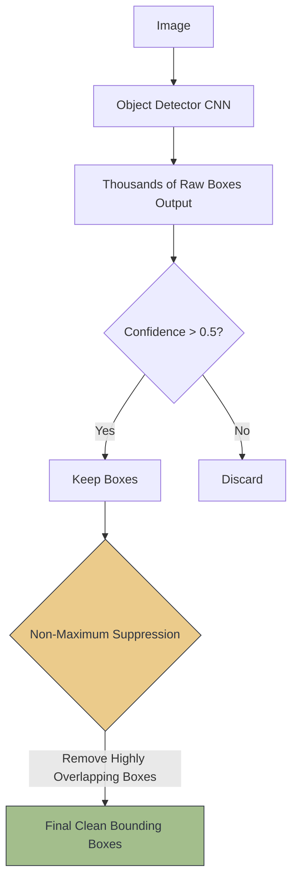

# 🎯 Object Detection Fundamentals

> **Difficulty**: ⭐⭐⭐☆☆ Intermediate | **Prerequisites**: CNN Architectures | **Estimated Reading Time**: 30 Minutes

---

## 📋 Table of Contents
1. [What Problem Does This Solve?](#1-what-problem-does-this-solve)
2. [Intuition](#2-intuition)
3. [Core Mathematics (IoU & mAP)](#3-core-mathematics-iou--map)
4. [Algorithm Workflow (NMS)](#4-algorithm-workflow-nms)
5. [Visual Explanation](#5-visual-explanation)
6. [PyTorch Implementation Concept](#6-pytorch-implementation-concept)
7. [Failure Cases](#7-failure-cases)
8. [What's Next?](#8-whats-next)

---

## 1. What Problem Does This Solve?

Standard Image Classification (like ResNet) answers one single question: *"What is the main subject of this image?"* It works perfectly for a centered picture of a cat. It fails completely if the image contains 3 dogs, 2 cats, and a car. 

**Object Detection** solves this by answering two questions simultaneously for multiple objects in the same frame:
1. **Localization**: *Where* are the objects? (Drawing a Bounding Box).
2. **Classification**: *What* are the objects? (Assigning a label).

---

## 2. Intuition

### 🟢 Beginner
If classification is pointing at a picture and saying "That's a dog," Object Detection is taking a red marker, drawing a precise box around the dog, drawing another box around the cat in the background, and writing their names above the boxes.

### 🟡 Intermediate
To achieve this, neural networks output a set of numbers for *every* potential object they find. A typical bounding box is mathematically represented by 4 numbers: `[x_center, y_center, width, height]`. The network also outputs a 5th number representing the `confidence` score (e.g., 95% sure an object exists inside that box). Because an image can have many objects, detectors output thousands of potential boxes, which we must subsequently filter.

### 🔴 Advanced
The fundamental challenge in Object Detection is that it is a **multi-task learning problem**. The network must simultaneously optimize two completely different loss functions:
1. **Regression Loss** (Smooth L1 or GIoU): To mathematically shift and scale the bounding box coordinates to perfectly surround the object.
2. **Classification Loss** (Cross-Entropy or Focal Loss): To guess the class ID.

Balancing these two losses during Backpropagation without one gradient overpowering the other is the hardest part of training a custom detector.

---

## 3. Core Mathematics (IoU & mAP)

### Intersection over Union (IoU)
How do we mathematically know if our predicted bounding box is "good" compared to the ground truth box? We use **IoU (Jaccard Index)**.
$$ IoU = \frac{\text{Area of Overlap}}{\text{Area of Union}} $$
- **0.0**: The boxes do not touch at all.
- **1.0**: The predicted box perfectly overlays the ground truth box.
- Generally, an IoU $> 0.50$ is considered a "True Positive" detection.

### Mean Average Precision (mAP)
You cannot use "Accuracy" to evaluate object detectors. We use **mAP**. It calculates the Area Under the Precision-Recall Curve across all classes and multiple IoU thresholds (e.g., mAP@0.50:0.95). It penalizes the model for missing objects (low recall) and for drawing boxes where nothing exists (low precision).

---

## 4. Algorithm Workflow (NMS)

Neural networks are over-eager. Because they predict from sliding windows or grids, if there is a dog, the network might draw 10 slightly different, highly overlapping boxes around the exact same dog. **Non-Maximum Suppression (NMS)** is the algorithmic solution to clean this up:

1. Look at all boxes predicted for the "Dog" class.
2. Discard any box with a confidence score $< 0.50$.
3. Pick the box with the highest confidence (e.g., 99%). This is the "King" box.
4. Calculate the **IoU** between the King box and all other remaining boxes.
5. If any box has an IoU $> 0.45$ with the King box, delete it! (It is just a duplicate prediction).
6. Repeat for the next highest confidence box until all duplicates are removed.

---

## 5. Visual Explanation



---

## 6. PyTorch Implementation Concept

While you will use robust frameworks like YOLO or Faster R-CNN in practice, understanding how NMS is implemented under the hood is critical. PyTorch has this built-in via `torchvision`:

```python
import torch
import torchvision

# Mock data
# boxes: Tensor of [x1, y1, x2, y2]
predicted_boxes = torch.tensor([[100, 100, 200, 200], [105, 105, 195, 195], [300, 300, 400, 400]], dtype=torch.float)
# scores: Tensor of confidence scores
predicted_scores = torch.tensor([0.95, 0.85, 0.90], dtype=torch.float)

# Apply NMS
# iou_threshold: 0.4 means "Delete boxes that overlap more than 40%"
keep_indices = torchvision.ops.nms(
    boxes=predicted_boxes, 
    scores=predicted_scores, 
    iou_threshold=0.4
)

final_boxes = predicted_boxes[keep_indices]
final_scores = predicted_scores[keep_indices]

print(f"Indices kept: {keep_indices}") 
# Output will drop the second box because it highly overlaps the first!
```

---

## 7. Failure Cases

1. **Dense Crowds (NMS Failure)**: If two people are standing shoulder-to-shoulder, their bounding boxes will naturally overlap by a huge amount (IoU > 0.6). NMS will mathematically assume the second person is just a duplicate box and delete it, rendering the second person literally invisible to the system! *Fix: Use Soft-NMS or anchor-free methods.*
2. **Small Objects**: Because detectors shrink images through pooling layers (e.g., to $416 \times 416$), tiny objects like a golf ball in the distance might become 1 pixel wide in the feature map. It is impossible to draw a robust bounding box around a single pixel.

---

## 8. What's Next?

### Summary
Object Detection bridges localization and classification. We learned that the raw outputs of neural networks are chaotic and overlapping, and we must use IoU mathematics and Non-Maximum Suppression (NMS) to filter the chaos into clean, usable bounding boxes. 

### Why it matters
Object Detection is arguably the most commercially applied Computer Vision technology in the world, powering everything from Tesla Autopilot to Amazon Go cashierless stores.

### Next Topic
We've covered the fundamentals, but how do we actually build the network? We will explore the most famous real-time Object Detection architecture ever created: **The YOLO Family**.

[← Image Preprocessing](02-Image-Preprocessing.md) | [Return to Module Index](./README.md) | [Next: The YOLO Family →](04-YOLO-Family.md)
