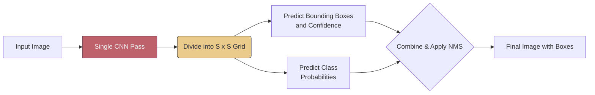

# 🚀 The YOLO Family

> **Difficulty**: ⭐⭐⭐☆☆ Intermediate | **Prerequisites**: Object Detection Fundamentals | **Estimated Reading Time**: 30 Minutes

---

## 📋 Table of Contents
1. [What Problem Does This Solve?](#1-what-problem-does-this-solve)
2. [Intuition](#2-intuition)
3. [Core Mechanics (The Grid)](#3-core-mechanics-the-grid)
4. [Algorithm Workflow](#4-algorithm-workflow)
5. [Visual Explanation](#5-visual-explanation)
6. [Implementation (Ultralytics)](#6-implementation-ultralytics)
7. [Evolution of the Architecture](#7-evolution-of-the-architecture)
8. [Failure Cases](#8-failure-cases)
9. [What's Next?](#9-whats-next)

---

## 1. What Problem Does This Solve?

Before YOLO (You Only Look Once), object detection was a slow, multi-stage process (like R-CNN). Models would first use a CPU algorithm to guess 2,000 potential locations for an object, crop them, and then run a heavy CNN classifier on every single guess. It was agonizingly slow, taking several seconds per image. 

YOLO completely revolutionized the field by reframing object detection into a **single regression problem**, making real-time, 60+ FPS video processing possible.

---

## 2. Intuition

### 🟢 Beginner
Older models used to slide a tiny window across an image, inch by inch, asking "Is there a dog here? How about here?" This is like searching a dark, crowded room with a tiny flashlight. YOLO, as the name implies, turns on the overhead lights. It looks at the entire image exactly one time, instantly seeing the global context and knowing where every object is.

### 🟡 Intermediate
YOLO is a **One-Stage Detector**. Instead of proposing regions, it divides the input image into an $S \times S$ grid. If the geometric center of an object falls into a specific grid cell, *that specific cell* is solely responsible for detecting that object. Each grid cell predicts a few bounding boxes and the confidence that an object actually exists.

### 🔴 Advanced
The genius of YOLO is its unified loss function. Instead of training separate networks, YOLO trains a single CNN end-to-end. The network's final output is a massive 3D tensor of shape $S \times S \times (B \times 5 + C)$. 
- $S \times S$ is the grid (e.g., $13 \times 13$).
- $B$ is the number of Anchor Boxes predicted per cell.
- $5$ represents the outputs: $\Delta x, \Delta y, \Delta w, \Delta h$ and the objectness confidence score.
- $C$ is the class probabilities.

Because it is a single forward pass, the gradients flow perfectly from the output back to the pixels, allowing the network to heavily optimize for raw speed.

---

## 3. Core Mechanics (The Grid)

The grid is the heart of YOLO. If we use a $13 \times 13$ grid, there are 169 cells.
If the center of a car falls into cell Row 5, Column 7, that specific cell must output a high confidence score. 

**Anchor Boxes:**
Cars are horizontal rectangles. People are vertical rectangles. Instead of making the network guess shapes from scratch, YOLO uses predefined "Anchor Boxes". Cell [5, 7] will output adjustments to a horizontal anchor box to perfectly fit the car, rather than generating the box out of thin air. This makes the math significantly easier for the network to learn.

---

## 4. Algorithm Workflow

1. Divide the image into an $S \times S$ grid.
2. Every single grid cell simultaneously predicts $B$ bounding boxes.
3. Every single grid cell simultaneously predicts $C$ class probabilities.
4. Multiply the box confidence score by the class probability to get a final prediction score for every box.
5. Apply Non-Maximum Suppression (NMS) to delete the thousands of duplicate, low-confidence boxes.
6. Return the final, highest-confidence bounding boxes.

---

## 5. Visual Explanation



---

## 6. Implementation (Ultralytics)

The modern standard is to use the `ultralytics` package, which abstracts away the immense complexity of PyTorch YOLO implementations.

```python
from ultralytics import YOLO

# 1. Load a pre-trained Nano model (built for extreme speed)
model = YOLO("yolov8n.pt")

# 2. Run inference on a live webcam feed
# show=True will automatically render the video window
results = model.predict(source="0", show=True, conf=0.5)

# 3. Access the bounding boxes programmatically
for result in results:
    boxes = result.boxes
    for box in boxes:
        # Extract coordinates, confidence, and class ID
        x1, y1, x2, y2 = box.xyxy[0]
        conf = box.conf[0]
        cls = int(box.cls[0])
        print(f"Class {cls} detected with {conf:.2f} confidence at {x1, y1, x2, y2}")
```

---

## 7. Evolution of the Architecture

*   **YOLOv1 (2015)**: Fast (45 FPS) but terrible at detecting small objects and objects clustered together.
*   **YOLOv3 (2018)**: Introduced **Multi-Scale Predictions**. Instead of predicting boxes at one resolution ($13 \times 13$), it predicted them at 3 different scales simultaneously, dramatically improving small-object detection.
*   **YOLOv5 (2020)**: Written entirely in PyTorch. Extremely easy to train and export to mobile devices, becoming the immediate industry standard.
*   **YOLOv8 / YOLOv11**: Moved away from Anchor Boxes entirely to an Anchor-Free architecture (CenterNet style), and unified Detection, Segmentation, and Pose Estimation into a single streamlined API.

---

## 8. Failure Cases

1. **The Grid Bottleneck**: In older YOLO versions, if a flock of 10 small birds landed inside the exact same grid cell, the network could physically only predict 2 or 3 of them. While modern YOLO versions mitigate this with multi-scale heads, incredibly dense crowds still cause YOLO to drop detections compared to slower Two-Stage detectors.
2. **Extreme Aspect Ratios**: Objects with highly unusual shapes (like a long, thin fishing pole) that don't match any of the predefined anchor box shapes can struggle to be localized perfectly.

---

## 9. What's Next?

### Summary
YOLO transformed Computer Vision by proving that object detection could be solved in a single mathematical pass. By dividing the image into a grid and directly regressing bounding boxes, it achieved unprecedented real-time speeds.

### Why it matters
If you are building an application that processes video (self-driving cars, drone navigation, surveillance), you are using a variant of YOLO. Speed is a feature.

### Next Topic
YOLO is fast, but what if we need absolute, pixel-perfect accuracy for a medical diagnosis where speed doesn't matter? We must look at the heavyweight champions: **Faster R-CNN and Two-Stage Detectors**.

[← Object Detection Fundamentals](03-Object-Detection-Fundamentals.md) | [Return to Module Index](./README.md) | [Next: Faster R-CNN →](05-Faster-RCNN-And-Two-Stage-Detectors.md)
