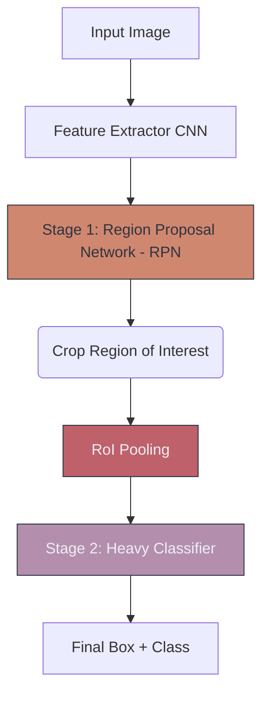

# 🐢 Faster R-CNN & Two-Stage Detectors

> **Difficulty**: ⭐⭐⭐⭐☆ Advanced | **Prerequisites**: YOLO, Object Detection | **Estimated Reading Time**: 35 Minutes

---

## 📋 Table of Contents
1. [What Problem Does This Solve?](#1-what-problem-does-this-solve)
2. [Intuition](#2-intuition)
3. [Core Mathematics (RoI Pooling)](#3-core-mathematics-roi-pooling)
4. [Algorithm Workflow](#4-algorithm-workflow)
5. [Visual Explanation](#5-visual-explanation)
6. [PyTorch Implementation Concept](#6-pytorch-implementation-concept)
7. [Failure Cases](#7-failure-cases)
8. [What's Next?](#8-whats-next)

---

## 1. What Problem Does This Solve?

YOLO is incredibly fast, but it makes mathematical trade-offs in accuracy to achieve that speed, particularly when dealing with microscopic objects, unusual aspect ratios, or heavily overlapping subjects. 

When absolute, pixel-perfect accuracy is non-negotiable and speed is secondary (e.g., finding a 4-pixel wide tumor in a massive MRI scan, or high-fidelity satellite image analysis), **Two-Stage Detectors** like Faster R-CNN are the required architecture.

---

## 2. Intuition

### 🟢 Beginner
If YOLO is someone glancing at a room and immediately pointing out objects, Faster R-CNN is a detective with a magnifying glass. 
*   **Stage 1:** The detective scans the room and highlights 50 areas that *might* look suspicious.
*   **Stage 2:** The detective walks over to each of those 50 areas, pulls out the magnifying glass, and carefully determines exactly what is there.

### 🟡 Intermediate
Two-Stage detectors physically separate the pipeline:
1. **Region Proposal Network (RPN)**: A small neural network that scans the image and proposes "Regions of Interest" (RoIs) that likely contain an object (ignoring *what* the object is, just focusing on "objectness").
2. **Classifier**: These proposed RoIs are cropped out, scaled to a uniform size, and passed into a heavy, powerful CNN classifier to determine the exact class and refine the bounding box coordinates.

### 🔴 Advanced
The major breakthrough of *Faster* R-CNN (2016) over its predecessors (R-CNN, Fast R-CNN) was making the RPN fully differentiable. Previous versions used classic CPU algorithms (like Selective Search) to propose regions, which broke the Backpropagation chain. Faster R-CNN uses a CNN for the RPN, allowing the *entire* pipeline to be trained end-to-end on a GPU. It uses **Anchor Boxes** (pre-defined box shapes) sliding across the feature map to guess the object locations.

---

## 3. Core Mathematics (RoI Pooling)

**RoI Pooling (Region of Interest Pooling)**
The RPN might propose a bounding box that is $20 \times 100$ pixels, and another that is $300 \times 300$ pixels. However, the Stage 2 Classifier (which contains Fully Connected Layers) absolutely requires a fixed input size (e.g., a $7 \times 7$ feature map). 

**RoI Pooling** mathematically warps and max-pools these weirdly shaped boxes into a perfect uniform shape so the dense layers can process them.
1. Divide the proposed region into a $7 \times 7$ grid.
2. If the region is $21 \times 14$, each grid cell will be $3 \times 2$ pixels.
3. Take the Max Value from each $3 \times 2$ cell.
4. Output exactly $7 \times 7$ features.

**Mask R-CNN (The Evolution)**
Researchers realized that if they added a third output to Faster R-CNN (Class, Box, and a Pixel Mask), they could color in the exact pixels of the object. This birthed **Instance Segmentation**.

---

## 4. Algorithm Workflow

1. Pass the $800 \times 800$ image through a Backbone CNN (like ResNet-50) to get a dense feature map.
2. The Region Proposal Network (RPN) slides across the feature map, predicting "objectness" scores and bounding box adjustments for thousands of anchors.
3. Extract the top 300 highest-confidence proposals.
4. Use RoI Pooling to crop these 300 specific areas from the feature map and standardize their size to $7 \times 7$.
5. Pass all 300 crops through the Stage 2 Fully Connected Network.
6. Output final Class IDs and final Box adjustments. 
7. NMS cleans up the remaining duplicates.

---

## 5. Visual Explanation



---

## 6. PyTorch Implementation Concept

Faster R-CNN is heavy. Training it from scratch is incredibly complex because of the two distinct loss functions (RPN Loss + Classifier Loss). PyTorch provides a pre-built version in `torchvision`.

```python
import torch
import torchvision
from torchvision.models.detection import fasterrcnn_resnet50_fpn

# 1. Load pre-trained Faster R-CNN (FPN backbone)
model = fasterrcnn_resnet50_fpn(pretrained=True)
model.eval()

# 2. Input must be a list of tensors [C, H, W]
# Notice the image is large (800x800) compared to YOLO (416x416)
image_tensor = torch.rand(1, 3, 800, 800) 

with torch.no_grad():
    predictions = model(image_tensor)

# Output includes 'boxes', 'labels', and 'scores'
# Unlike YOLO, the output is not a massive grid, it's just the final filtered detections
print(f"Number of detections: {predictions[0]['boxes'].shape[0]}")
```

---

## 7. Failure Cases

1. **Deployment Nightmares**: Faster R-CNN is notoriously difficult to deploy. Unlike YOLO (which cleanly exports to ONNX or mobile devices), Faster R-CNN contains complex custom layers (like RoI Pooling or RoI Align) that many edge hardware accelerators (like older TensorRT versions or CoreML) simply do not support natively.
2. **Speed Limits**: It is inherently slow due to the two stages. If your business requirement is 30 FPS inference on a live video feed, Faster R-CNN will bottleneck your pipeline.

---

## 8. What's Next?

### Summary
Two-Stage Detectors like Faster R-CNN sacrifice speed for supreme accuracy by splitting the detection problem into a Region Proposal step and a distinct Classification step, bridged by the clever math of RoI Pooling.

### Why it matters
While YOLO dominates real-time systems, Faster R-CNN dominates Kaggle competitions, academic benchmarks, and high-stakes medical/satellite imagery where a false negative is catastrophic.

### Next Topic
We've drawn boxes around objects. But what if we need to know the *exact* shape of the object? We will leave bounding boxes behind and explore **Image Segmentation**.

[← The YOLO Family](04-YOLO-Family.md) | [Return to Module Index](./README.md) | [Next: Image Segmentation →](06-Image-Segmentation.md)
