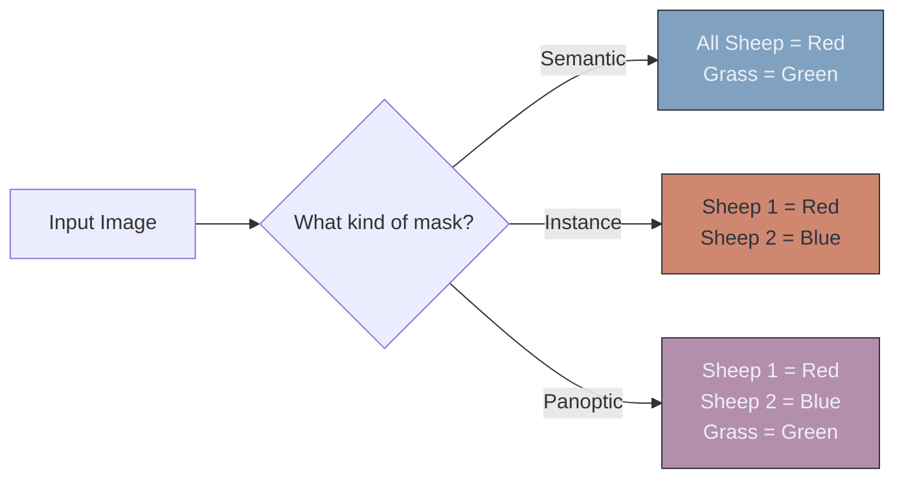

# 🎨 Image Segmentation

> **Difficulty**: ⭐⭐☆☆☆ Intermediate | **Prerequisites**: CNNs, Object Detection | **Estimated Reading Time**: 25 Minutes

---

## 📋 Table of Contents
1. [What Problem Does This Solve?](#1-what-problem-does-this-solve)
2. [Intuition](#2-intuition)
3. [Core Mechanics (Transposed Convolutions)](#3-core-mechanics-transposed-convolutions)
4. [Visual Explanation](#4-visual-explanation)
5. [Algorithm Workflow](#5-algorithm-workflow)
6. [PyTorch Implementation](#6-pytorch-implementation)
7. [Failure Cases](#7-failure-cases)
8. [What's Next?](#8-whats-next)

---

## 1. What Problem Does This Solve?

Bounding boxes are squares, but the real world is not made of squares. If you draw a bounding box around a person's outstretched arms, 80% of the pixels inside that box might just be the background sky. 

If a robot needs to pick up a fragile glass, or a self-driving car needs to know exactly where the drivable road curves, a bounding box does not provide enough geometric information. **Image Segmentation** solves this by classifying *every single pixel* in an image.

---

## 2. Intuition

### 🟢 Beginner
Imagine a coloring book. Object detection is drawing a quick, rough square around the dog. Segmentation is carefully staying inside the lines, coloring the dog blue, the sky red, and the grass green. You are assigning a color (a class) to every single tiny dot (pixel).

### 🟡 Intermediate
There are two main types of Segmentation you must know:
1. **Semantic Segmentation**: Colors all objects of a class the same color. If there are 3 sheep in a field, it colors all sheep red. It does not know where Sheep 1 ends and Sheep 2 begins.
2. **Instance Segmentation**: Treats every object as a unique entity. It colors Sheep 1 red, Sheep 2 blue, and Sheep 3 green.

### 🔴 Advanced
A third, newer type is **Panoptic Segmentation**. It is the holy grail that combines both. It assigns a unique ID to instances (Sheep 1, Sheep 2) while also segmenting the background "stuff" (the sky, the grass) which Instance Segmentation normally ignores.
Segmentation networks are typically **Encoder-Decoder** architectures (like FCNs). They downsample the image to find the "What", and then upsample back to the original resolution to find the "Where".

---

## 3. Core Mechanics (Transposed Convolutions)

**Transposed Convolutions (Deconvolutions)**
Standard CNNs shrink an image (e.g., $224 \times 224 \rightarrow 7 \times 7$) using Max Pooling or Strided Convolutions. To assign a class to every pixel, we must blow that $7 \times 7$ feature map back up to $224 \times 224$. 

You cannot just stretch the image using simple interpolation. **Transposed convolutions** learn mathematical weights to intelligently expand the matrix. They broadcast input pixels across a larger output matrix based on learned filters.

**Dice Score / IoU**
Accuracy is a terrible metric for segmentation. If an image is 99% background and 1% tumor, a model that guesses "all background" will have 99% accuracy but is completely useless. We use **Intersection over Union (IoU)** or the **Dice Coefficient** to measure how perfectly the predicted mask overlaps the ground truth mask.
$$ \text{Dice} = \frac{2 \times |A \cap B|}{|A| + |B|} $$

---

## 4. Visual Explanation



---

## 5. Algorithm Workflow (Semantic)

1. Input a $256 \times 256$ RGB image.
2. Pass through an Encoder CNN to get a deep $8 \times 8$ feature map.
3. Pass through a Decoder (Transposed Convolutions) to upsample back to $256 \times 256$.
4. The final output is a tensor of shape `[Classes, 256, 256]`.
5. For every single pixel coordinate $(x, y)$, calculate the `argmax` across the `Classes` dimension.
6. The result is a $256 \times 256$ 2D array of class IDs (e.g., `0` for background, `1` for Sheep).

---

## 6. PyTorch Implementation

Using `torchvision`'s DeepLabV3 (a standard Semantic Segmentation model):

```python
import torch
from torchvision import models

# 1. Load a pre-trained DeepLabV3 model
model = models.segmentation.deeplabv3_resnet101(pretrained=True).eval()

# 2. Input Image: [Batch, Channels, Height, Width]
input_tensor = torch.rand(1, 3, 520, 520)

# 3. Inference
with torch.no_grad():
    # DeepLab returns an OrderedDict, we want the 'out' key
    output = model(input_tensor)['out']

# output shape: [1, 21, 520, 520] (21 classes in VOC dataset)
# 4. Collapse the 21 classes to find the highest probability class per pixel
mask = torch.argmax(output.squeeze(), dim=0) 

# mask shape: [520, 520] containing integers 0-20 representing the class ID at that pixel
```

---

## 7. Failure Cases

1. **Checkerboard Artifacts**: Transposed convolutions can sometimes overlap unevenly during the upsampling process, causing the final mask to look like it has a faint checkerboard pattern. *Fix: Use Bilinear Interpolation followed by a standard $1 \times 1$ convolution instead of Transposed Convolutions.*
2. **Lost Thin Structures**: Because the image is compressed down to an $8 \times 8$ grid in the bottleneck, very thin objects (like bicycle spokes or telephone wires) completely disappear from the feature map. The decoder cannot reconstruct what the encoder destroyed. 

---

## 8. What's Next?

### Summary
Image Segmentation classifies every pixel, allowing us to understand the exact shape and contours of objects. Semantic segmentation groups classes, while Instance segmentation separates them.

### Why it matters
Self-driving cars cannot use bounding boxes to stay in their lane; they must use segmentation to map the exact curve of the road pixels.

### Next Topic
Segmentation struggles with fine details because the Encoder destroys them. We will solve this by exploring the most famous segmentation architecture in healthcare: **The U-Net**.

[← Faster R-CNN](05-Faster-RCNN-And-Two-Stage-Detectors.md) | [Return to Module Index](./README.md) | [Next: U-Net & Medical Imaging →](07-UNet-And-Medical-Imaging.md)
