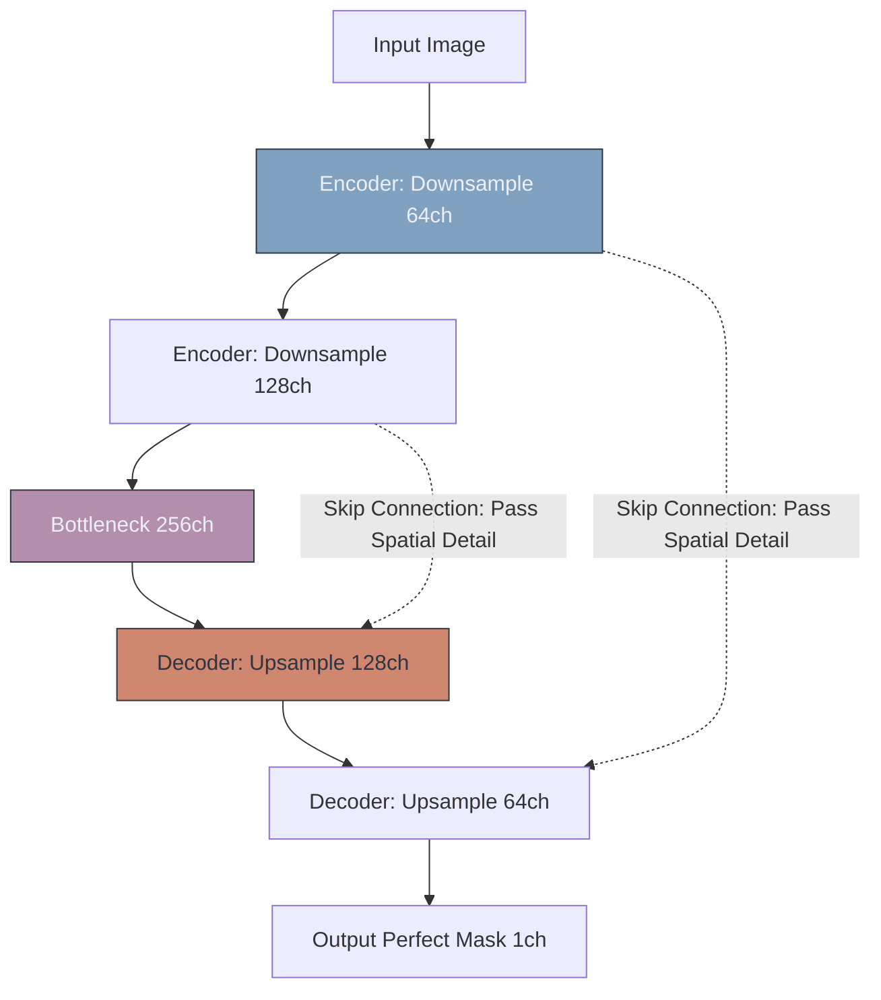

# ⚕️ U-Net & Medical Imaging

> **Difficulty**: ⭐⭐⭐☆☆ Intermediate | **Prerequisites**: Image Segmentation | **Estimated Reading Time**: 30 Minutes

---

## 📋 Table of Contents
1. [What Problem Does This Solve?](#1-what-problem-does-this-solve)
2. [Intuition](#2-intuition)
3. [Core Mechanics (Skip Connections)](#3-core-mechanics-skip-connections)
4. [Visual Explanation](#4-visual-explanation)
5. [Algorithm Workflow](#5-algorithm-workflow)
6. [PyTorch Implementation Concept](#6-pytorch-implementation-concept)
7. [Failure Cases](#7-failure-cases)
8. [What's Next?](#8-whats-next)

---

## 1. What Problem Does This Solve?

Standard segmentation networks (like FCNs) compress the image so heavily that they destroy fine details. When you upsample the image back to its original size, the boundaries of objects are blurry. 

In Medical Imaging, a blurry boundary is unacceptable. A surgeon needs to know the *exact* microscopic boundary of a tumor or a cell wall before operating. Furthermore, medical datasets are incredibly small (often fewer than 100 images) and cannot train a massive ResNet from scratch. **U-Net** is the architectural standard that solves both of these problems simultaneously.

---

## 2. Intuition

### 🟢 Beginner
Imagine trying to draw a highly detailed map of a city from memory. If you only look at the whole continent (the Encoder), you know roughly where the city is, but you forget the exact street names. U-Net is like looking at the continent map, but also keeping the high-resolution city street map right next to you on the desk. It beautifully combines the "big picture context" with the "fine spatial details."

### 🟡 Intermediate
U-Net gets its name because its architecture looks like a literal "U". 
It has a **Contracting Path (Encoder)** that learns *What* the object is (context). 
It has an **Expanding Path (Decoder)** that learns *Where* the object is (localization).
The magic lies in the bridge between them.

### 🔴 Advanced
The true genius of U-Net is its **Skip Connections**. As the Encoder shrinks the image, it saves the high-resolution feature maps in GPU memory. When the Decoder begins to upsample, U-Net takes those saved, high-resolution feature maps from the Encoder and concatenates them directly into the Decoder layers. This gives the Decoder the exact spatial geometry it needs to draw pixel-perfect boundaries, effectively bypassing the destructive bottleneck.

---

## 3. Core Mechanics (Skip Connections)

**Extreme Data Augmentation**
Because U-Net was designed to work on tiny medical datasets (the original 2015 paper won a challenge using only 30 images), it relies heavily on extreme data augmentation.

Specifically, it uses **Elastic Deformations**. Instead of just rotating an image, medical images are warped, stretched, and twisted like a funhouse mirror. This teaches the network the biological structure of a cell, regardless of its exact shape, preventing overfitting on tiny datasets.

**Loss Function Adjustments**
Medical masks are often highly imbalanced (e.g., cell boundaries are only 2% of the pixels, background is 98%). U-Net heavily utilizes weighted Cross-Entropy or **Dice Loss** to force the network to care about the tiny boundary lines rather than just predicting "background" for everything.

---

## 4. Visual Explanation



---

## 5. Algorithm Workflow

1. **Down**: Pass the image through two $3 \times 3$ convolutions, then a Max Pooling layer. Save the feature map in memory.
2. **Down**: Repeat until you reach the bottleneck.
3. **Up**: Apply a Transposed Convolution to double the resolution.
4. **Skip**: Take the saved feature map from the corresponding Down layer, crop it (if necessary to match dimensions), and **concatenate** it to the Up feature map along the channel dimension.
5. **Up**: Pass through two $3 \times 3$ convolutions to merge the information.
6. **Output**: A $1 \times 1$ convolution maps the features to the desired number of classes.

---

## 6. PyTorch Implementation Concept

The power of the Skip Connection is surprisingly simple to implement in PyTorch:

```python
import torch
import torch.nn as nn

# Inside the forward pass of a custom U-Net Module:

def forward(self, input_tensor):
    # 1. Down (Encoder)
    # x_down shape: [Batch, 64, 256, 256] 
    x_down = self.encoder(input_tensor) 

    # ... image passes through pooling and bottleneck ...
    bottleneck_tensor = self.bottleneck(x_down)

    # 2. Up (Decoder)
    # x_up shape: [Batch, 64, 256, 256]
    x_up = self.upsample(bottleneck_tensor)

    # 3. THE SKIP CONNECTION
    # Concatenate the feature maps along the Channel dimension (dim=1)
    # combined shape: [Batch, 128, 256, 256] (64 + 64)
    combined = torch.cat([x_up, x_down], dim=1)

    # 4. Pass combined tensor into the next convolution block
    output = self.decoder_conv(combined)
    
    return output
```

---

## 7. Failure Cases

1. **Memory Exhaustion (OOM)**: Because Skip Connections require you to save the high-resolution feature maps from *every* stage of the Encoder, U-Net uses a massive amount of VRAM. Training a 3D U-Net on high-res MRI scans often requires micro-batch sizes of just 1 or 2 images per GPU, necessitating Gradient Accumulation to stabilize training.
2. **Global Context Issues**: While U-Net is great at local details, standard CNN U-Nets can sometimes miss long-range dependencies across the image. Modern variants (like Swin-UNet) integrate Vision Transformers to solve this.

---

## 8. What's Next?

### Summary
U-Net revolutionized medical imaging by proving that high-resolution spatial information could be preserved during deep network training via Skip Connections, allowing for pixel-perfect segmentations on tiny datasets.

### Why it matters
If you are analyzing MRI scans, CT scans, satellite imagery, or anything requiring highly precise boundaries, U-Net is the undisputed starting architecture.

### Next Topic
We have segmented objects perfectly. But what if the object is a human, and we need to know exactly what they are doing with their body? We will explore **Pose Estimation**.

[← Image Segmentation](06-Image-Segmentation.md) | [Return to Module Index](./README.md) | [Next: Pose Estimation →](08-Pose-Estimation.md)
