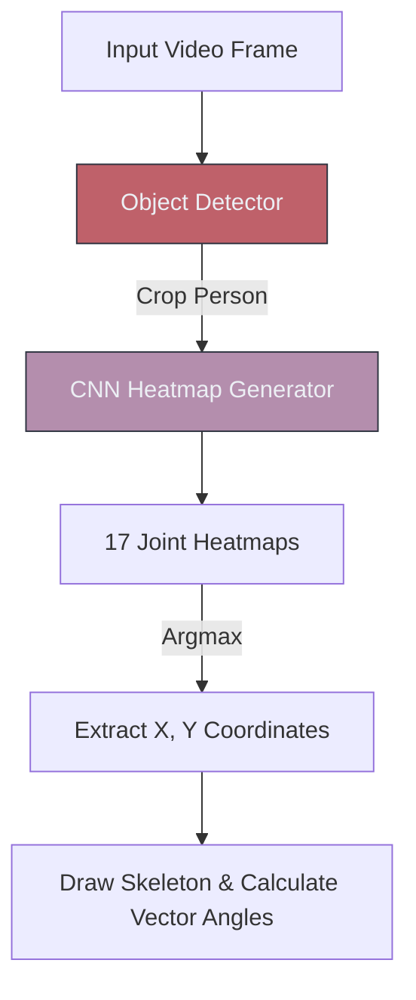

# 🧍‍♂️ Pose Estimation

> **Difficulty**: ⭐⭐☆☆☆ Intermediate | **Prerequisites**: CNNs | **Estimated Reading Time**: 25 Minutes

---

## 📋 Table of Contents
1. [What Problem Does This Solve?](#1-what-problem-does-this-solve)
2. [Intuition](#2-intuition)
3. [Core Mechanics (Heatmaps)](#3-core-mechanics-heatmaps)
4. [Algorithm Workflow](#4-algorithm-workflow)
5. [Visual Explanation](#5-visual-explanation)
6. [MediaPipe Implementation](#6-mediapipe-implementation)
7. [Failure Cases](#7-failure-cases)
8. [What's Next?](#8-whats-next)

---

## 1. What Problem Does This Solve?

If an Object Detector draws a box around a person, it knows the person exists, but it has absolutely no idea what the person is *doing*. Is the person standing, falling down, doing a pushup, or swinging a golf club? 

**Pose Estimation** solves this by finding specific, pre-defined "Keypoints" on the human body (like the left elbow, right knee, and nose) and mathematically connecting them to form a structural 2D or 3D skeleton.

---

## 2. Intuition

### 🟢 Beginner
Imagine you are looking at a blurry photo of a friend waving at you. Even if you can't see their face clearly, you can guess where their shoulder is, and from there, you can guess where their elbow is, and from there, their hand. Pose Estimation models do exactly this: they look for visual clues of joints and connect the dots based on human anatomy.

### 🟡 Intermediate
Pose Estimation generally predicts $X$ and $Y$ pixel coordinates for $K$ keypoints (e.g., 33 keypoints in Google MediaPipe). 
There are two main approaches for multi-person tracking:
1. **Top-Down**: Run a standard Object Detector first to find all people. Crop the people out. Run the Pose Estimator on each cropped person. (Highly accurate, but very slow if there are 50 people in the image).
2. **Bottom-Up**: Find every single elbow, knee, and nose in the entire image at once. Then, use math to group them together into individual skeletons. (Faster for crowds, but slightly less accurate).

### 🔴 Advanced
Predicting raw $X, Y$ coordinates directly using a fully connected layer is notoriously inaccurate. Instead, modern models predict **Heatmaps**. For 17 joints, the network outputs 17 separate 2D probability maps. The map for the "Right Elbow" will be entirely zeros, except for a bright 2D Gaussian bell curve right over the pixels where the elbow is located. We then simply find the `argmax` (the brightest pixel) of that heatmap to get the $X,Y$ coordinate.

---

## 3. Core Mechanics (Heatmaps)

By framing the problem as a segmentation task (predicting a heatmap) rather than a regression task (predicting a single number), the CNN can leverage spatial context. The network isn't just guessing a number; it's coloring the pixels where it thinks the joint lives.

**MediaPipe (The Edge Champion)**
For real-time, on-device pose estimation, Google's MediaPipe is the undisputed king. It uses an incredibly lightweight Top-Down approach. Once it finds a person in Frame 1, it assumes the person won't move much in Frame 2. It tracks their bounding box, completely skipping the heavy Object Detection step for subsequent frames. It predicts 33 3D landmarks (including the $Z$ axis for depth) running at 30+ FPS on a mobile phone CPU.

---

## 4. Algorithm Workflow (Fitness App)

If you want to calculate the angle of a bicep curl:
1. Extract the $(X, Y)$ coordinates for the **Shoulder**, **Elbow**, and **Wrist**.
2. Treat these as two mathematical vectors: $\vec{A}$ (Shoulder to Elbow) and $\vec{B}$ (Wrist to Elbow).
3. Use the dot product or `math.atan2` to calculate the exact degree angle between the two vectors.
4. If Angle $< 30^\circ$, the curl is complete. If Angle $> 160^\circ$, the arm is straight.

---

## 5. Visual Explanation



---

## 6. MediaPipe Implementation

```python
import cv2
import mediapipe as mp

# 1. Initialize MediaPipe Pose
mp_pose = mp.solutions.pose
pose = mp_pose.Pose(
    static_image_mode=True,
    model_complexity=2, # 0, 1, or 2 (Higher is more accurate but slower)
    min_detection_confidence=0.5
)

# 2. Read Image
image = cv2.imread('gym.jpg')
image_rgb = cv2.cvtColor(image, cv2.COLOR_BGR2RGB)

# 3. Run Inference
results = pose.process(image_rgb)

# 4. Extract specific landmark (e.g., Left Elbow is landmark 13)
if results.pose_landmarks:
    left_elbow = results.pose_landmarks.landmark[mp_pose.PoseLandmark.LEFT_ELBOW]
    
    # Coordinates are normalized [0.0, 1.0]. Multiply by image dimensions to get pixels.
    h, w, c = image.shape
    pixel_x = int(left_elbow.x * w)
    pixel_y = int(left_elbow.y * h)
    
    print(f"Left Elbow located at: ({pixel_x}, {pixel_y})")
```

---

## 7. Failure Cases

1. **Self-Occlusion**: If a person is facing the camera and crosses their arms, their wrists overlap. Because the network cannot physically "see" the left wrist, it must guess based on context. Traditional 2D heatmap models fail miserably here, drawing the left wrist on the right arm. *Fix: Use 3D pose estimators or temporal models (like VideoPose3D) that remember where the arm was in the previous frames.*
2. **Motion Blur**: In sports analytics, an arm swinging a tennis racket moves so fast it becomes a blur. Heatmap generators will output a wide, smeared probability distribution instead of a tight Gaussian curve, leading to highly inaccurate $X, Y$ extraction.

---

## 8. What's Next?

### Summary
Pose Estimation upgrades Object Detection by finding the structural keypoints of an object, allowing us to understand body mechanics, posture, and action using vector mathematics.

### Why it matters
Pose estimation is the backbone of modern sports analytics, cashierless retail (tracking hand movements), and CGI motion capture without physical markers.

### Next Topic
Pose estimation tracks joints on a single person. But what if there are 10 cars on a highway, and we need to track their movements across time? We will explore **Object Tracking**.

[← U-Net & Medical Imaging](07-UNet-And-Medical-Imaging.md) | [Return to Module Index](./README.md) | [Next: Object Tracking →](09-Object-Tracking.md)
