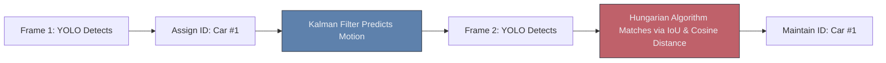

# 🎥 Object Tracking in Video

> **Difficulty**: ⭐⭐⭐⭐☆ Advanced | **Prerequisites**: YOLO, Mathematics (Vectors) | **Estimated Reading Time**: 35 Minutes

---

## 📋 Table of Contents
1. [What Problem Does This Solve?](#1-what-problem-does-this-solve)
2. [Intuition](#2-intuition)
3. [Core Mathematics (Kalman Filters)](#3-core-mathematics-kalman-filters)
4. [Algorithm Workflow (DeepSORT)](#4-algorithm-workflow-deepsort)
5. [Visual Explanation](#5-visual-explanation)
6. [Implementation (ByteTrack)](#6-implementation-bytetrack)
7. [Failure Cases](#7-failure-cases)
8. [What's Next?](#8-whats-next)

---

## 1. What Problem Does This Solve?

If you pass a 30 FPS video through YOLO, YOLO will draw a bounding box around a car 30 times a second. But YOLO has amnesia. It has absolutely no idea that the car in Frame 1 is the *exact same car* in Frame 2. 

If you want to count how many unique cars passed through an intersection, YOLO will just count the exact same car 30 times. **Object Tracking** solves this by assigning a unique ID (e.g., `Car #42`) and maintaining that specific ID across frames, allowing you to calculate speed, trajectory, and unique foot traffic.

---

## 2. Intuition

### 🟢 Beginner
If you see a red ball rolling to the right, and you close your eyes for one second, you can guess exactly where the ball will be when you open your eyes. You mentally calculated its speed and direction. Computer Vision trackers do exactly this. They calculate the velocity of bounding boxes to predict where they should be in the next frame.

### 🟡 Intermediate
The modern standard is the **Tracking-by-Detection** paradigm.
1. Run an Object Detector (YOLO) on the current frame.
2. Use a mathematical motion model (like a **Kalman Filter**) to predict where the boxes from the *previous* frame should be right now.
3. Use a matching algorithm (like the **Hungarian Algorithm**) to match the new YOLO detections with the predicted boxes, calculating the Intersection over Union (IoU) between them to assign the correct ID.

### 🔴 Advanced
A basic tracker like **SORT** (Simple Online and Realtime Tracking) relies purely on IoU and motion. If a person walks behind a tree and disappears for 5 frames, the Kalman filter loses them. When they reappear, YOLO finds them, but SORT has no memory of them, resulting in a completely new ID (an **ID Switch**). 

To solve this, we use **DeepSORT**, which adds an Appearance Embedding. It passes the cropped image of the person through a CNN to generate a mathematical vector of what they look like ("red shirt, blue jeans"). It uses Cosine Distance to re-identify them when they reappear!

---

## 3. Core Mathematics (Kalman Filters)

The **Kalman Filter** is an ancient algorithm (used to guide the Apollo moon missions) that perfectly estimates the state of a moving object.
In tracking, the "State" is defined by 8 variables:
$$ [x, y, a, h, v_x, v_y, v_a, v_h] $$
Where $(x, y)$ is the center, $a$ is the aspect ratio, $h$ is the height, and the $v$ variables represent their velocities. The filter constantly updates its velocity predictions based on the actual YOLO measurements.

---

## 4. Algorithm Workflow (DeepSORT)

1. **Detect**: YOLO finds 5 people in Frame $T$.
2. **Predict**: The Kalman Filter predicts the locations of the 5 tracks from Frame $T-1$.
3. **Extract Features**: Pass the 5 newly detected people through a Re-ID CNN to get their 128D appearance embeddings.
4. **Calculate Distance Matrix**: Calculate both the Spatial Distance (IoU) and the Appearance Distance (Cosine Similarity) between the new detections and the existing tracks.
5. **Hungarian Match**: Run the Hungarian Algorithm to find the mathematically optimal assignment of old IDs to the new detections.
6. **Update**: Update the Kalman Filter velocities with the new locations.

---

## 5. Visual Explanation



---

## 6. Implementation (ByteTrack)

When a person walks behind a tree, YOLO's confidence score drops from `0.90` down to `0.20` before they fully disappear. DeepSORT throws away any detection below `0.50`, instantly losing the track. 

**ByteTrack** changed the game by keeping *all* low-confidence detections. It first matches the high-confidence boxes to existing tracks. Then, it uses the remaining unmatched tracks and explicitly tries to match them against the low-confidence boxes. This allows it to smoothly track heavily occluded objects through dense crowds.

Tracking is heavily optimized in modern libraries. It is built directly into the Ultralytics YOLO API!

```python
from ultralytics import YOLO

# Load a YOLOv8 model
model = YOLO('yolov8n.pt')

# Run inference on a video file, using ByteTrack
# 'persist=True' tells the model to keep tracking IDs in memory between frames
results = model.track(source="highway.mp4", tracker="bytetrack.yaml", persist=True)

for frame_result in results:
    if frame_result.boxes.id is not None:
        tracking_ids = frame_result.boxes.id.int().cpu().tolist()
        print(f"Tracking IDs in current frame: {tracking_ids}")
```

---

## 7. Failure Cases

1. **Identical Appearances (Sports)**: If you are tracking basketball players, and everyone on the same team is wearing the exact same red jersey, DeepSORT's appearance embeddings become useless (Cosine Distance between Player 1 and Player 2 is almost 0). The tracker will furiously swap their IDs every time they cross paths. You must fine-tune the Re-ID network specifically on faces or jersey numbers, not just the overall bounding box.
2. **Camera Motion**: If the camera is mounted on a drone and rapidly panning, the Kalman Filter's prediction of bounding box velocity will be completely wrong, causing massive ID switches. You must use camera motion compensation (CMC) algorithms.

---

## 8. What's Next?

### Summary
Object Tracking gives memory to Object Detectors. By combining Kalman Filters for motion prediction and Re-ID CNNs for appearance matching, we can assign unique IDs to objects across time.

### Why it matters
Tracking is the foundation of Video Analytics. You cannot measure foot traffic, calculate vehicle speeds, or analyze sports plays without robust ID tracking.

### Next Topic
DeepSORT uses a CNN to identify if a person looks the same. What if we need to identify exactly *who* that person is with cryptographic accuracy? We will explore **Face Recognition Systems**.

[← Pose Estimation](08-Pose-Estimation.md) | [Return to Module Index](./README.md) | [Next: Face Recognition →](10-Face-Recognition.md)
