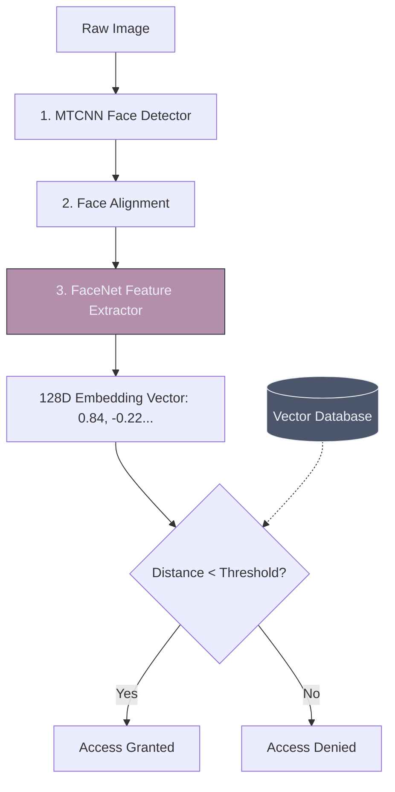

# 👤 Face Recognition Systems

> **Difficulty**: ⭐⭐⭐⭐☆ Advanced | **Prerequisites**: CNNs, Siamese Networks | **Estimated Reading Time**: 35 Minutes

---

## 📋 Table of Contents
1. [What Problem Does This Solve?](#1-what-problem-does-this-solve)
2. [Intuition](#2-intuition)
3. [Core Mathematics (Triplet Loss)](#3-core-mathematics-triplet-loss)
4. [Algorithm Workflow](#4-algorithm-workflow)
5. [Visual Explanation](#5-visual-explanation)
6. [Implementation Concept](#6-implementation-concept)
7. [Failure Cases & Ethics](#7-failure-cases--ethics)
8. [What's Next?](#8-whats-next)

---

## 1. What Problem Does This Solve?

Standard Image Classification (like ResNet) outputs a discrete class label from a fixed list (e.g., `Dog`, `Cat`). You cannot train a classifier to recognize faces this way. If you train a network to recognize 1,000 employees, and you hire a new employee, you would have to rebuild and retrain the entire network from scratch to add class `1,001`. 

**Face Recognition** solves this by generating **Embeddings** instead of names. To add a new employee, you just take their photo, generate their mathematical vector, and save it to a database. No retraining required!

---

## 2. Intuition

### 🟢 Beginner
Imagine trying to describe a friend's face to a sketch artist. You might say "Distance between eyes: 2 inches. Nose length: 1.5 inches." You just created an embedding! A computer does the exact same thing, but instead of 2 measurements, it calculates 128 incredibly complex measurements and saves them as a list of numbers.

### 🟡 Intermediate
Face Recognition is never a single model; it is a strict 4-step pipeline:
1. **Detection**: Find the face in the image (using MTCNN or Haar Cascades).
2. **Alignment**: Rotate the image so the eyes are perfectly level.
3. **Extraction**: Pass the aligned face through the CNN (like FaceNet) to get the 128D embedding vector.
4. **Matching**: Calculate the Euclidean Distance or Cosine Similarity between this new vector and the vectors in your database.

### 🔴 Advanced
You must deeply understand the difference between **Verification (1:1)** and **Identification (1:N)**.
- **Verification**: "Are you Alice?" The system compares your face against *only* Alice's saved vector. If the distance is small, it unlocks. Highly accurate and extremely fast.
- **Identification**: "Who are you?" The system compares your face against *10 million* saved vectors to find the closest match. Prone to false positives and requires heavy optimization (like HNSW vector databases) to run quickly.

---

## 3. Core Mathematics (Triplet Loss)

How do you train a network to output numbers instead of names? You use a **Siamese Network** trained with **Triplet Loss**.

During training, the network is fed three images simultaneously: 
1. An **Anchor** (Alice).
2. A **Positive** (a different photo of Alice).
3. A **Negative** (Bob).

The Loss Function calculates the embedding vectors for all three. It then applies mathematical pressure to push the Anchor vector and Positive vector closer together in 128D space, while violently shoving the Negative vector far away.

$$ \mathcal{L} = \max(0, ||f(A) - f(P)||^2 - ||f(A) - f(N)||^2 + \alpha) $$

---

## 4. Algorithm Workflow (Verification)

1. User approaches the door scanner.
2. The camera captures an image and detects the bounding box of the face using MTCNN.
3. The face is cropped, aligned using facial landmarks, and resized to $160 \times 160$.
4. The image passes through the `FaceNet` CNN, outputting a 128D numpy array.
5. The system pulls the user's stored 128D vector from the SQL database.
6. Calculate: `distance = numpy.linalg.norm(live_vector - db_vector)`.
7. If `distance < 0.6`, open the door.

---

## 5. Visual Explanation



---

## 6. Implementation Concept

Using the high-level `face_recognition` Python library (a wrapper around dlib):

```python
import face_recognition

# 1. Load the known image and extract its embedding (encoding)
known_image = face_recognition.load_image_file("alice_db.jpg")
known_encoding = face_recognition.face_encodings(known_image)[0]

# 2. Load the live webcam image
unknown_image = face_recognition.load_image_file("webcam.jpg")
unknown_encoding = face_recognition.face_encodings(unknown_image)[0]

# 3. Calculate distance and compare against a strict threshold (0.6 is standard)
# Returns True if distance is less than the tolerance
results = face_recognition.compare_faces([known_encoding], unknown_encoding, tolerance=0.6)

if results[0] == True:
    print("Welcome, Alice!")
else:
    print("INTRUDER ALERT")
```

---

## 7. Failure Cases & Ethics

1. **The Bias Problem**: If a FaceNet model is trained predominantly on faces of a specific demographic, it will learn embeddings tailored specifically to those facial features. When presented with faces from an underrepresented demographic, the vectors cluster poorly, leading to catastrophic false positives (identifying an innocent person as a criminal). *As an AI Engineer, ensuring absolute diversity in your training datasets is a strict ethical requirement.*
2. **Presentation Attacks (Spoofing)**: Holding up an iPad playing a video of Alice's face will easily fool a standard 2D face recognition system. Production systems must implement **Liveness Detection** (requiring the user to blink, tracking infrared heat maps, or using Apple's 3D Dot Projector).

---

## 8. What's Next?

### Summary
Face Recognition replaces classification layers with embeddings. By using Triplet Loss, the network learns to map faces into a multi-dimensional space where similar faces cluster together, allowing for infinite scaling of classes without retraining.

### Why it matters
Face Recognition is the foundation of modern biometric security, powering smartphone Face ID, airport border control, and secure banking applications.

### Next Topic
We can read faces, but can we read text? We will explore how to bridge Computer Vision and Natural Language Processing via **OCR Systems**.

[← Object Tracking](09-Object-Tracking.md) | [Return to Module Index](./README.md) | [Next: OCR Systems →](11-OCR-Systems.md)
