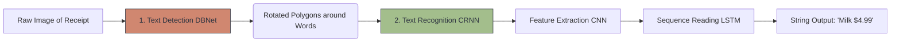

# 📄 OCR (Optical Character Recognition)

> **Difficulty**: ⭐⭐⭐☆☆ Intermediate | **Prerequisites**: CNNs, RNNs | **Estimated Reading Time**: 25 Minutes

---

## 📋 Table of Contents
1. [What Problem Does This Solve?](#1-what-problem-does-this-solve)
2. [Intuition](#2-intuition)
3. [Core Mechanics (CRNN)](#3-core-mechanics-crnn)
4. [Algorithm Workflow](#4-algorithm-workflow)
5. [Visual Explanation](#5-visual-explanation)
6. [Implementation (EasyOCR)](#6-implementation-easyocr)
7. [Failure Cases](#7-failure-cases)
8. [What's Next?](#8-whats-next)

---

## 1. What Problem Does This Solve?

A massive amount of the world's data is trapped in physical formats: receipts, street signs, handwritten medical notes, and PDF scans. Object Detection can find a license plate, but it cannot read the letters. 

**OCR (Optical Character Recognition)** bridges the gap between vision and language. It translates the raw pixels of an image into raw, machine-readable string text (e.g., `"TOTAL: $14.99"`).

---

## 2. Intuition

### 🟢 Beginner
If you look at the shape `A`, your brain instantly maps those lines and angles to the first letter of the alphabet. OCR models are trained on millions of images of fonts. They learn that a vertical line next to a curve is a `D`, and two intersecting diagonals is an `X`.

### 🟡 Intermediate
Modern OCR is not a single model; it is a **Two-Stage Pipeline**:
1. **Text Detection**: Find exactly where the text is. Because text lines can be extremely long, curved, or rotated, standard bounding boxes fail. Specialized detectors (like CRAFT or DBNet) draw tight, rotated polygons around paragraphs or words.
2. **Text Recognition**: Crop out the polygon, flatten it, and pass it to a sequence model to read the letters from left to right.

### 🔴 Advanced
The Text Recognition stage is incredibly complex. If you just run a CNN classifier on individual letters, you lose context (e.g., `l` vs `1` vs `I`). Instead, we use a **CRNN (Convolutional Recurrent Neural Network)**. 
First, a CNN extracts the visual features of the cropped word. Then, those features are fed sequentially into an RNN (usually an LSTM) that reads them left-to-right. Finally, a CTC (Connectionist Temporal Classification) layer translates the RNN outputs into the final string, perfectly handling the fact that the letter 'W' might take up 4 pixels of width, while the letter 'I' only takes up 1 pixel.

---

## 3. Core Mechanics (CRNN)

**The Big Three Engines:**
You rarely build OCR from scratch. The industry relies on highly-optimized open-source engines:
1. **Tesseract**: Maintained by Google. It is a legacy engine. Incredibly fast and lightweight, and works perfectly on clean, flat, black-and-white PDF scans. It fails miserably on "Text in the Wild" (photos of signs or blurry receipts).
2. **EasyOCR**: Built on PyTorch. Excellent at reading messy, real-world photos in 80+ languages. Extremely easy to use in Python.
3. **PaddleOCR**: Built by Baidu. The absolute State-of-the-Art for open-source OCR. It features incredibly small, ultra-fast models that dominate text detection in the wild.

---

## 4. Algorithm Workflow

1. Read the image using OpenCV.
2. (Crucial) **Preprocess**: Apply adaptive thresholding to remove shadows, and use perspective transforms to un-warp the angled photo so it looks mathematically flat.
3. Pass into PaddleOCR or EasyOCR.
4. The engine returns a list of tuples containing:
   - The bounding box coordinates (the polygon).
   - The predicted string.
   - The confidence score.
5. Use Regex on the strings to extract the exact data you want (e.g., `re.search(r'\$\d+\.\d{2}', text)` to find prices).

---

## 5. Visual Explanation



---

## 6. Implementation (EasyOCR)

```python
import easyocr
import cv2

# 1. Initialize the reader (Loads the models into GPU memory)
# specify the languages you want to read
reader = easyocr.Reader(['en']) 

# 2. Run inference on the image path
results = reader.readtext('stop_sign.jpg')

# 3. Parse the results
for (bbox, text, prob) in results:
    print(f"Detected Text: {text} | Confidence: {prob:.2f}")
    
# Expected Output:
# Detected Text: STOP | Confidence: 0.99
```

---

## 7. Failure Cases

1. **Layout Parsing (The Nightmare of OCR)**: Reading text is a solved problem. Understanding *what the text means* is not. If you scan a complex 4-column financial invoice, the OCR engine will just output a massive string of random numbers. Reconstructing the tabular structure (knowing that `$400` belongs to `Q3 Revenue`) requires highly advanced Layout Analysis models (like LayoutLM) to operate *on top* of the OCR output.
2. **Handwriting**: Standard CRNNs fail completely on cursive handwriting. Letters overlap, and the style is completely unstructured. You must use specialized handwriting datasets (like IAM) and highly customized models.

---

## 8. What's Next?

### Summary
OCR bridges Vision and Language by using specialized polygon detectors to find text, and Convolutional Recurrent networks (CRNNs) to read the letters sequentially.

### Why it matters
OCR is the backbone of Robotic Process Automation (RPA), automatically extracting invoice numbers, reading license plates at toll booths, and translating street signs on mobile apps.

### Next Topic
We have analyzed images across space. Now we must analyze them across time. We will explore **Video Analytics and 3D Convolutions**.

[← Face Recognition](10-Face-Recognition.md) | [Return to Module Index](./README.md) | [Next: Video Analytics →](12-Video-Analytics.md)
