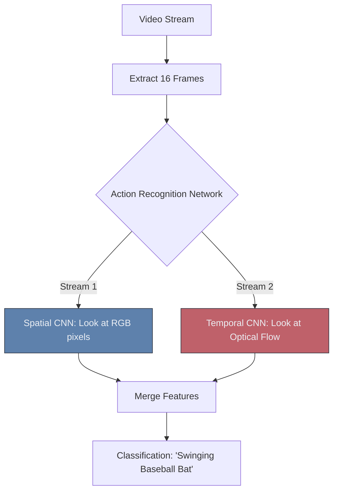

# 🎞️ Video Analytics

> **Difficulty**: ⭐⭐⭐☆☆ Intermediate | **Prerequisites**: Object Tracking, CNNs | **Estimated Reading Time**: 25 Minutes

---

## 📋 Table of Contents
1. [What Problem Does This Solve?](#1-what-problem-does-this-solve)
2. [Intuition](#2-intuition)
3. [Core Mechanics (3D Convolutions)](#3-core-mechanics-3d-convolutions)
4. [Algorithm Workflow](#4-algorithm-workflow)
5. [Visual Explanation](#5-visual-explanation)
6. [PyTorch Implementation Concept](#6-pytorch-implementation-concept)
7. [Failure Cases](#7-failure-cases)
8. [What's Next?](#8-whats-next)

---

## 1. What Problem Does This Solve?

A single image tells you what is happening right now. A sequence of images tells you a story. 

If you show a standard CNN a photo of a person with their arm raised, the CNN can confidently detect the "Person". But it cannot tell you if the person is waving hello, or throwing a baseball. **Video Analytics** extends Computer Vision into the Temporal (Time) dimension to understand actions, behaviors, and sequences over time.

---

## 2. Intuition

### 🟢 Beginner
A video is just a flipbook. It is a stack of 30 images (frames) played every second. To understand a video, the computer has to look at the first image, remember what it saw, look at the second image, and calculate how things moved between the two.

### 🟡 Intermediate
The simplest way to do Video Analytics is **Action Recognition via Tracking**. You use YOLO to find a person, use ByteTrack to track them across 50 frames, and calculate the math of their bounding box coordinates (e.g., if the box moves quickly from the left of the screen to the right, they are running).

### 🔴 Advanced
Tracking bounding boxes doesn't help if you need to classify complex actions (like "mixing batter in a bowl" vs "whisking eggs"). For this, we must analyze the actual pixels over time. We use **Two-Stream Networks** or **3D CNNs**.
- A 2D CNN kernel is $3 \times 3$ (Height x Width). It slides across an image.
- A 3D CNN kernel is $3 \times 3 \times 3$ (Time x Height x Width). It slides across an image *and* through the sequence of frames simultaneously, capturing both spatial textures and temporal motion in one mathematical operation.

---

## 3. Core Mechanics (3D Convolutions)

**Optical Flow**
Instead of just feeding raw RGB frames into a network, we often compute the **Optical Flow** first. Optical Flow is a classical OpenCV algorithm that calculates the exact direction and speed every single pixel moved between Frame 1 and Frame 2. It generates a "motion map". Feeding this motion map directly into a CNN drastically improves action recognition accuracy compared to passing raw RGB images.

**Two-Stream Networks**
Because Spatial information (RGB) and Temporal information (Optical Flow) are both critical, modern action recognition uses Two-Stream networks. Stream 1 looks at the RGB frames. Stream 2 looks at the Optical Flow. The outputs are merged at the end for a final classification.

---

## 4. Algorithm Workflow (Real-Time Fall Detection)

If you want to build a real-time anomaly detector (e.g., detecting if someone falls down in a hospital):
1. Create a queue that holds the last 30 frames in memory.
2. Every time a new frame arrives, push it to the queue and pop the oldest frame.
3. Pass the batch of 30 frames `[Batch, Channels, Time, Height, Width]` through a pre-trained Action Recognition model.
4. The model outputs a probability score for the "Falling" class.
5. If the score $> 0.80$, trigger an alert to the nurses' station.

---

## 5. Visual Explanation



---

## 6. PyTorch Implementation Concept

Using `torchvision`'s pre-trained video models (like 3D ResNet):

```python
import torch
from torchvision.models.video import r3d_18

# Load a 3D ResNet pre-trained on Kinetics-400 (Action Recognition Dataset)
model = r3d_18(pretrained=True).eval()

# Input format for Video Models: [Batch, Channels, Frames, Height, Width]
# e.g., 1 video, 3 color channels, 16 consecutive frames, 112x112 size
video_clip = torch.rand(1, 3, 16, 112, 112)

with torch.no_grad():
    predictions = model(video_clip)

# Get the top predicted action index
predicted_action_class = torch.argmax(predictions[0]).item()
print(f"Action Class ID: {predicted_action_class}")
```

---

## 7. Failure Cases

1. **The Computation Cost**: Processing video with 3D Convolutions is unbelievably expensive. If you process 30 frames per second at 1080p, you are pushing gigabytes of data through the GPU every second. *Fix: You must aggressively sub-sample. Don't process 30 FPS. Extract only 3 frames per second, resize them to $112 \times 112$, and process those.*
2. **Camera Motion Limits**: Action recognition datasets are usually filmed on static cameras. If the camera itself is moving wildly, the optical flow map will be destroyed, and the 3D CNN will fail to understand the action.

---

## 8. What's Next?

### Summary
Video Analytics moves beyond static spatial images by incorporating the temporal dimension via Optical Flow and 3D Convolutions, allowing networks to understand complex actions and behaviors.

### Why it matters
This powers smart surveillance systems, retail heatmaps (analyzing lingering behavior), and automated sports broadcasting highlights.

### Next Topic
For a decade, Convolutional Neural Networks (CNNs) were the undisputed kings of all these tasks. But a new architecture has arrived from Natural Language Processing to overthrow them. We will explore **Vision Transformers**.

[← OCR Systems](11-OCR-Systems.md) | [Return to Module Index](./README.md) | [Next: Vision Transformers →](13-Vision-Transformers.md)
