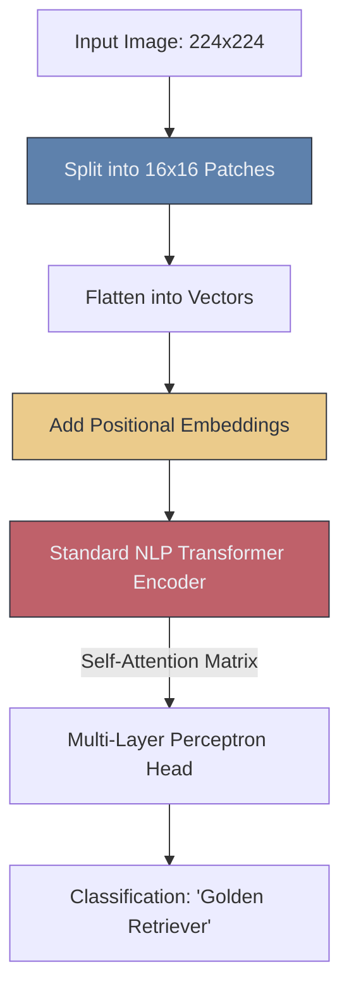

# 👁️ Vision Transformers (ViT)

> **Difficulty**: ⭐⭐⭐⭐⭐ Advanced | **Prerequisites**: CNNs, NLP Attention Mechanism | **Estimated Reading Time**: 35 Minutes

---

## 📋 Table of Contents
1. [What Problem Does This Solve?](#1-what-problem-does-this-solve)
2. [Intuition](#2-intuition)
3. [Core Mechanics (Self-Attention)](#3-core-mechanics-self-attention)
4. [Algorithm Workflow](#4-algorithm-workflow)
5. [Visual Explanation](#5-visual-explanation)
6. [HuggingFace Implementation](#6-huggingface-implementation)
7. [Failure Cases](#7-failure-cases)
8. [What's Next?](#8-whats-next)

---

## 1. What Problem Does This Solve?

For over a decade, Convolutional Neural Networks (CNNs) were the absolute, undisputed kings of Computer Vision. But CNNs have a physical limitation: the convolution kernel only looks at a tiny $3 \times 3$ window of pixels at a time. It takes 50+ layers for a CNN to finally "zoom out" enough to see how the top-left corner of the image relates to the bottom-right corner.

In 2020, researchers imported a model directly from NLP (The Transformer) and applied it to images. **Vision Transformers (ViT)** solved the global context problem by allowing the network to look at *every part of the image simultaneously* right from the first layer, completely overthrowing CNNs as the State-of-the-Art architecture.

---

## 2. Intuition

### 🟢 Beginner
In language AI (like ChatGPT), a Transformer takes a sentence, splits it into words, and figures out how the words relate to each other. A Vision Transformer does the exact same thing to an image. It takes a photo, cuts it up into 16 tiny square "patches", and treats each patch as a "word". It then asks: "How does the patch containing the dog's ear relate to the patch containing the dog's tail?"

### 🟡 Intermediate
CNNs have a high **Inductive Bias**. They are hard-coded with the mathematical assumption that pixels close to each other are related. This makes them very easy to train on small datasets. 

ViTs have an extremely *low* inductive bias. They assume nothing about the image geometry. When initialized, a ViT doesn't actually know that Patch 1 is physically next to Patch 2. It has to learn *how vision works entirely from scratch*. Because of this, ViTs require massive amounts of data (tens of millions of images) to beat CNNs.

### 🔴 Advanced
To give the Transformer a sense of space, we use **Positional Embeddings**. We flatten the 2D image patches into 1D vectors, but before feeding them into the network, we mathematically add a positional vector (e.g., this is Patch $x=4, y=2$) to the patch embedding. 

Once inside, the **Self-Attention** mechanism calculates the dot-product similarity between all patches. In the very first layer, Patch 1 can calculate its attention with Patch 196, capturing global context immediately—something a CNN cannot physically do.

---

## 3. Core Mechanics (Self-Attention)

**The Math of Attention**
$$ \text{Attention}(Q, K, V) = \text{softmax}\left(\frac{QK^T}{\sqrt{d_k}}\right)V $$
Every patch is multiplied by weight matrices to create a Query ($Q$), Key ($K$), and Value ($V$). The dot product $QK^T$ determines how much "attention" Patch A should pay to Patch B.

**The Hybrid Evolution: Swin Transformers**
Calculating attention between *every single patch* is $O(N^2)$ complexity. If you double the image resolution, the math quadruples. It becomes computationally explosive.
The **Swin (Shifted Window) Transformer** solved this by re-introducing the local concept of CNNs back into the Transformer. It calculates attention only within local "windows" (like a convolution kernel), and then merges those windows in deeper layers. Swin Transformers are now the standard backbone for modern object detection frameworks.

---

## 4. Algorithm Workflow

1. Take a $224 \times 224 \times 3$ RGB image.
2. Slice it into a grid of $14 \times 14$ patches, where each patch is $16 \times 16$ pixels.
3. You now have exactly $196$ patches.
4. Flatten each patch into a 1D vector of length $768$ ($16 \times 16 \times 3$).
5. Prepend a special `[CLS]` (Classification) token to the sequence (making it 197 vectors).
6. Add positional embeddings to all 197 vectors.
7. Pass the sequence through 12 Transformer Encoder blocks (Self-Attention + MLPs).
8. Take the output of the `[CLS]` token and pass it to a Linear layer for the final classification.

---

## 5. Visual Explanation



---

## 6. HuggingFace Implementation

Using the HuggingFace `transformers` library:

```python
from transformers import ViTImageProcessor, ViTForImageClassification
from PIL import Image

# 1. Load the image processor (handles the Patching and resizing)
processor = ViTImageProcessor.from_pretrained('google/vit-base-patch16-224')

# 2. Load the Transformer model
model = ViTForImageClassification.from_pretrained('google/vit-base-patch16-224')

image = Image.open('dog.jpg')

# 3. Preprocess and infer
inputs = processor(images=image, return_tensors="pt")
outputs = model(**inputs)

# 4. Extract class
predicted_class_idx = outputs.logits.argmax(-1).item()
print("Predicted class:", model.config.id2label[predicted_class_idx])
```

---

## 7. Failure Cases

1. **Small Datasets**: If you only have 5,000 images, do not train a Vision Transformer from scratch. Because of its lack of inductive bias, it will overfit instantly and fail. Stick to a pre-trained ResNet. If you *must* use a ViT on a small dataset, you **must** use a model pre-trained on ImageNet-21k or JFT-300M and freeze the early layers.
2. **Computational Overhead**: While they are more accurate than CNNs, base ViTs are significantly slower and require more memory during inference. Deploying them to edge devices requires heavy optimization.

---

## 8. What's Next?

### Summary
Vision Transformers proved that the Attention Mechanism from NLP could perfectly replace Convolutional layers. By slicing an image into patches and treating them like words, ViTs achieve global context and unprecedented accuracy on massive datasets.

### Why it matters
ViTs are rapidly replacing ResNet as the standard backbone in AI research. Furthermore, because they share the exact same architecture as language models, they paved the way for models that understand both images and text simultaneously.

### Next Topic
How do we teach a computer that a picture of a dog and the word "Dog" mean the exact same thing? We will explore Vision-Language Models in **Multimodal Vision**.

[← Video Analytics](12-Video-Analytics.md) | [Return to Module Index](./README.md) | [Next: Multimodal Vision →](14-Multimodal-Vision.md)
