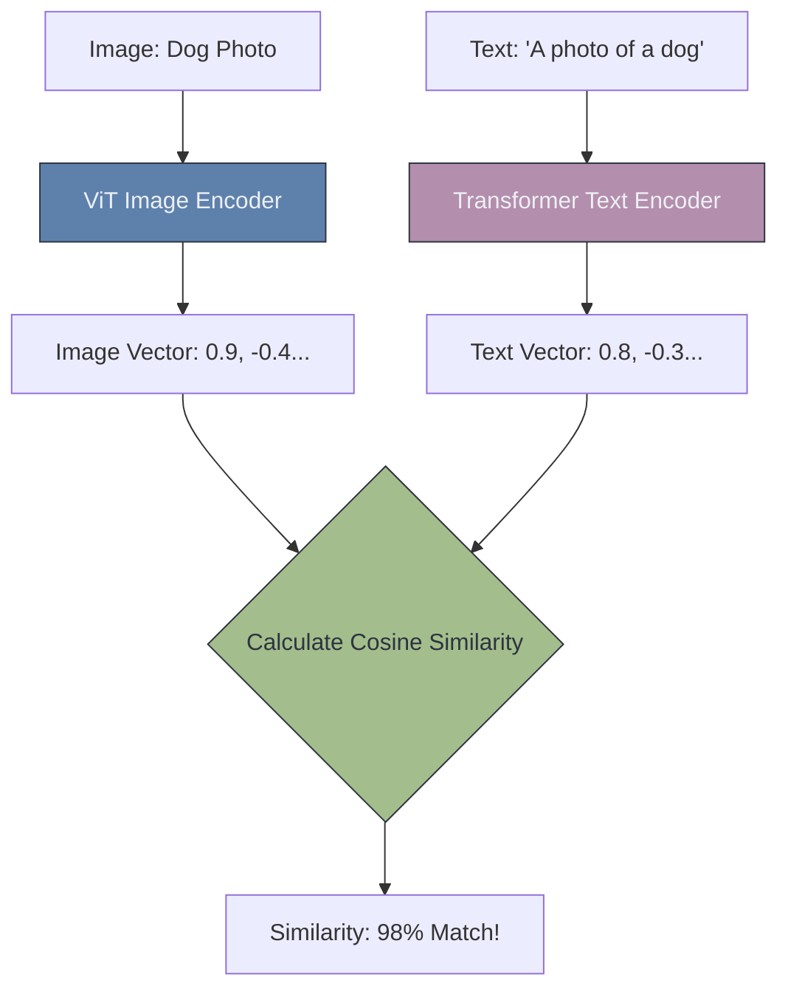

# 🧠 Multimodal Vision (Vision-Language Models)

> **Difficulty**: ⭐⭐⭐⭐☆ Advanced | **Prerequisites**: Vision Transformers, Embeddings | **Estimated Reading Time**: 25 Minutes

---

## 📋 Table of Contents
1. [What Problem Does This Solve?](#1-what-problem-does-this-solve)
2. [Intuition](#2-intuition)
3. [Core Mathematics (Contrastive Loss)](#3-core-mathematics-contrastive-loss)
4. [Algorithm Workflow (Zero-Shot)](#4-algorithm-workflow-zero-shot)
5. [Visual Explanation](#5-visual-explanation)
6. [HuggingFace Implementation](#6-huggingface-implementation)
7. [Failure Cases](#7-failure-cases)
8. [What's Next?](#8-whats-next)

---

## 1. What Problem Does This Solve?

Traditional Computer Vision models are strictly separated from language. A ResNet trained on 1,000 classes only knows that class `204` represents a "Golden Retriever". If you ask the model to find a "Fluffy yellow dog playing in the park," it has absolutely no idea what you mean, because those words are not in its fixed, hard-coded list of 1,000 classes.

**Multimodal Vision** (specifically Vision-Language Models like CLIP) solves this by mapping images and text into the exact same mathematical universe, allowing them to communicate.

---

## 2. Intuition

### 🟢 Beginner
Imagine an English speaker and a Spanish speaker trying to talk. They need a translator. Multimodal models act as the universal translator between the "language" of pixels and the "language" of text. They learn that a photo of a dog means the exact same thing as the text string "a photo of a dog".

### 🟡 Intermediate
To achieve this, models like OpenAI's **CLIP** (Contrastive Language-Image Pretraining) use two completely separate encoders:
1. **Image Encoder**: (A Vision Transformer or ResNet).
2. **Text Encoder**: (A standard NLP Transformer).

When given a photo of a dog and the text "A dog", both encoders process their data and output a 512-dimensional vector. The goal of the model is to make sure the image vector and the text vector are mathematically identical.

### 🔴 Advanced
Because CLIP understands language semantics, it enables **Zero-Shot Classification**. You don't need to train a new classification layer or collect new data. If you want to classify an image as a Cat, Dog, or Bird, you simply pass the text strings `"A photo of a cat"`, `"A photo of a dog"`, and `"A photo of a bird"` into the Text Encoder to get three vectors. Then you pass the image into the Image Encoder to get one vector. Whichever text vector has the highest Cosine Similarity to the image vector is your prediction!

---

## 3. Core Mathematics (Contrastive Loss)

CLIP is trained using **Contrastive Loss** (InfoNCE). It is fed a massive batch of $N$ (image, text) pairs scraped from the internet (e.g., $N=32,768$). 

It creates an $N \times N$ matrix comparing every single image vector against every single text vector in the batch via dot-product. 
The loss function applies mathematical pressure to maximize the Cosine Similarity along the diagonal (matching the correct image with the correct text) while aggressively pushing the similarity toward zero for everything else (the off-diagonal elements). This forces the model to learn incredibly rich, generalized representations of visual concepts.

---

## 4. Algorithm Workflow (Semantic Search)

How to build a Google Images style search engine using CLIP:
1. Pass all 1,000,000 of your database images through the CLIP Image Encoder.
2. Save the 1,000,000 vectors in a Vector Database (like Pinecone or Milvus).
3. A user types a query: `"Sunset over a futuristic city"`.
4. Pass the query through the CLIP Text Encoder to get a single vector.
5. Ask the Vector Database to find the Top-5 image vectors that are mathematically closest (Cosine Distance) to the query vector.
6. Return those 5 images to the user.

---

## 5. Visual Explanation



---

## 6. HuggingFace Implementation

Using the HuggingFace `transformers` library to run Zero-Shot Classification:

```python
from PIL import Image
import torch
from transformers import CLIPProcessor, CLIPModel

# 1. Load CLIP model and processor
model = CLIPModel.from_pretrained("openai/clip-vit-base-patch32")
processor = CLIPProcessor.from_pretrained("openai/clip-vit-base-patch32")

# 2. Define inputs
image = Image.open("mystery_animal.jpg")
classes = ["a photo of a cat", "a photo of a dog", "a photo of a car"]

# 3. Process image and text simultaneously
inputs = processor(text=classes, images=image, return_tensors="pt", padding=True)

# 4. Inference
with torch.no_grad():
    outputs = model(**inputs)

# 5. Extract similarities (logits) and apply Softmax
logits_per_image = outputs.logits_per_image
probs = logits_per_image.softmax(dim=1)

print(f"Probabilities: {probs}") 
# Will show highest probability for the text that best matches the image
```

---

## 7. Failure Cases

1. **Typography Attacks**: Because CLIP relies heavily on text it scraped from the internet, it is easily fooled by literal text inside an image. If you take a photo of an Apple, but you write the word "IPOD" on a piece of tape and stick it to the apple, CLIP will confidently classify the image as an iPod. It trusts the written text more than the visual shape.
2. **Counting and Spatial Relations**: CLIP is terrible at counting ("A photo of 5 cats") or spatial reasoning ("A red block on top of a blue block"). It acts as a "bag of words" and will often trigger high similarity as long as all the objects are present, regardless of their position.

---

## 8. What's Next?

### Summary
Vision-Language Models like CLIP bridge the gap between pixels and text using Contrastive Loss. They enable Zero-Shot classification and semantic image search without requiring any new training data.

### Why it matters
CLIP is the absolute foundation for modern Generative AI. Text-to-image models like Midjourney, DALL-E, and Stable Diffusion rely entirely on CLIP embeddings to understand what the user's prompt actually means visually.

### Next Topic
We have explored all the major architectures. The final step is moving these massive mathematical models out of Jupyter Notebooks and into the real world. We will conclude with **Computer Vision in Production**.

[← Vision Transformers](13-Vision-Transformers.md) | [Return to Module Index](./README.md) | [Next: CV In Production →](15-Computer-Vision-In-Production.md)
