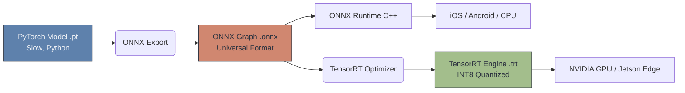

# 🏭 Computer Vision in Production

> **Difficulty**: ⭐⭐⭐⭐☆ Advanced | **Prerequisites**: PyTorch, Object Detection | **Estimated Reading Time**: 30 Minutes

---

## 📋 Table of Contents
1. [What Problem Does This Solve?](#1-what-problem-does-this-solve)
2. [Intuition](#2-intuition)
3. [Core Mechanics (Quantization)](#3-core-mechanics-quantization)
4. [Algorithm Workflow (Export Pipeline)](#4-algorithm-workflow-export-pipeline)
5. [Visual Explanation](#5-visual-explanation)
6. [Implementation Concept](#6-implementation-concept)
7. [Failure Cases](#7-failure-cases)
8. [Module Conclusion](#8-module-conclusion)

---

## 1. What Problem Does This Solve?

A YOLO model that achieves 99% accuracy in a Jupyter Notebook is completely useless if it takes 3 seconds to run on an iPhone, or if it requires a $10,000 GPU to process a simple webcam feed.

In AI Research, the goal is Accuracy. In **MLOps (Production)**, the goals are Speed, Latency, Memory efficiency, and Hardware Compatibility. You cannot run raw PyTorch Python code efficiently in an iOS app or a C++ embedded device.

---

## 2. Intuition

### 🟢 Beginner
PyTorch is like writing a book in English. It's easy for humans to read and write. But computers (specifically, mobile phones and edge hardware) don't speak English very well; they speak C++. MLOps is the process of translating your English book into highly optimized C++ so the computer can read it 10x faster.

### 🟡 Intermediate
To deploy a model, we must decouple it from the Python programming language. We export the trained PyTorch `.pt` file into a universal format called **ONNX (Open Neural Network Exchange)**. An ONNX file is simply a mathematical graph of your network. Once in ONNX format, you can use highly optimized C++ inference engines (like ONNX Runtime) to run the model natively on CPUs, GPUs, or mobile chips.

### 🔴 Advanced
If you are deploying to a production server with NVIDIA GPUs, ONNX is just the middle step. You want **TensorRT**. TensorRT takes your ONNX graph and aggressively optimizes it for the *exact physical architecture* of the GPU it is running on. 
1. **Layer Fusion**: It mathematically combines multiple layers (e.g., Convolution + BatchNorm + ReLU) into a single, faster math operation.
2. **Memory Layout**: It optimizes how the tensors are stored in the GPU VRAM to maximize cache hits.

---

## 3. Core Mechanics (Quantization)

**The Magic Shrink Ray**
Neural networks are typically trained using FP32 (highly precise 32-bit floating-point decimals like `0.14159265`). 
**Quantization** converts these complex decimals into INT8 (basic 8-bit integers like `3`).

- **Benefit**: The model file size shrinks by exactly 4x (a 100MB model becomes 25MB). Furthermore, CPUs and Edge devices can do integer math massively faster than floating-point math, leading to a 3x-4x speedup in inference time.
- **Trade-off**: You lose mathematical precision. However, deep neural networks are incredibly robust. Dropping from FP32 to INT8 usually only costs about 1-2% in accuracy, which is highly acceptable for a massive speed boost!

---

## 4. Algorithm Workflow (Export Pipeline)

The standard pipeline for preparing a model for production:
1. Finish training your model in PyTorch.
2. Load the weights and set the model to `.eval()`.
3. Create a "Dummy Tensor" of the exact size your model expects (e.g., `1 x 3 x 640 x 640`).
4. Trace the model by passing the dummy tensor through it to map the computational graph.
5. Export to `.onnx`.
6. (Optional) Run the NVIDIA `trtexec` builder on the `.onnx` file to generate a `.trt` engine file for your specific GPU.

---

## 5. Visual Explanation



---

## 6. Implementation Concept

Exporting a basic PyTorch model to ONNX:

```python
import torch
import torchvision

# 1. Load trained model
model = torchvision.models.resnet18(pretrained=True)
model.eval()

# 2. Create a dummy input tensor matching production specs
dummy_input = torch.randn(1, 3, 224, 224)

# 3. Export
torch.onnx.export(
    model, 
    dummy_input, 
    "resnet18_production.onnx", 
    export_params=True,
    opset_version=12,
    input_names=['input_image'], 
    output_names=['class_logits']
)

print("Successfully exported to ONNX format!")
```

---

## 7. Failure Cases

1. **Hardware Specificity (TensorRT)**: A TensorRT engine file compiled on an NVIDIA RTX 3090 GPU will **not work** if you copy it to an NVIDIA T4 GPU server. TensorRT aggressively optimizes for the exact physical silicon of the chip it was compiled on. You must compile the `.trt` file on the exact same hardware it will run on in production.
2. **Data Leakage in Edge AI**: If you deploy a model to a Raspberry Pi (Edge AI) at a retail store, you must be careful about environmental drift. If the store changes its lighting from yellow to white, your model accuracy will plummet. You must build a pipeline to occasionally sample images from the edge device and send them back to the cloud for retraining.

---

## 8. Module Conclusion

### Summary
Deploying Computer Vision models requires translating Python research code into optimized C++ graphs via ONNX, and accelerating them using hardware-specific engines like TensorRT and techniques like Quantization.

### Congratulations!
You have completed the **Computer Vision** module. You have journeyed from the foundational mathematics of convolutions all the way to deploying optimized state-of-the-art architectures in production. 

You are now ready to tackle the real-world projects in the `/projects` directory to solidify your skills.

[← Multimodal Vision](14-Multimodal-Vision.md) | [Return to Module Index](./README.md)
