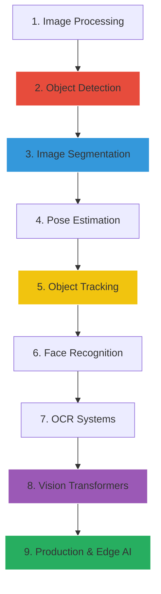

# Module 11: Advanced Computer Vision

> [!IMPORTANT]
> Welcome to Advanced Computer Vision. In this module, we move past basic image classification and tackle real-world vision systems: Object Detection, Segmentation, OCR, Tracking, and Vision Transformers.

This module is designed to bridge the gap between academic Computer Vision and production-grade Industry applications. 

---

## 🎯 Learning Outcomes

After completing this module, you will understand:
* **Object Detection Pipelines**: How to build and deploy YOLO and Faster R-CNN models.
* **Pixel-Level Segmentation**: Using U-Net for precise medical imagery and instance segmentation.
* **Object Tracking**: Managing unique object IDs across video frames using DeepSORT and ByteTrack.
* **OCR**: Extracting text from documents and the wild using Tesseract and PaddleOCR.
* **Vision Transformers**: How Attention mechanisms overtook Convolutional Neural Networks.
* **Production Deployment**: Exporting models to ONNX and TensorRT for mobile and Edge AI.

---

## 🗺️ Visual Learning Roadmap

---

## 📚 Study Guide & Topic Navigation

Follow these lessons chronologically to build a full understanding of modern vision systems.

### 🟢 Beginner (Foundations & Processing)
* [01. Computer Vision Pipeline](./01-Computer-Vision-Pipeline.md)
* [02. Image Preprocessing](./02-Image-Preprocessing.md)
* [03. Object Detection Fundamentals](./03-Object-Detection-Fundamentals.md)

### 🟡 Intermediate (Detection & Segmentation)
* [04. The YOLO Family](./04-YOLO-Family.md)
* [05. Faster R-CNN & Two-Stage Detectors](./05-Faster-RCNN-And-Two-Stage-Detectors.md)
* [06. Image Segmentation](./06-Image-Segmentation.md)
* [07. U-Net & Medical Imaging](./07-UNet-And-Medical-Imaging.md)
* [08. Pose Estimation](./08-Pose-Estimation.md)

### 🔴 Advanced (Tracking, OCR & Transformers)
* [09. Object Tracking](./09-Object-Tracking.md)
* [10. Face Recognition](./10-Face-Recognition.md)
* [11. OCR Systems](./11-OCR-Systems.md)
* [12. Video Analytics](./12-Video-Analytics.md)
* [13. Vision Transformers](./13-Vision-Transformers.md)
* [14. Multimodal Vision](./14-Multimodal-Vision.md)
* [15. Computer Vision In Production](./15-Computer-Vision-In-Production.md)

### 📓 Extended Topics (Legacy / Deep Dives)
* [16. OpenCV Masterclass](./16-OpenCV-Masterclass.md)
* [17. Image Generation](./17-Image-Generation.md)
* [18. 3D Vision](./18-3D-Vision.md)
* [19. CV Real World Projects Overview](./19-CV-Real-World-Projects.md)

---

## 💻 Recommended Notebooks

Theory is nothing without implementation. Practice with these interactive labs in the `/notebooks` folder:

1. **Object Detection Lab**: Train and infer with YOLO.
2. **Segmentation Lab**: Implement U-Net and Mask R-CNN.
3. **OCR Lab**: Build a document understanding pipeline.
4. **Pose Estimation Lab**: Experiment with MediaPipe.
5. **Tracking Lab**: Process a video feed with ByteTrack.
6. **Vision Transformers Lab**: Visualize ViT Attention Maps.
7. **Production Deployment Lab**: Optimize an ONNX model.

---

## 🏆 Project Showcase

To truly master these concepts, complete the following projects (located in the `/projects` folder):

| Level | Project | Description |
| :--- | :--- | :--- |
| 🟢 | **[01. Traffic Vehicle Detection](./projects/01-Traffic-Vehicle-Detection-System)** | High-speed vehicle detection on highway video feeds using YOLO. |
| 🟢 | **[02. Smart Parking Detection](./projects/02-Smart-Parking-Detection)** | Count available parking spots using object detection and spatial logic. |
| 🟡 | **[03. License Plate Recognition](./projects/03-License-Plate-Recognition)** | Two-stage pipeline: Detect the plate, then read it via OCR. |
| 🟡 | **[04. Medical Image Segmentation](./projects/04-Medical-Image-Segmentation)** | Perfect pixel segmentation of cell nuclei using U-Net. |
| 🟡 | **[05. Face Attendance System](./projects/05-Face-Attendance-System)** | End-to-end embedding extraction and 1:N face verification. |
| 🔴 | **[06. Fitness Pose Analyzer](./projects/06-Fitness-Pose-Analyzer)** | Track human joints and calculate rep-counts using MediaPipe. |
| 🔴 | **[07. Retail Customer Analytics](./projects/07-Retail-Customer-Analytics)** | Count unique people entering/exiting a store using ByteTrack. |
| 🔴 | **[08. Real-Time Surveillance Dashboard](./projects/08-Real-Time-Surveillance-Dashboard)** | Multi-camera anomaly and intruder detection dashboard. |
| 🔴 | **[09. OCR Document Scanner](./projects/09-OCR-Document-Scanner)** | Extract dollar amounts from messy, angled photos of receipts. |
| 🔴 | **[10. Vision Transformer Classifier](./projects/10-Vision-Transformer-Image-Classifier)** | Fine-tune a modern ViT architecture using HuggingFace. |

---

## 💼 Skills Gained

* **Technical Skills**: YOLO, U-Net, Transformers, ONNX, MediaPipe, OpenCV, DeepSORT.
* **Industry Skills**: Data Annotation (Roboflow/CVAT), Edge Deployment, Real-time video processing.
* **Interview Readiness**: Explaining IoU, mAP, Triplet Loss, and why ViTs beat CNNs at scale.

> [!TIP]  
> **Prerequisites:** You must have completed the **07-Computer-Vision-CNNs** module before starting this one. You should already be comfortable with PyTorch, Convolutional layers, Feature Maps, and basic classification loops.

**Estimated Study Time:** 4-6 Weeks.

[Return to Main Roadmap](../README.md)
