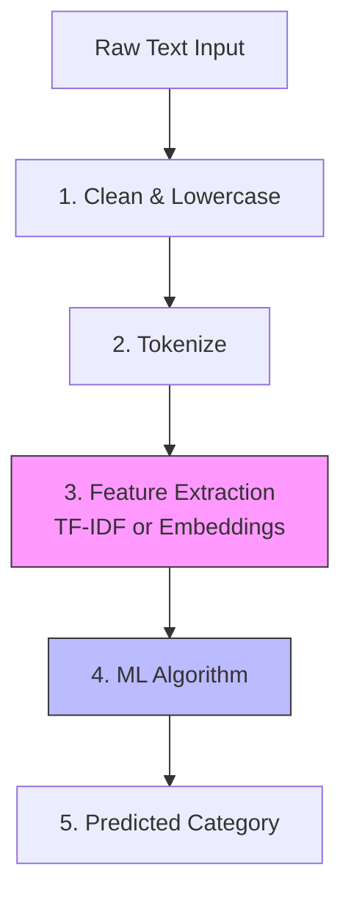

# 06 - Text Classification

> **Difficulty**: ⭐⭐☆☆☆ Intermediate | **Prerequisites**: 04-Feature-Extraction | **Estimated Reading Time**: 20 Minutes

---

## 📋 Table of Contents
1. [What Problem Does This Solve?](#1-what-problem-does-this-solve)
2. [The Text Classification Pipeline](#2-the-text-classification-pipeline)
3. [Classical Machine Learning Approaches](#3-classical-machine-learning-approaches)
4. [Deep Learning Approaches](#4-deep-learning-approaches)
5. [Industry Applications](#5-industry-applications)
6. [Key Takeaways](#6-key-takeaways)
7. [Next Topic](#7-next-topic)

---

# 1. What Problem Does This Solve?

We know how to clean text (Preprocessing). We know how to split it (Tokenization). We know how to turn it into math (TF-IDF / Embeddings). 

Now, we actually want to *do* something with that math.

### 🟢 Beginner
If you receive an email from a Nigerian Prince promising you $1,000,000, how does Gmail know to automatically move it to the Spam folder? It doesn't have a human reading your emails. It uses a **Text Classifier**.

### 🟡 Intermediate
Text Classification is a Supervised Machine Learning task. We take a string of text as an input ($X$), and we map it to a predefined categorical label ($y$). 
*   Spam vs. Not Spam (Binary Classification)
*   Sports vs. Politics vs. Tech (Multiclass Classification)

### 🔴 Advanced
Because text can vary massively in length (a 2-word tweet vs. a 500-page book), standard ML algorithms can struggle. The architecture we choose depends entirely on the size of the dataset and the complexity of the grammar. Classical algorithms (like Naive Bayes) are incredibly fast but ignore word order. Deep Learning algorithms (like LSTMs and CNNs) capture complex grammar but require massive amounts of data and compute.

---

# 2. The Text Classification Pipeline

To build a production text classifier, you must build a strict data pipeline. If your training data goes through step 2, but your live production data skips step 2, the math will fail and the model will crash.

---

# 3. Classical Machine Learning Approaches

If you have a small dataset (less than 10,000 documents) and you don't have access to a GPU, classical ML is the best approach.

### Naive Bayes
This is the algorithm that powered the first Spam Filters in the 1990s. 
It relies on **Bayes' Theorem** of probability. It calculates the probability of a document being Spam *given* that it contains the word "Prince."
*   *Pros:* Incredibly fast. Works perfectly with Bag-of-Words and TF-IDF. Needs very little data.
*   *Cons:* It is "Naive" because it assumes every word is completely independent. It doesn't know that "United" and "States" usually appear together.

### Support Vector Machines (SVM)
SVMs try to draw a literal geometric line (hyperplane) through the TF-IDF matrix to separate the "Sports" documents from the "Politics" documents.
*   *Pros:* Extremely accurate for high-dimensional text data. 
*   *Cons:* Can be slow to train on very large datasets.

---

# 4. Deep Learning Approaches

If you have a massive dataset (100,000+ documents), classical ML will plateau. To capture true grammatical context and sarcasm, we must use Neural Networks combined with **Word Embeddings**.

### Recurrent Neural Networks (LSTMs)
Unlike TF-IDF, which throws all words into a blender, an LSTM reads the sentence *in order*, from left to right. It keeps a running "memory" of what it just read.
*   *Pros:* Excellent at understanding sequence and grammar.
*   *Cons:* Very slow to train because it cannot be parallelized on a GPU. It struggles with extremely long documents (forgetting the beginning of the book by the time it reaches the end).

### 1D Convolutional Neural Networks (Text CNNs)
We usually use CNNs for Images (2D grids of pixels). But we can use a 1D CNN for text! The "filter" slides across the sentence 3 words at a time, looking for specific "phrases" or "N-Grams" that indicate a specific class.
*   *Pros:* Much faster than LSTMs. Excellent at finding specific trigger phrases.
*   *Cons:* Doesn't understand the long-term context of the entire document as well as an LSTM.

---

# 5. Industry Applications

Text Classification powers the modern internet.

1.  **Content Moderation:** Automatically flagging and deleting toxic comments or hate speech on social media platforms.
2.  **Customer Support Routing:** Reading an incoming customer email ("My password is broken") and automatically forwarding it to the IT Department instead of the Billing Department.
3.  **Intent Detection:** In Chatbots, classifying the user's text into an "Intent". (e.g., classifying "I want to fly to Paris" into the `BOOK_FLIGHT` intent category).

---

# 6. Key Takeaways

*   **Text Classification** is the supervised learning task of assigning predefined labels to documents.
*   The **Pipeline** (Clean $\to$ Tokenize $\to$ Vectorize $\to$ Model) must be strictly enforced during both training and production.
*   **Classical Models** (Naive Bayes, SVM) paired with TF-IDF are fast and effective for small datasets where word order doesn't matter.
*   **Deep Learning Models** (LSTMs, CNNs) paired with Word Embeddings are slower to train but can understand grammar and context in large datasets.

---

# 7. Next Topic

One of the most valuable and lucrative types of Text Classification is trying to determine the emotion of the user. Is the user happy, angry, or sad?

In the next lesson, we will do a deep dive into a specific sub-field of Text Classification that powers modern marketing and product analytics: **Sentiment Analysis**.

[← Word Embeddings](05-Word-Embeddings.md) | [Back to Index](README.md) | [Next Topic: Sentiment Analysis →](07-Sentiment-Analysis.md)
