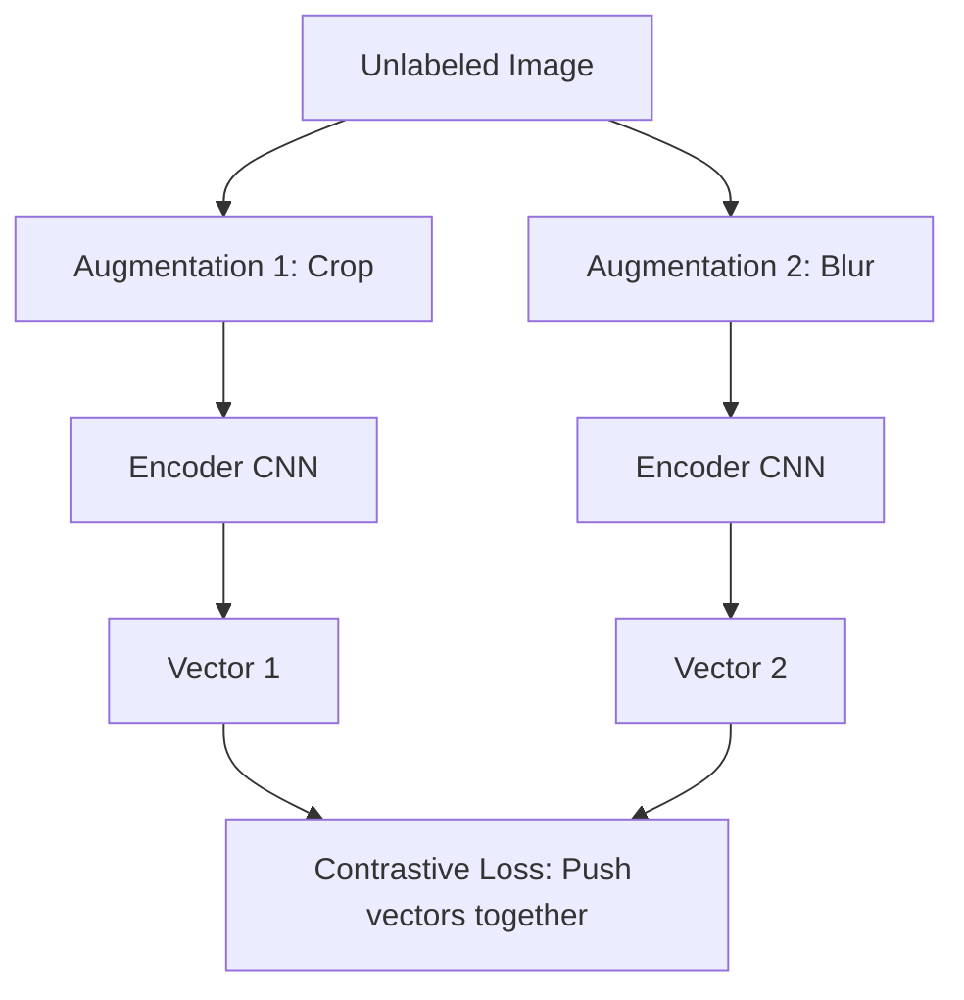

# 02 - Self-Supervised Learning

> **Difficulty**: ⭐⭐⭐⭐☆ Advanced | **Prerequisites**: 01-Representation-Learning | **Estimated Reading Time**: 30 Minutes

---

## 📋 Table of Contents
1. [What Problem Does This Solve?](#1-what-problem-does-this-solve)
2. [Why Labels Are Expensive](#2-why-labels-are-expensive)
3. [Learning Without Labels (The Proxy Task)](#3-learning-without-labels-the-proxy-task)
4. [Contrastive Learning (SimCLR)](#4-contrastive-learning-simclr)
5. [Non-Contrastive Methods (BYOL & DINO)](#5-non-contrastive-methods-byol--dino)
6. [Industry Applications](#6-industry-applications)
7. [Key Takeaways](#7-key-takeaways)
8. [Next Topic](#8-next-topic)

---

# 1. What Problem Does This Solve?

Deep Learning models are notoriously data-hungry. To train a ResNet to classify medical X-Rays, you traditionally need 100,000 X-Rays, *each manually labeled by a board-certified doctor*. 

### 🟢 Beginner
What if we have 10 million X-Rays, but only 1,000 of them are labeled? Traditional Supervised Learning will fail because 1,000 images is not enough to train a deep neural network. 

### 🟡 Intermediate
We need a way to let the Neural Network "study" the 9,999,000 unlabeled X-Rays to learn the general structure of lungs and bones (Representation Learning). Once it understands the basic anatomy, we can use the 1,000 labeled images to teach it what "cancer" looks like. This process of learning from unlabeled data is called **Self-Supervised Learning (SSL)**.

### 🔴 Advanced
Self-Supervised Learning automatically generates its own labels from the raw data by framing a "pretext" or "proxy" task. By solving this artificial task, the network is forced to learn a highly robust latent representation of the dataset. Today, SSL is the foundational training methodology behind every Large Language Model (like GPT-4) and modern Vision Foundation Model.

---

# 2. Why Labels Are Expensive

Supervised Learning dominated the 2010s (e.g., ImageNet), but it hit a strict bottleneck:
1.  **Cost:** Paying humans to draw bounding boxes around pedestrians in 10 million autonomous driving frames costs millions of dollars.
2.  **Expertise:** You cannot crowd-source the labeling of MRI scans or legal contracts to non-experts.
3.  **Bias:** Human labelers make mistakes, disagree with each other, and inject subjective biases into the dataset.

The internet contains trillions of raw images and petabytes of raw text. If we restrict AI to only learning from human-labeled data, we are leaving 99.9% of the world's knowledge untouched.

---

# 3. Learning Without Labels (The Proxy Task)

How can a network learn if we don't give it a label to predict? We invent a **Proxy Task**.

We take an unlabeled piece of data, artificially corrupt or alter it, and force the network to fix it.

### Proxy Tasks in NLP
The most famous SSL proxy task is **Masked Language Modeling (MLM)** used by BERT.
1.  Take a raw, unlabeled sentence: `"The quick brown fox jumps."`
2.  Corrupt it: `"The quick [MASK] fox jumps."`
3.  Ask the network to predict the hidden word.
*The network creates its own label ("brown") entirely from the raw data!* To succeed, it must learn the rules of English grammar.

### Proxy Tasks in Computer Vision
Early vision proxy tasks included:
*   **Colorization:** Convert a color image to grayscale, and force the network to predict the original colors.
*   **Jigsaw Puzzles:** Cut an image into 9 patches, scramble them, and force the network to put them back in order.

To solve the puzzle, the network *must* learn that "ears" go above "eyes". It learns the representation of a face without ever being told what a face is.

---

# 4. Contrastive Learning (SimCLR)

In 2020, SSL in Computer Vision was revolutionized by **Contrastive Learning**, specifically a paper from Google called **SimCLR** (Simple Framework for Contrastive Learning of Visual Representations).

Instead of solving puzzles, Contrastive Learning forces the network to answer the question: *"Are these two things the same?"*

**The SimCLR Workflow:**
1.  Take an unlabeled image of a dog ($x$).
2.  Create two heavily augmented views of the same image (e.g., crop and color-distort one into $x_1$, and flip and blur the other into $x_2$).
3.  Pass both through an Encoder (ResNet) to get two vectors ($z_1$ and $z_2$).
4.  **The Loss Function (InfoNCE):** Maximize the mathematical similarity (Dot Product) between $z_1$ and $z_2$ (because they came from the same dog), while simultaneously minimizing the similarity against all other random images in the batch.

To push $z_1$ and $z_2$ together, the network realizes: *"I cannot rely on color, because one is black-and-white. I cannot rely on the background, because one is zoomed in. I must learn the underlying shape of the dog."*

---

# 5. Non-Contrastive Methods (BYOL & DINO)

SimCLR has a problem: It requires massive batch sizes (e.g., 4,096 images at once) to ensure there are enough "negative" examples to push away from. If the batch size is too small, the network suffers from **Model Collapse** (it just outputs a vector of `[0,0,0]` for every single image, achieving perfect similarity while learning nothing).

**BYOL (Bootstrap Your Own Latent):**
DeepMind proved you don't need negative examples at all. You can use two networks (an Online network and a slow-moving Target network). The Online network tries to predict the output of the Target network. Because the Target network updates slowly, it prevents collapse.

**DINO (Self-Distillation with No Labels):**
Meta developed DINO, which uses a Vision Transformer (ViT). Instead of comparing full images, it passes "global" crops and "local" crops to a Teacher/Student network setup. Amazingly, DINO learns to perfectly segment objects from the background (drawing a perfect outline around a bird) *without ever seeing a single segmentation mask during training*. 

---

# 6. Industry Applications

*   **Medical Imaging:** Hospitals have millions of unlabeled MRIs. SSL is used to pretrain the network on the anatomy, requiring only a handful of expert-labeled scans to fine-tune it for tumor detection.
*   **Foundation Models:** SSL is the exact mechanism used to train GPT-4 (predicting the next word) and Stable Diffusion (predicting the noise added to an image).
*   **Zero-Shot Learning:** By learning incredibly rich representations, SSL models can often classify objects they have never explicitly been trained on.

---

# 7. Key Takeaways

*   **Self-Supervised Learning (SSL)** generates its own labels from raw, unlabeled data using a proxy task.
*   It solves the bottleneck of expensive, biased, human-curated datasets.
*   **Contrastive Learning (SimCLR)** learns representations by forcing two augmented views of the same image to have similar latent vectors.
*   **Non-Contrastive Methods (BYOL, DINO)** eliminate the need for massive batch sizes and negative examples.
*   SSL is the engine behind all modern Foundation Models in both NLP and Computer Vision.

---

# 8. Next Topic

We now know how to train a massive neural network on millions of unlabeled images or text documents to learn the fundamental structure of the world.

But how do we actually *use* that knowledge to solve our specific, small-scale business problem (like detecting a defective part on an assembly line)? 

In the next lesson, we will explore **Transfer Learning and Foundation Models**.

[← Representation Learning](01-Representation-Learning.md) | [Back to Index](README.md) | [Next Topic: Transfer Learning & Foundation Models →](03-Transfer-Learning-And_Foundation_Models.md)
