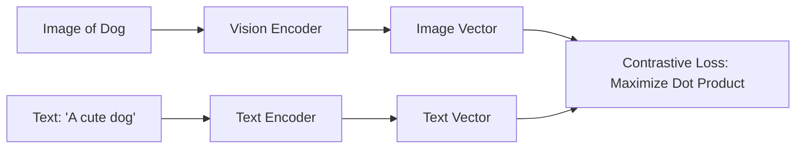

# 06 - Multimodal AI

> **Difficulty**: ⭐⭐⭐☆☆ Intermediate | **Prerequisites**: 03-Transfer-Learning-And-Foundation-Models | **Estimated Reading Time**: 25 Minutes

---

## 📋 Table of Contents
1. [What Problem Does This Solve?](#1-what-problem-does-this-solve)
2. [What is Multimodality?](#2-what-is-multimodality)
3. [The Alignment Problem (CLIP)](#3-the-alignment-problem-clip)
4. [Vision-Language Models (BLIP & Flamingo)](#4-vision-language-models-blip--flamingo)
5. [Native Multimodal Models (GPT-4o)](#5-native-multimodal-models-gpt-4o)
6. [Key Takeaways](#6-key-takeaways)
7. [Next Topic](#7-next-topic)

---

# 1. What Problem Does This Solve?

Until 2021, the field of AI was highly siloed. 
*   Computer Vision Engineers built CNNs to process pixels.
*   NLP Engineers built Transformers to process words.

### 🟢 Beginner
If you handed a photograph to an NLP model, it would crash. If you handed a text document to a Vision model, it would crash. But human intelligence is not siloed. When you see a picture of an apple, you simultaneously process its color (vision), the sound it makes when you bite it (audio), and the word "Apple" (language).

### 🟡 Intermediate
To build smarter AI, we need to bridge these modalities. We need a way to take a vector representing an Image and a vector representing Text, and align them into the *exact same mathematical Latent Space*. This is called **Multimodal AI**.

### 🔴 Advanced
Multimodal AI is achieved through specialized contrastive loss functions and cross-attention mechanisms. By aligning text and image embeddings, we unlock Zero-Shot image classification, text-to-image generation (Stable Diffusion), and visual question answering (VQA). Modern systems like GPT-4o take this a step further by processing text, vision, and audio *natively* through a single unified neural network, eliminating the need for separate encoders.

---

# 2. What is Multimodality?

A **Modality** is simply a specific type of data format.
*   Language (Text)
*   Vision (Images / Video)
*   Audio (Speech / Music)
*   Sensory (Robotic joint states, LiDAR)

A **Multimodal Model** is a Neural Network that can ingest multiple modalities simultaneously, or translate between them.
*   *Image $\to$ Text:* Image Captioning ("A dog playing in the grass").
*   *Text $\to$ Image:* AI Art Generation (Midjourney).
*   *Image + Text $\to$ Text:* Visual Question Answering (User uploads a photo of a math problem and asks "Solve this").

---

# 3. The Alignment Problem (CLIP)

The foundational breakthrough in modern Multimodal AI was **CLIP (Contrastive Language-Image Pretraining)**, released by OpenAI in 2021.

Before CLIP, if you wanted an AI to recognize a "Dog", you had to manually label 10,000 images with the class ID `1`.

**The CLIP Approach:**
OpenAI scraped 400 million pairs of (Image, Text) from the internet (e.g., a photo of a dog from Instagram, and the user's caption: "My dog playing in the park").

They built an architecture with two separate Encoders:
1.  A Vision Transformer (ViT) to encode the Image into a vector.
2.  A Text Transformer to encode the Caption into a vector.

Using **Contrastive Learning**, they forced the math to push the Image Vector and the Text Vector as close together as possible. 

**Why CLIP changed everything:**
Because the Image and the Text share the exact same mathematical space, you can do **Zero-Shot Classification**. 
You hand CLIP a photo it has never seen. You then hand it 1,000 text strings ("A photo of a dog", "A photo of a cat", etc.). You simply calculate which text vector is mathematically closest to the image vector. You now have an image classifier that requires zero fine-tuning!

---

# 4. Vision-Language Models (BLIP & Flamingo)

CLIP is great at matching images to text, but it cannot *generate* new text. It cannot look at an image and answer a question about it.

To do that, we build **Vision-Language Models (VLMs)** like BLIP (Salesforce) and Flamingo (DeepMind).

**The Architecture:**
1.  **The Eyes:** A frozen Vision Encoder (like CLIP) looks at the image and extracts the visual features.
2.  **The Adapter:** A specialized Neural Network layer translates those visual features into "Visual Tokens" (pretending the image is just a sequence of words).
3.  **The Brain:** A massive Large Language Model (LLM) accepts the user's text prompt AND the Visual Tokens simultaneously.

Because the LLM is doing the heavy lifting, the model can engage in complex reasoning. You can show it a meme, and it can explain *why* the meme is funny by combining its visual understanding of the image with its semantic understanding of human culture.

---

# 5. Native Multimodal Models (GPT-4o)

The problem with stitching a Vision Encoder and an LLM together is latency and loss of nuance. 

If you convert Audio to Text (Transcription) $\to$ pass the Text to an LLM $\to$ pass the LLM Output to a Text-to-Speech synthesizer... you lose all the emotion. The LLM doesn't hear the user crying, laughing, or shouting; it only sees the raw text.

**The "Omni" Approach:**
Models like **GPT-4o (Omni)** and **Gemini 1.5 Pro** drop the stitched-together pipeline entirely. They are trained from scratch to accept raw audio waveforms, raw image pixels, and raw text tokens directly into the *same* Transformer neural network. 

Because the audio goes straight into the brain of the network, GPT-4o can hear the user's tone of voice, understand background noises (like a dog barking), and respond with a generated audio waveform that contains laughter and emotional inflection in real-time.

---

# 6. Key Takeaways

*   **Multimodal AI** bridges the gap between different data types (Text, Vision, Audio).
*   **CLIP** revolutionized the field by using Contrastive Learning to force Image embeddings and Text embeddings into the exact same latent space, enabling zero-shot vision tasks.
*   **Vision-Language Models (VLMs)** stitch a Vision Encoder to a Large Language Model, allowing the LLM to "see" and answer questions about images.
*   **Native Multimodal Models (GPT-4o)** process raw pixels, audio, and text through a single unified network, preserving deep semantic nuance like emotion and tone.

---

# 7. Next Topic

We now have Large Language Models that can read text, see images, and hear audio. They contain the knowledge of the entire internet.

But they have a fatal flaw: They frequently lie (Hallucinate). Furthermore, they do not know your company's private, proprietary data.

In the next lesson, we will solve both of these problems by exploring the most important architecture in modern Enterprise AI: **Retrieval-Augmented Generation (RAG)**.

[← Deep Reinforcement Learning](05-Deep-Reinforcement-Learning.md) | [Back to Index](README.md) | [Next Topic: Retrieval-Augmented Generation →](07-Retrieval-Augmented-Generation.md)
