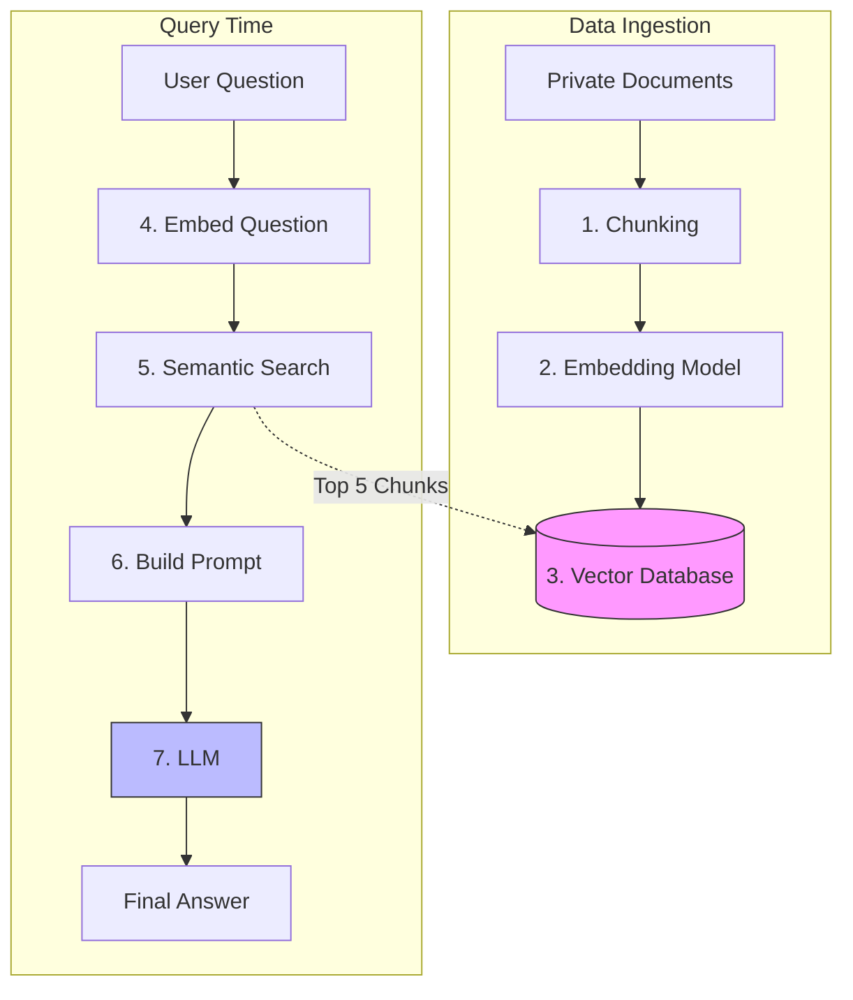

# 07 - Retrieval-Augmented Generation (RAG)

> **Difficulty**: ⭐⭐⭐⭐☆ Advanced | **Prerequisites**: 03-Transfer-Learning-And-Foundation-Models | **Estimated Reading Time**: 35 Minutes

---

## 📋 Table of Contents
1. [What Problem Does This Solve?](#1-what-problem-does-this-solve)
2. [Why LLMs Hallucinate](#2-why-llms-hallucinate)
3. [The RAG Architecture](#3-the-rag-architecture)
4. [Step 1: Chunking and Embedding](#4-step-1-chunking-and-embedding)
5. [Step 2: The Vector Database](#5-step-2-the-vector-database)
6. [Step 3: Retrieval and Generation](#6-step-3-retrieval-and-generation)
7. [Advanced RAG Techniques](#7-advanced-rag-techniques)
8. [Key Takeaways](#8-key-takeaways)
9. [Next Topic](#9-next-topic)

---

# 1. What Problem Does This Solve?

Imagine you work for a Law Firm. You want to build a Chatbot that can answer questions about the firm's private, confidential contracts. 

### 🟢 Beginner
You cannot use ChatGPT out-of-the-box. ChatGPT was trained on public internet data in 2023. It has never seen your private contracts. If you ask it *"What is the penalty clause in the Smith vs. Jones contract?"*, it will completely invent a fake answer.

### 🟡 Intermediate
How do we teach the LLM about the contract? 
*   *Option A (Fine-Tuning):* We could fine-tune the LLM on all our PDFs. This is incredibly expensive, requires GPUs, and if the contract changes tomorrow, we have to fine-tune it all over again.
*   *Option B (RAG):* We can simply **Search** for the relevant paragraph in the PDF, copy-paste that paragraph into the prompt, and ask the LLM to read it and answer the question. This is cheap, fast, and secure.

### 🔴 Advanced
**Retrieval-Augmented Generation (RAG)** is the industry standard for Enterprise AI. It separates the "Knowledge" from the "Reasoning". The LLM provides the semantic reasoning, while an external **Vector Database** provides the factual knowledge. Because the LLM is explicitly instructed to *only* use the retrieved context, RAG dramatically reduces hallucinations and provides verifiable citations for every claim.

---

# 2. Why LLMs Hallucinate

An LLM is not a database. It does not store facts in neat SQL tables. It stores statistical probabilities in its continuous weights.

When you ask an LLM a question, it is just guessing the most likely next word. If it doesn't know the answer, its training forces it to confidently generate text anyway. This is called a **Hallucination**.

RAG solves this by changing the prompt.
*   *Without RAG:* `User: "What is the capital of Atlantis?"` $\to$ *Hallucinates a fake answer.*
*   *With RAG:* `System: "Using ONLY the following text: [Text: Atlantis is a fictional city], answer the user. User: What is the capital of Atlantis?"` $\to$ *Accurate Answer: "Atlantis is fictional."*

---

# 3. The RAG Architecture

A production RAG system is a pipeline combining traditional Search with modern LLMs.

---

# 4. Step 1: Chunking and Embedding

You have a 500-page PDF. You cannot pass 500 pages to an LLM; the context window will overflow, and it will cost $50 per query.

1.  **Chunking:** We split the document into small pieces (e.g., 500-word paragraphs with a 50-word overlap so we don't accidentally cut a sentence in half).
2.  **Embedding:** We pass every single chunk through a small, fast Representation Learning model (like `text-embedding-3-small`). This converts the English text into a dense array of floats (e.g., a 1536-dimensional vector).

---

# 5. Step 2: The Vector Database

We need a place to store millions of these 1536-dimensional vectors. Traditional SQL databases (`WHERE keyword = 'penalty'`) are terrible at this.

We use a **Vector Database** (like Pinecone, Milvus, or pgvector). Vector databases do not search for exact keywords; they search for mathematical proximity. They are optimized to calculate the Cosine Similarity between vectors in milliseconds using algorithms like HNSW (Hierarchical Navigable Small World graphs).

---

# 6. Step 3: Retrieval and Generation

When the user asks a question at runtime:
1.  **Embed:** We pass the user's question through the *exact same* embedding model.
2.  **Search:** We ask the Vector DB: *"Find the 5 chunks whose vectors are geometrically closest to my question vector."*
3.  **Prompt:** We inject those 5 chunks into a massive system prompt.
4.  **Generate:** The LLM reads the chunks, synthesizes the information, and outputs a polite, conversational answer to the user, citing its sources.

---

# 7. Advanced RAG Techniques

Basic RAG works well for simple questions, but fails in complex enterprise scenarios. The cutting-edge of AI Engineering focuses on Advanced RAG:

*   **Query Rewriting:** Users ask terrible questions ("Why did it crash?"). Before searching, an LLM rewrites the question using conversation history ("Why did the production server crash at 3 PM on Tuesday?").
*   **Hybrid Search:** Pure Vector Search struggles with exact IDs (e.g., "Find invoice #A49-XYZ"). Hybrid Search combines Vector Search (for semantic meaning) with BM25 Keyword Search (for exact matches).
*   **Re-Ranking:** Vector databases are fast but mathematically simplistic. Advanced RAG pulls the Top 50 chunks from the DB, and then passes them through a slower, highly accurate **Cross-Encoder** model to re-score and re-rank them, keeping only the absolute best Top 5.

---

# 8. Key Takeaways

*   **RAG** combines the reasoning power of an LLM with the factual accuracy of a private database.
*   It solves the **Hallucination** problem by explicitly forcing the LLM to only read from retrieved context.
*   **Chunking and Embedding** convert long documents into searchable mathematical vectors.
*   **Vector Databases** use Cosine Similarity to perform semantic search, finding concepts rather than exact keywords.
*   **Advanced RAG** introduces query rewriting, hybrid search, and cross-encoder re-ranking to achieve production-grade reliability.

---

# 9. Next Topic

RAG systems are incredibly powerful, but they are linear. The user asks a question, the system searches, the system answers. It is a one-way pipeline.

What if we want an AI to solve a problem that requires multiple steps, taking actions, making mistakes, looking at the results, and trying again? 

In the next lesson, we will explore the frontier of Artificial Intelligence: **AI Agents**.

[← Multimodal AI](06-Multimodal-AI.md) | [Back to Index](README.md) | [Next Topic: AI Agents →](08-AI-Agents.md)
